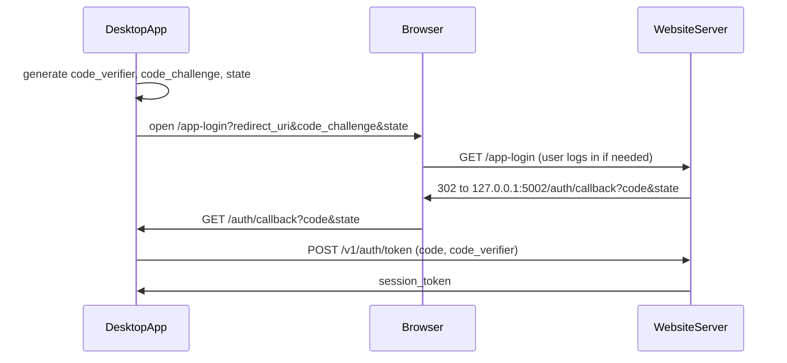

# Paid Plaid — API Contract (desktop app <-> website server)

This is the interface between the desktop app (`budget_app`, the **client**) and the
website server (`budget_app_website`, the **server**). Both sides build against this
document. Any step that adds or changes an endpoint updates its entry here in the same
PR. Entries marked **TODO** are filled in by the step listed next to them.

See [PLAN.md](PLAN.md) for steps and status.

---

## Base URL and versioning

- Production: `https://workbenchbudgeting.com/v1`
- Local dev: `http://127.0.0.1:5001/v1` (website `serve.py` default port)
- The desktop app reads the base URL from `BUDGET_APP_CLOUD_URL`.
- Breaking changes require a new version prefix (`/v2`); additive changes (new optional
  fields, new endpoints) do not. Clients must ignore unknown response fields.
- All requests and responses are JSON (`Content-Type: application/json`), UTF-8.
  Timestamps are ISO 8601 UTC strings. Amounts are decimal numbers in account currency.

## Authentication

All `/v1/*` endpoints except `POST /v1/auth/token` require:

```
Authorization: Bearer <session_token>
```

A missing, unknown, expired, or revoked token gets 401 `unauthorized` with
`WWW-Authenticate: Bearer`. The whole `/v1` API 404s while `ACCOUNTS_ENABLED` is off.

Session tokens are opaque random strings. The server stores only a hash. The desktop
app stores the token in the OS keychain (`keyring`), never in SQLite or `.env`.

### Desktop sign-in flow (PKCE, loopback redirect) — steps 10 and 14



1. App generates `code_verifier` (random), `code_challenge = BASE64URL(SHA256(verifier))`,
   and `state` (random).
2. App opens the browser to (all values URL-encoded):
   `GET /app-login?redirect_uri=http://127.0.0.1:5002/auth/callback&code_challenge=<c>&code_challenge_method=S256&state=<s>&device_name=<name>`
   - `redirect_uri`: exactly `http://127.0.0.1:<port>/auth/callback` or
     `http://localhost:<port>/auth/callback` (explicit port, no query or fragment).
   - `code_challenge`: 43 characters (unpadded base64url SHA-256). `code_challenge_method`
     must be `S256`.
   - `state`: required, up to 256 characters. Returned unchanged.
   - `device_name`: optional, shown to the user; whitespace collapsed, cut to 100 characters.
   - Any missing or invalid parameter → a 400 error page in the browser and **no redirect**
     (so the app just stops waiting after its own timeout).
3. Server requires a web login (password or Google; logged-out users go through `/login`
   and come back), then shows a confirmation page: "The Workbench Budgeting app on
   <device_name> wants to sign in as <email>" with **Continue**, **Use a different account**
   (logs out of the website and starts over), and **Cancel**.
   - Continue → `302 redirect_uri?code=<one-time code>&state=<s>`. Codes expire after
     5 minutes and are single-use.
   - Cancel → `redirect_uri?error=access_denied&state=<s>`.
4. App checks `state` (and handles `error=access_denied` by showing "Sign-in canceled"),
   then calls `POST /v1/auth/token` with the code and its `code_verifier`.

Session tokens last **180 days** from sign-in (no sliding renewal). A session also ends when
the user signs out of the app (`POST /v1/auth/logout`), when their password is changed,
reset, or removed (the same rule that ends other web sessions), or when the account is
deleted. Any of these → 401 on the next call; the app clears the token and shows Sign in.

## Error format

Every non-2xx response has this body:

```json
{ "error": { "code": "plaid_access_required", "message": "Human-readable explanation" } }
```

| HTTP | `code` | Meaning | Client behavior |
| --- | --- | --- | --- |
| 400 | `bad_request` | Invalid input | Show message |
| 401 | `unauthorized` | Missing, invalid, expired, or revoked session token | Clear token, prompt sign-in |
| 402 | `plaid_access_required` | Signed in but no active Plaid subscription | Show "Subscribe to sync banks" with link to `/account` |
| 400 | `item_limit_reached` | Already 10 bank connections (Plaid bills per connection) | Show message; suggest removing one |
| 404 | `not_found` | Resource does not exist or is not the caller's | Show message |
| 409 | `plaid_relink_required` | Plaid item needs re-authentication (e.g. `ITEM_LOGIN_REQUIRED`) | Start update-mode Link for that item |
| 429 | `rate_limited` | Too many requests | Retry after `Retry-After` seconds |
| 502 | `plaid_error` | Upstream Plaid failure | Show message, allow retry |

---

## Endpoints

### Auth

#### `POST /v1/auth/token` — step 10
Exchange a one-time code for a session token. No bearer token required. Rate limited
(20/minute per IP; 429).

Request:
```json
{ "code": "…", "code_verifier": "…", "device_name": "Max's MacBook" }
```
- `code_verifier`: 43–128 characters from `A-Z a-z 0-9 - . _ ~` (RFC 7636).
- `device_name`: optional; overrides the one sent to `/app-login`.

Response 200:
```json
{ "session_token": "…", "expires_at": "2027-04-02T22:14:00Z", "user": { "id": 1, "email": "…" } }
```

Errors: 400 `bad_request` if the body isn't a JSON object, a field is missing or the wrong
type, or the code is unknown, expired, already used, or doesn't match the verifier. The
first redemption attempt uses up the code even if the verifier is wrong, so on any 400 the
app starts sign-in again.

#### `GET /v1/me` — step 10
Current user and entitlement. `plaid_access` comes from `billing.has_plaid_access(user)` (step 9): true
for `active`/`trialing`; `past_due` for 7 days after the failed renewal; `canceled` at the customer's
request until `current_period_end`; false otherwise (including cancellation for non-payment).

Response 200:
```json
{
  "user": { "id": 1, "email": "…", "email_verified": true },
  "plaid_access": true,
  "subscription": { "status": "active", "current_period_end": "2026-11-01T12:30:00Z", "cancel_at_period_end": false },
  "account_url": "https://workbenchbudgeting.com/account"
}
```
- `subscription` is `null` until the user has started a subscription. `status` is Stripe's
  status string (`active`, `trialing`, `past_due`, `canceled`, `unpaid`, `incomplete`,
  `paused`, …); clients should use `plaid_access`, not `status`, to decide what's allowed.
  `current_period_end` may be `null`.

Errors: 401 `unauthorized`.

#### `POST /v1/auth/logout` — step 10
Revokes the calling session token (other devices stay signed in). Response 204, no body.
Errors: 401 `unauthorized` (including an already revoked token).

### Plaid (all require a session **and** Plaid access; otherwise 401 / 402)

Exception: `DELETE /v1/plaid/items/<item_id>` needs only a session, so a user whose
subscription lapsed can still remove a bank. The `/v1/plaid` endpoints 404 unless
`ACCOUNTS_ENABLED` is on and the server has `PLAID_CLIENT_ID`, `PLAID_SECRET`, and
`PLAID_TOKEN_KEY` set. Any Plaid failure (error response or network) → 502 `plaid_error`.
Plaid access tokens are stored encrypted on the server and are **never** returned.

#### `POST /v1/plaid/link-token` — step 11
Create a Plaid Link token for the user (product `transactions`, 730 days of history
requested, US, English). No request body. Rate limited (30/hour per IP).

Response 200: `{ "link_token": "link-sandbox-…", "expiration": "2026-10-05T02:00:00Z" }`

Errors: 400 `item_limit_reached` if the user already has 10 items; 401; 402; 502.

#### `POST /v1/plaid/exchange` — step 11
Exchange the `public_token` from Plaid Link's `onSuccess`. Rate limited (20/hour per IP).

Request:
```json
{ "public_token": "public-sandbox-…", "institution": { "id": "ins_109508", "name": "First Platypus Bank" } }
```
- `institution` is optional (pass Link's `metadata.institution`, renaming `institution_id`
  to `id`). It's display-only: `id` is cut to 64 characters and `name` to 255.
- Exchanging a token for an Item the user already has updates it (new access token,
  institution, `status` back to `ok`). Plaid answers a repeat exchange of the same
  `public_token` with the same Item, so retrying after a timeout is safe and never
  creates a duplicate.

Response 200: `{ "item": <PlaidItem> }`

Errors: 400 `bad_request` (missing/blank `public_token`, `institution` not an object, or
Plaid says the public token is invalid or expired); 400 `item_limit_reached`; 401;
402; 502.

#### `GET /v1/plaid/items` — step 11
The caller's items, oldest first. Response 200: `{ "items": [<PlaidItem>, …] }`.
Errors: 401; 402.

#### `DELETE /v1/plaid/items/<item_id>` — step 11
Calls Plaid `/item/remove` and deletes the item. Response 204, no body. Session only (no
402). If Plaid says the Item is already gone (`ITEM_NOT_FOUND`, `INVALID_ACCESS_TOKEN`)
the item is still deleted. Errors: 401; 404 `not_found` (unknown or another user's item);
502 (the item is kept, so the user can retry).

#### `POST /v1/plaid/sync` — step 12 — TODO
Returns accounts and transactions in the shape the desktop ingest consumes (see
`budget_app/backend/plaid_data_fetcher.py`). Transaction data is not stored on the server.
Request (draft): `{ "item_id": "…optional…", "days_back": 730 }`
Response: TODO (define with a shared fixture at step 12).

#### `POST /v1/plaid/items/<item_id>/relink-token` — step 13 — TODO
Update-mode Link token for an item returning 409. Response: `{ "link_token": "…" }`.

### Shared objects

#### `PlaidItem` — step 11
```json
{
  "item_id": "…",
  "institution_id": "ins_…",
  "institution_name": "…",
  "status": "ok | relink_required | error",
  "created_at": "2026-10-04T23:10:00Z",
  "last_synced_at": null
}
```
`institution_id` and `institution_name` may be `null`. `last_synced_at` is `null` until the
first sync (step 12). Step 11 only ever sets `status` to `ok`; steps 12–13 set the others.

---

## Server-only endpoints (not called by the desktop app)

Listed here so both sides know they exist.

| Endpoint | Step | Purpose |
| --- | --- | --- |
| `GET /healthz` | 1 | Health check: 200 `{"status": "ok"}`, or 503 `{"status": "error", "database": "unreachable"}` if the database query fails |
| `GET, POST /signup` | 4 | Create an account (email + password), then log in. HTML form with CSRF token; 404 when `ACCOUNTS_ENABLED` is off |
| `GET, POST /login` | 4 | Log in; honors a local-only `?next=` path, otherwise goes to `/account`. GET redirects there when already logged in. POST rate limited (5/min, 30/hour per IP; 429). 404 when the flag is off |
| `POST /logout` | 4 | Log out (CSRF token required, else 400), redirect to `/`. 404 when the flag is off |
| `GET, POST /forgot-password` | 5 | Request a reset email. Same response whether or not the email has an account. POST rate limited (5/hour per IP). 404 when the flag is off |
| `GET, POST /reset-password/<token>` | 5 | Choose a new password. Token expires after 1 hour and is single-use (it stops working once the password changes); invalid → 400 page. A successful reset also marks the email verified, logs the user in, and ends their other sessions. 404 when the flag is off |
| `GET /verify-email/<token>` | 5 | Mark the email verified. Token expires after 48 hours and is tied to the address it was sent to; reusing a valid link is harmless. Invalid → 400 page. 404 when the flag is off |
| `POST /verify-email/resend` | 5 | Logged-in only (CSRF token required): send a new verification link. Rate limited (3/hour). 404 when the flag is off |
| `GET, POST /account` | 6 | Logged-in only (otherwise 302 to `/login?next=/account`). Shows email, verification status (with resend), subscription status with Subscribe and/or Manage subscription buttons (steps 8–9), and change-password / set-password. POST changes the password (CSRF token required; current password required if one is set; rate limited 10/hour) and ends other sessions. 404 when the flag is off |
| `GET /auth/google` | 7 | Start "Sign in with Google": redirects to Google with `state` and `nonce` (stored in the session). Optional local-only `?next=`. Rate limited (20/hour). 404 when the flag is off or `GOOGLE_CLIENT_ID`/`GOOGLE_CLIENT_SECRET` are unset |
| `GET /auth/google/callback` | 7 | Google OpenID Connect callback. Checks `state`, exchanges the code, verifies the ID token and `nonce`, then matches the account: by Google `sub` first; if logged in, connects Google to the current account; otherwise (verified Google email only) links to the user with that email or creates one. Logs in and redirects to `next` or `/account`. Any failure (bad/missing/replayed state, user cancelled, unverified email, Google account linked elsewhere) → 400 page. Same 404 rules as above |
| `POST /account/google/unlink` | 7 | Logged-in only (CSRF token required): disconnect Google. Refused (with a message) if the user has no password, so the last sign-in method can't be removed. 404 when the flag is off |
| `POST /billing/checkout` | 8 | Logged-in only (CSRF token required; rate limited 10/hour): creates the user's Stripe customer on first use, then a Checkout Session for `STRIPE_PRICE_ID` and 303-redirects to it. Success returns to `/account?checkout=success`, cancel to `/account?checkout=canceled`. If the user already has a live subscription (`active`, `trialing`, `past_due`, `unpaid`, `incomplete`, `paused`), redirects to `/account` with a message instead. 404 when the flag is off or any `STRIPE_*` var is unset |
| `POST /stripe/webhook` | 8 | Stripe events. Verifies `Stripe-Signature` against `STRIPE_WEBHOOK_SECRET` (5-minute tolerance; failure → 400). No CSRF token. Handles `checkout.session.completed`, `customer.subscription.created/updated/deleted`, `invoice.paid`, `invoice.payment_failed` by re-fetching the subscription from Stripe and copying its status, renewal date, and pending cancellation into `subscriptions`. Other types are acknowledged and ignored. Each event ID is processed once (repeats → 200 `{"received": true, "duplicate": true}`); errors → 500 so Stripe retries. Same 404 rules as checkout |
| `POST /billing/portal` | 9 | Logged-in only (CSRF token required; rate limited 20/hour): creates a Stripe Customer Portal session for the user's customer and 303-redirects to it; the portal returns to `/account`. Users without a Stripe customer are redirected to `/account` with a message. Stripe errors (e.g. portal not configured) → back to `/account` with a message (Checkout does the same since step 9). Same 404 rules as checkout |
| `GET, POST /app-login` | 10 | Browser page for the desktop sign-in flow (see "Desktop sign-in flow" above). Logged-in only (otherwise 302 to `/login?next=…`, where password or Google login both return here). GET checks the parameters (invalid → 400 page, no redirect) and shows the confirmation page; POST (CSRF token required; rate limited 30/hour) issues the one-time code and 302s to the app's loopback `redirect_uri`. 404 when the flag is off |
| `POST /logout?next=<path>` | 10 | `/logout` (step 4) now honors a local-only `next` path, used by "Use a different account" on `/app-login`; anything else still goes to `/` |
| `POST /plaid/webhook` | 13 | Plaid item events (JWT-verified) |
