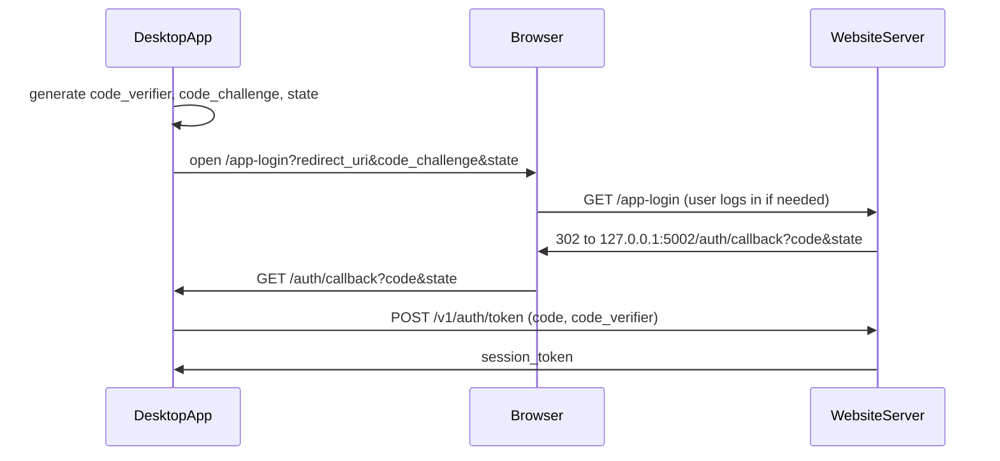

# Paid Plaid — API Contract (desktop app <-> website server)

This is the interface between the desktop app (`budget_app`, the **client**) and the
website server (`budget_app_website`, the **server**). Both sides build against this
document. Any step that adds or changes an endpoint updates its entry here in the same
PR. Entries marked **TODO** are filled in by the step listed next to them.

See [PLAN.md](PLAN.md) for steps and status.

---

## Base URL and versioning

- Production: `https://workbenchbudgeting.com/v1`
- Local dev: `http://127.0.0.1:5001/v1` (website `serve.py` default port)
- The desktop app reads the base URL from `BUDGET_APP_CLOUD_URL`.
- Breaking changes require a new version prefix (`/v2`); additive changes (new optional
  fields, new endpoints) do not. Clients must ignore unknown response fields.
- All requests and responses are JSON (`Content-Type: application/json`), UTF-8.
  Timestamps are ISO 8601 UTC strings. Amounts are decimal numbers in account currency.

## Authentication

All `/v1/*` endpoints except `POST /v1/auth/token` require:

```
Authorization: Bearer <session_token>
```

Session tokens are opaque random strings. The server stores only a hash. The desktop
app stores the token in the OS keychain (`keyring`), never in SQLite or `.env`.

### Desktop sign-in flow (PKCE, loopback redirect) — steps 10 and 14



1. App generates `code_verifier` (random), `code_challenge = BASE64URL(SHA256(verifier))`,
   and `state` (random).
2. App opens the browser to:
   `GET /app-login?redirect_uri=http://127.0.0.1:5002/auth/callback&code_challenge=<c>&code_challenge_method=S256&state=<s>&device_name=<name>`
3. Server requires a web login, then redirects to `redirect_uri?code=<one-time code>&state=<s>`.
   Only `http://127.0.0.1:<port>/auth/callback` and `http://localhost:<port>/auth/callback`
   are accepted. Codes expire after 5 minutes and are single-use.
4. App checks `state`, then calls `POST /v1/auth/token`.

## Error format

Every non-2xx response has this body:

```json
{ "error": { "code": "plaid_access_required", "message": "Human-readable explanation" } }
```

| HTTP | `code` | Meaning | Client behavior |
| --- | --- | --- | --- |
| 400 | `bad_request` | Invalid input | Show message |
| 401 | `unauthorized` | Missing, invalid, expired, or revoked session token | Clear token, prompt sign-in |
| 402 | `plaid_access_required` | Signed in but no active Plaid subscription | Show "Subscribe to sync banks" with link to `/account` |
| 404 | `not_found` | Resource does not exist or is not the caller's | Show message |
| 409 | `plaid_relink_required` | Plaid item needs re-authentication (e.g. `ITEM_LOGIN_REQUIRED`) | Start update-mode Link for that item |
| 429 | `rate_limited` | Too many requests | Retry after `Retry-After` seconds |
| 502 | `plaid_error` | Upstream Plaid failure | Show message, allow retry |

---

## Endpoints

### Auth

#### `POST /v1/auth/token` — step 10 — TODO
Exchange a one-time code for a session token. No bearer token required.

Request (draft):
```json
{ "code": "…", "code_verifier": "…", "device_name": "Max's MacBook" }
```
Response 200 (draft):
```json
{ "session_token": "…", "expires_at": "2027-03-30T00:00:00Z", "user": { "id": 1, "email": "…" } }
```

#### `GET /v1/me` — step 10 — TODO
Current user and entitlement.

Response 200 (draft):
```json
{
  "user": { "id": 1, "email": "…", "email_verified": true },
  "plaid_access": true,
  "subscription": { "status": "active", "current_period_end": "…", "cancel_at_period_end": false },
  "account_url": "https://workbenchbudgeting.com/account"
}
```

#### `POST /v1/auth/logout` — step 10 — TODO
Revokes the calling session token. Response 204.

### Plaid (all require a session **and** Plaid access; otherwise 401 / 402)

#### `POST /v1/plaid/link-token` — step 11 — TODO
Create a Plaid Link token for the user. Response: `{ "link_token": "…", "expiration": "…" }`.

#### `POST /v1/plaid/exchange` — step 11 — TODO
Exchange a Link `public_token`. The server stores the access token; it is **never**
returned to the client.
Request: `{ "public_token": "…", "institution": { "id": "…", "name": "…" } }`
Response: `{ "item": <PlaidItem> }`

#### `GET /v1/plaid/items` — step 11 — TODO
Response: `{ "items": [<PlaidItem>, …] }`

#### `DELETE /v1/plaid/items/<item_id>` — step 11 — TODO
Calls Plaid `/item/remove` and deletes the item. Response 204.

#### `POST /v1/plaid/sync` — step 12 — TODO
Returns accounts and transactions in the shape the desktop ingest consumes (see
`budget_app/backend/plaid_data_fetcher.py`). Transaction data is not stored on the server.
Request (draft): `{ "item_id": "…optional…", "days_back": 730 }`
Response: TODO (define with a shared fixture at step 12).

#### `POST /v1/plaid/items/<item_id>/relink-token` — step 13 — TODO
Update-mode Link token for an item returning 409. Response: `{ "link_token": "…" }`.

### Shared objects

#### `PlaidItem` (draft)
```json
{
  "item_id": "…",
  "institution_id": "ins_…",
  "institution_name": "…",
  "status": "ok | relink_required | error",
  "created_at": "…",
  "last_synced_at": "…"
}
```

---

## Server-only endpoints (not called by the desktop app)

Listed here so both sides know they exist.

| Endpoint | Step | Purpose |
| --- | --- | --- |
| `GET /healthz` | 1 | Health check: 200 `{"status": "ok"}`, or 503 `{"status": "error", "database": "unreachable"}` if the database query fails |
| `GET /auth/google` | 7 | Start "Sign in with Google" |
| `GET /auth/google/callback` | 7 | Google OpenID Connect callback |
| `POST /billing/checkout` | 8 | Start Stripe Checkout ($8.99/month) |
| `POST /stripe/webhook` | 8 | Stripe events (signature-verified) |
| `POST /billing/portal` | 9 | Open Stripe Customer Portal |
| `GET /app-login` | 10 | Browser page for the desktop sign-in flow (accepts password or Google web login) |
| `POST /plaid/webhook` | 13 | Plaid item events (JWT-verified) |
