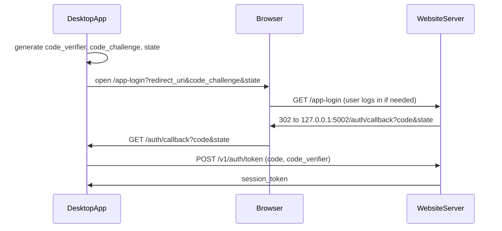

# Paid App — API Contract (desktop app <-> website server)

This is the interface between the desktop app (`budget_app`, the **client**) and the
website server (`budget_app_website`, the **server**). Both sides build against this
document. Any step that adds or changes an endpoint updates its entry here in the same
PR. Entries marked **TODO** are filled in by the step listed next to them.

See [PLAN.md](PLAN.md) for steps and status.

---

## Base URL and versioning

- Production: `https://workbenchbudgeting.com/v1`
- Local dev: `http://127.0.0.1:5001/v1` (website `serve.py` default port)
- The desktop app reads the server's **site root** from `BUDGET_APP_CLOUD_URL` (default
  `https://workbenchbudgeting.com`; a trailing `/` or `/v1` is ignored) and adds `/v1` for
  the API and `/app-login` for browser sign-in. For local dev, set it to `http://127.0.0.1:5001`.
- Breaking changes require a new version prefix (`/v2`); additive changes (new optional
  fields, new endpoints) do not. Clients must ignore unknown response fields.
- All requests and responses are JSON (`Content-Type: application/json`), UTF-8.
  Timestamps are ISO 8601 UTC strings. Amounts are decimal numbers in account currency.

## Authentication

All `/v1/*` endpoints except `POST /v1/auth/token` require:

```
Authorization: Bearer <session_token>
```

A missing, unknown, expired, or revoked token gets 401 `unauthorized` with
`WWW-Authenticate: Bearer`. The whole `/v1` API 404s while `ACCOUNTS_ENABLED` is off.

Session tokens are opaque random strings. The server stores only a hash. The desktop
app stores the token in the OS keychain (`keyring`), never in SQLite or `.env`.

### Desktop sign-in flow (PKCE, loopback redirect) — steps 10 and 14



1. App generates `code_verifier` (random), `code_challenge = BASE64URL(SHA256(verifier))`,
   and `state` (random).
2. App opens the browser to (all values URL-encoded):
   `GET /app-login?redirect_uri=http://127.0.0.1:5002/auth/callback&code_challenge=<c>&code_challenge_method=S256&state=<s>&device_name=<name>`
   - `redirect_uri`: exactly `http://127.0.0.1:<port>/auth/callback` or
     `http://localhost:<port>/auth/callback` (explicit port, no query or fragment).
   - `code_challenge`: 43 characters (unpadded base64url SHA-256). `code_challenge_method`
     must be `S256`.
   - `state`: required, up to 256 characters. Returned unchanged.
   - `device_name`: optional, shown to the user; whitespace collapsed, cut to 100 characters.
   - Any missing or invalid parameter → a 400 error page in the browser and **no redirect**
     (so the app just stops waiting after its own timeout).
3. Server requires a web login (password or Google; logged-out users go through `/login`
   and come back), then shows a confirmation page: "The Workbench Budgeting app on
   <device_name> wants to sign in as <email>" with **Continue**, **Use a different account**
   (logs out of the website and starts over), and **Cancel**.
   - Continue → `302 redirect_uri?code=<one-time code>&state=<s>`. Codes expire after
     5 minutes and are single-use.
   - Cancel → `redirect_uri?error=access_denied&state=<s>`.
4. App checks `state` (and handles `error=access_denied` by showing "Sign-in canceled"),
   then calls `POST /v1/auth/token` with the code and its `code_verifier`.

Desktop side (step 14): the app's UI runs in the user's browser, so "Sign in" opens the
app's own `GET /auth/start` in a new tab, which redirects to `/app-login`. The
`redirect_uri` uses the host and port the UI is on (`127.0.0.1` or `localhost`), so the
callback lands on the same origin and the UI tab notices the sign-in. Each `state` and
its verifier are kept in memory for 10 minutes and used once. The token goes into the OS
keychain, one entry per server URL.

Session tokens last **180 days** from sign-in (no sliding renewal). A session also ends when
the user signs out of the app (`POST /v1/auth/logout`), when their password is changed,
reset, or removed (the same rule that ends other web sessions), or when the account is
deleted. Any of these → 401 on the next call; the app clears the token and shows Sign in.

## Error format

Every non-2xx response has this body:

```json
{ "error": { "code": "subscription_required", "message": "Human-readable explanation" } }
```

| HTTP | `code` | Meaning | Client behavior |
| --- | --- | --- | --- |
| 400 | `bad_request` | Invalid input | Show message |
| 401 | `unauthorized` | Missing, invalid, expired, or revoked session token | Clear token, prompt sign-in |
| 402 | `subscription_required` | Signed in but no active subscription (see `paid_access` in `/v1/me`) | Refresh `/v1/me` and show the lock screen (step 14a) with a link to `/account` |
| 400 | `item_limit_reached` | Already 10 bank connections (Plaid bills per connection) | Show message; suggest removing one |
| 404 | `not_found` | Resource does not exist or is not the caller's | Show message |
| 409 | `plaid_relink_required` | Plaid item needs re-authentication (e.g. `ITEM_LOGIN_REQUIRED`) | Start update-mode Link for that item |
| 429 | `rate_limited` | Too many requests | Retry after `Retry-After` seconds |
| 502 | `plaid_error` | Upstream Plaid failure | Show message, allow retry |
| 503 | `plaid_not_ready` | Plaid is still loading a newly linked bank's history (`PRODUCT_NOT_READY`, usually a few seconds after linking) | Retry after `Retry-After` seconds |

---

## Endpoints

### Auth

#### `POST /v1/auth/token` — step 10
Exchange a one-time code for a session token. No bearer token required. Rate limited
(20/minute per IP; 429).

Request:
```json
{ "code": "…", "code_verifier": "…", "device_name": "Max's MacBook" }
```
- `code_verifier`: 43–128 characters from `A-Z a-z 0-9 - . _ ~` (RFC 7636).
- `device_name`: optional; overrides the one sent to `/app-login`.

Response 200:
```json
{ "session_token": "…", "expires_at": "2027-04-02T22:14:00Z", "user": { "id": 1, "email": "…" } }
```

Errors: 400 `bad_request` if the body isn't a JSON object, a field is missing or the wrong
type, or the code is unknown, expired, already used, or doesn't match the verifier. The
first redemption attempt uses up the code even if the verifier is wrong, so on any 400 the
app starts sign-in again.

#### `GET /v1/me` — steps 10 and 13a
Current user and entitlement. `paid_access` comes from `billing.has_paid_access(user)` (steps 9
and 13a) and unlocks the whole desktop app (the Sample profile is free without it): true
for `active`/`trialing`; `past_due` for 7 days after the failed renewal; `canceled` at the customer's
request until `current_period_end`; false otherwise (including cancellation for non-payment).

Response 200:
```json
{
  "user": { "id": 1, "email": "…", "email_verified": true },
  "paid_access": true,
  "access_until": "2026-11-01T12:30:00Z",
  "trial_available": false,
  "subscription": { "status": "active", "current_period_end": "2026-11-01T12:30:00Z", "cancel_at_period_end": false },
  "account_url": "https://workbenchbudgeting.com/account"
}
```
- `access_until` (step 13a): the time until which access is already guaranteed with no
  further payment, ISO 8601 UTC. The desktop stays unlocked offline until `access_until`
  plus its offline grace (step 14a). Always `null` when `paid_access` is false.

  | State | `paid_access` | `access_until` |
  | --- | --- | --- |
  | `active` (renewing or set to cancel) | true | `current_period_end` |
  | `trialing` (free trial, including a canceled trial) | true | the trial's end (Stripe's `current_period_end` during a trial) |
  | `past_due`, within 7 days of the failed renewal | true | the end of those 7 days |
  | `canceled` at the customer's request, before `current_period_end` | true | `current_period_end` |
  | Anything else (no subscription, grace over, canceled for non-payment, `unpaid`, `incomplete`, `paused`, …) | false | `null` |

  Two edge cases while `paid_access` is true: `access_until` is `null` if Stripe hasn't
  reported a period end yet, and for a moment around renewal it can be slightly in the
  past (the renewal webhook hasn't arrived). Online, trust `paid_access`; use
  `access_until` only for deciding how long to stay unlocked offline.
- `trial_available` (step 13a): true when the user has never had a free trial and trials
  are on (`TRIAL_DAYS` > 0, 7 by default). Label the Subscribe button "Start your free
  week" when true. A trial is used up as soon as Stripe reports a subscription with one;
  canceling the trial doesn't bring it back.
- `subscription` is `null` until the user has started a subscription. `status` is Stripe's
  status string (`active`, `trialing`, `past_due`, `canceled`, `unpaid`, `incomplete`,
  `paused`, …); clients should use `paid_access`, not `status`, to decide what's allowed.
  `current_period_end` may be `null`.

Errors: 401 `unauthorized`.

How the desktop uses it (step 14a; no server change): it keeps `paid_access`,
`access_until`, and the time of the check in the keychain and stays unlocked while
`paid_access` is true and `now < max(access_until, checked_at) + 3 days` (from
`checked_at` alone when `access_until` is `null`). It calls `/v1/me` at startup, every
6 hours, on sign-in, when the user opens the Account menu or clicks "I've subscribed,
check again", and, once
`access_until` has passed, before allowing a request (at most every 15 minutes). A 401
signs the app out and locks it; a network error or 5xx keeps the stored answer for the
offline grace.

#### `POST /v1/auth/logout` — step 10
Revokes the calling session token (other devices stay signed in). Response 204, no body.
Errors: 401 `unauthorized` (including an already revoked token).

### Plaid (all require a session **and** an active subscription; otherwise 401 / 402)

Bank syncing is one of the things the subscription unlocks (free trial included); the
402 is `subscription_required`, the same check as `paid_access` in `/v1/me`.

Exception: `DELETE /v1/plaid/items/<item_id>` needs only a session, so a user whose
subscription lapsed can still remove a bank. The `/v1/plaid` endpoints 404 unless
`ACCOUNTS_ENABLED` is on and the server has `PLAID_CLIENT_ID`, `PLAID_SECRET`, and
`PLAID_TOKEN_KEY` set. Any Plaid failure (error response or network) → 502 `plaid_error`,
except the specific errors listed for each endpoint (e.g. sync's 409 and 503).
Plaid access tokens are stored encrypted on the server and are **never** returned.

#### `POST /v1/plaid/link-token` — step 11
Create a Plaid Link token for the user (product `transactions`, 730 days of history
requested, US, English). No request body. Rate limited (30/hour per IP).

Response 200: `{ "link_token": "link-sandbox-…", "expiration": "2026-10-05T02:00:00Z" }`

Errors: 400 `item_limit_reached` if the user already has 10 items; 401; 402; 502.

Since step 13 the token also registers the server's webhook (`<PUBLIC_BASE_URL>/plaid/webhook`)
on the new Item, so Plaid reports login problems to the server. Without `PUBLIC_BASE_URL`
(local dev) no webhook is set; nothing else changes for the client.

#### `POST /v1/plaid/exchange` — step 11
Exchange the `public_token` from Plaid Link's `onSuccess`. Rate limited (20/hour per IP).

Request:
```json
{ "public_token": "public-sandbox-…", "institution": { "id": "ins_109508", "name": "First Platypus Bank" } }
```
- `institution` is optional (pass Link's `metadata.institution`, renaming `institution_id`
  to `id`). It's display-only: `id` is cut to 64 characters and `name` to 255.
- Exchanging a token for an Item the user already has updates it (new access token,
  institution, `status` back to `ok`). Plaid answers a repeat exchange of the same
  `public_token` with the same Item, so retrying after a timeout is safe and never
  creates a duplicate.

Response 200: `{ "item": <PlaidItem> }`

Errors: 400 `bad_request` (missing/blank `public_token`, `institution` not an object, or
Plaid says the public token is invalid or expired); 400 `item_limit_reached`; 401;
402; 502.

#### `GET /v1/plaid/items` — step 11
The caller's items, oldest first. Response 200: `{ "items": [<PlaidItem>, …] }`.
Errors: 401; 402.

#### `DELETE /v1/plaid/items/<item_id>` — step 11
Calls Plaid `/item/remove` and deletes the item. Response 204, no body. Session only (no
402). If Plaid says the Item is already gone (`ITEM_NOT_FOUND`, `INVALID_ACCESS_TOKEN`)
the item is still deleted. Errors: 401; 404 `not_found` (unknown or another user's item);
502 (the item is kept, so the user can retry).

#### `POST /v1/plaid/sync` — step 12
Fetches accounts and transactions from Plaid (`/transactions/get`, every page) and passes
them straight through. Transaction data is **not stored** on the server; only the item's
`status` and `last_synced_at` change. Rate limited (120/hour per IP).

Request (the body is optional; `{}` or no body means every item, 730 days):
```json
{ "item_id": "…", "days_back": 730 }
```
- `item_id`: optional. Given → sync just that item; omitted → every item of the caller's,
  oldest first.
- `days_back`: optional whole number, 1–730 (default 730). Transactions dated from
  `today − days_back` through today (UTC dates). Plaid only has the history requested at
  link time (730 days, see `link-token`).

Response 200:
```json
{
  "items": [
    {
      "item": <PlaidItem>,
      "accounts": [ <Plaid account>, … ],
      "transactions": [ <Plaid transaction>, … ],
      "error": null
    }
  ]
}
```
- `accounts` and `transactions` are Plaid's own `/transactions/get` JSON, unchanged (same
  field names and values; dates as `YYYY-MM-DD` strings; `amount` positive for money
  leaving the account, Plaid's convention). Newest transactions first. Includes pending
  transactions. Clients must ignore fields they don't use; Plaid adds fields over time.
- **Shared fixture:** [`fixtures/plaid_sync_response.json`](fixtures/plaid_sync_response.json)
  is a real sandbox response (5 accounts: checking, savings, credit card, IRA, student
  loan; 14 transactions). The server's tests check that it produces this file exactly.
  `scripts/check_sync_fixture_with_desktop.py` runs the desktop's unchanged
  `fetch_and_save_plaid_data` on it (run with the desktop's Python).
- **Desktop ingest (step 15):** the desktop's ingest code reads Plaid *objects* by
  attribute (`account.balances.current`), so plain dicts save nothing. Wrap the JSON
  recursively in `types.SimpleNamespace` (or rebuild plaid-python models) before passing
  it to `PlaidDataRetriever.save_data` / the grouping in `fetch_and_save_plaid_data`. The
  check script confirms the SimpleNamespace path saves exactly the same rows, including
  `hash_id`, as today's direct Plaid path, so moving a bank to the server doesn't
  duplicate transactions.
- On success `last_synced_at` is set and the item's `status` becomes `ok`, except that
  `relink_recommended` stays (the bank still works, but its consent ends soon; see
  `relink-complete`).

Errors with `item_id` (returned as the HTTP status):
- 409 `plaid_relink_required`: Plaid says `ITEM_LOGIN_REQUIRED`. The item's `status`
  becomes `relink_required` (also shown by `GET /v1/plaid/items`); start update-mode Link
  (step 13). The next successful sync sets it back to `ok`.
- 503 `plaid_not_ready` with `Retry-After` (seconds): right after linking, Plaid is still
  loading history. The desktop should retry; in the sandbox it takes about a second.
  Even after that, Plaid fills in older history over the next seconds to minutes (in the
  sandbox, a sync 1 s after linking returned 16 transactions and one 12 s after returned
  48). Sync again a little later; repeats are safe because the desktop dedupes by `hash_id`.
- 502 `plaid_error`: any other Plaid failure or timeout; the item is unchanged, except
  that if Plaid says the Item no longer exists (`ITEM_NOT_FOUND`, `INVALID_ACCESS_TOKEN`)
  its `status` becomes `error` (since step 13): remove it and link the bank again.
- 404 `not_found` (unknown or another user's item); 400 `bad_request` (body not a JSON
  object, bad `days_back` or `item_id`); 401; 402.

Without `item_id`, one bank's failure doesn't fail the rest: the response is still 200,
and that entry has `"accounts": []`, `"transactions": []`, and
`"error": { "code": "plaid_relink_required" | "plaid_not_ready" | "plaid_error", "message": "…" }`
(same meanings and item updates as above). 401/402/400 still apply to the whole request.

Large first pulls make many Plaid calls, so a request can take tens of seconds. Prefer one
request per item (the desktop already refreshes connections one by one) and allow a
client timeout of at least 120 seconds.

#### `POST /v1/plaid/items/<item_id>/relink-token` — step 13
Update-mode Link token for one item: open Plaid Link with it when the item's `status` is
`relink_required` (sync returned 409) or `relink_recommended`. The user signs in to the
bank again; the Item and its access token stay the same, so **don't** call `exchange`
afterwards. No request body. Rate limited (30/hour per IP).

Response 200: `{ "link_token": "link-sandbox-…", "expiration": "2026-10-05T02:00:00Z" }`

Errors: 401; 402; 404 `not_found` (unknown or another user's item); 502 `plaid_error`. If
Plaid says the Item no longer exists, the item's `status` becomes `error` and the 502 is
returned; update mode can't fix that, so remove the item and link the bank again.

#### `POST /v1/plaid/items/<item_id>/relink-complete` — step 13
Call after update-mode Link's `onSuccess`. Sets the item's `status` from
`relink_required` or `relink_recommended` back to `ok` (other statuses are left alone).
Plaid doesn't notify the server when update mode succeeds, so the client has to. If the
bank still needs a login, the next sync returns 409 and sets `relink_required` again.
No request body. Rate limited (30/hour per IP).

Response 200: `{ "item": <PlaidItem> }`

Errors: 401; 402; 404 `not_found`.

Typical flow: sync → 409 → `relink-token` → Link (update mode) → `relink-complete` → sync.

#### How the desktop uses the Plaid endpoints (step 15; no server change)
With `BUDGET_APP_CLOUD` on, the desktop's local Plaid routes call these endpoints
instead of Plaid (`backend/cloud_plaid.py`); the desktop never sees an access token.
- A linked bank is a local `plaid_connections` row with `token_label` `cloud:<item_id>`.
  Rows linked before (direct-path tokens) keep the direct path until step 16 re-links them.
- Link: `link-token` → Plaid Link → `exchange` (with `institution` built from Link's
  metadata) → `sync` for that item right away (retrying `plaid_not_ready` up to 4 times,
  waiting `Retry-After`, at most 10 s) → one more `sync` about 45 s later to pick up
  Plaid's backfill.
- Refresh: one `sync` per item (`days_back` 730, client timeout 120 s), one at a time.
  The JSON is wrapped in `SimpleNamespace` and saved by the same code as the direct path.
- `GET /items` (5 s timeout) is called when the connections list is shown, only if the
  profile has cloud rows, to show the server's `status`; it isn't stored locally.
- 409 → local status `relink_required` and a Reconnect button: `relink-token` → Link in
  update mode → `relink-complete` → `sync` (never `exchange`). `relink_recommended`
  offers Reconnect too; `error` or an item missing on the server says to remove and add
  the bank again.
- Remove: `DELETE /items/<item_id>` first (404 counts as done); if that fails the local
  row is kept and the error shown.
- 401 or 402 from any of these → the desktop refreshes its entitlement and answers its
  own UI with 402 `subscription_required`, which opens the lock screen (step 14a).

### Shared objects

#### `PlaidItem` — step 11
```json
{
  "item_id": "…",
  "institution_id": "ins_…",
  "institution_name": "…",
  "status": "ok | relink_recommended | relink_required | error",
  "created_at": "2026-10-04T23:10:00Z",
  "last_synced_at": null
}
```
`institution_id` and `institution_name` may be `null`. `last_synced_at` is `null` until the
first successful sync.

| `status` | Meaning | Set by | Cleared by |
| --- | --- | --- | --- |
| `ok` | Syncing works | Linking, a successful sync, `relink-complete`, Plaid's `LOGIN_REPAIRED` webhook | — |
| `relink_recommended` | Still syncs, but the bank's consent ends soon. Suggest re-linking (update mode) | Plaid's `PENDING_EXPIRATION` / `PENDING_DISCONNECT` webhooks (only when the item was `ok`) | `relink-complete`, `LOGIN_REPAIRED`, a re-exchange. A successful sync does **not** clear it |
| `relink_required` | Sync returns 409 until the user goes through update mode | A sync hitting `ITEM_LOGIN_REQUIRED`; Plaid's `ITEM` `ERROR` webhook | `relink-complete` (or `LOGIN_REPAIRED`) then a successful sync |
| `error` | The Item is gone at Plaid (user revoked access, or Plaid says it doesn't exist). Update mode can't fix it | Plaid's `USER_PERMISSION_REVOKED` webhook or an `ITEM` `ERROR` with `ITEM_NOT_FOUND`; sync or relink-token getting `ITEM_NOT_FOUND` / `INVALID_ACCESS_TOKEN` | Remove the item (`DELETE`) and link the bank again |

Items can also disappear from `GET /v1/plaid/items` without a client call: the server
removes every bank at Plaid when the subscription ends for good, or when the account is
deleted (step 13; see the server-only table).

---

## Server-only endpoints (not called by the desktop app)

Listed here so both sides know they exist.

| Endpoint | Step | Purpose |
| --- | --- | --- |
| `GET /healthz` | 1 | Health check: 200 `{"status": "ok"}`, or 503 `{"status": "error", "database": "unreachable"}` if the database query fails |
| `GET, POST /signup` | 4 | Create an account (email + password), then log in. HTML form with CSRF token; 404 when `ACCOUNTS_ENABLED` is off |
| `GET, POST /login` | 4 | Log in; honors a local-only `?next=` path, otherwise goes to `/account`. GET redirects there when already logged in. POST rate limited (5/min, 30/hour per IP; 429). 404 when the flag is off |
| `POST /logout` | 4 | Log out (CSRF token required, else 400), redirect to `/`. 404 when the flag is off |
| `GET, POST /forgot-password` | 5 | Request a reset email. Same response whether or not the email has an account. POST rate limited (5/hour per IP). 404 when the flag is off |
| `GET, POST /reset-password/<token>` | 5 | Choose a new password. Token expires after 1 hour and is single-use (it stops working once the password changes); invalid → 400 page. A successful reset also marks the email verified, logs the user in, and ends their other sessions. 404 when the flag is off |
| `GET /verify-email/<token>` | 5 | Mark the email verified. Token expires after 48 hours and is tied to the address it was sent to; reusing a valid link is harmless. Invalid → 400 page. 404 when the flag is off |
| `POST /verify-email/resend` | 5 | Logged-in only (CSRF token required): send a new verification link. Rate limited (3/hour). 404 when the flag is off |
| `GET, POST /account` | 6 | Logged-in only (otherwise 302 to `/login?next=/account`). Shows email, verification status (with resend), subscription status with Subscribe and/or Manage subscription buttons (steps 8–9; since step 13a the Subscribe button reads "Start your free week" when `trial_available`, and a trial shows "Free trial: ends on <date>, then $8.99/month"), and change-password / set-password, and (step 13) a collapsed "Delete account" section posting to `/account/delete`. POST changes the password (CSRF token required; current password required if one is set; rate limited 10/hour) and ends other sessions. 404 when the flag is off |
| `GET /auth/google` | 7 | Start "Sign in with Google": redirects to Google with `state` and `nonce` (stored in the session). Optional local-only `?next=`. Rate limited (20/hour). 404 when the flag is off or `GOOGLE_CLIENT_ID`/`GOOGLE_CLIENT_SECRET` are unset |
| `GET /auth/google/callback` | 7 | Google OpenID Connect callback. Checks `state`, exchanges the code, verifies the ID token and `nonce`, then matches the account: by Google `sub` first; if logged in, connects Google to the current account; otherwise (verified Google email only) links to the user with that email or creates one. Logs in and redirects to `next` or `/account`. Any failure (bad/missing/replayed state, user cancelled, unverified email, Google account linked elsewhere) → 400 page. Same 404 rules as above |
| `POST /account/google/unlink` | 7 | Logged-in only (CSRF token required): disconnect Google. Refused (with a message) if the user has no password, so the last sign-in method can't be removed. 404 when the flag is off |
| `POST /billing/checkout` | 8 | Logged-in only (CSRF token required; rate limited 10/hour): creates the user's Stripe customer on first use, then a Checkout Session for `STRIPE_PRICE_ID` and 303-redirects to it. Since step 13a, a user who has never had a trial gets `subscription_data.trial_period_days` = `TRIAL_DAYS` (default 7; 0 turns trials off): Checkout still collects a card, and Stripe charges $8.99 when the trial ends unless the user cancels first. Success returns to `/account?checkout=success`, cancel to `/account?checkout=canceled`. If the user already has a live subscription (`active`, `trialing`, `past_due`, `unpaid`, `incomplete`, `paused`), redirects to `/account` with a message instead. 404 when the flag is off or any `STRIPE_*` var is unset |
| `POST /stripe/webhook` | 8 | Stripe events. Verifies `Stripe-Signature` against `STRIPE_WEBHOOK_SECRET` (5-minute tolerance; failure → 400). No CSRF token. Handles `checkout.session.completed`, `customer.subscription.created/updated/deleted`, `invoice.paid`, `invoice.payment_failed` by re-fetching the subscription from Stripe and copying its status, renewal date, and pending cancellation into `subscriptions`. Other types are acknowledged and ignored. Each event ID is processed once (repeats → 200 `{"received": true, "duplicate": true}`); errors → 500 so Stripe retries. Since step 13, when Plaid is enabled and the subscription has ended for good (`canceled` or `incomplete_expired`, with no paid time left), it also removes the user's banks at Plaid and here, because Plaid bills per connected bank. A failed removal is logged and the bank kept for `flask plaid-remove-lapsed`; it doesn't fail the webhook. `unpaid` and `past_due` keep the banks, since a payment can still restore access. Events for a deleted user's customer are acknowledged. Since step 13a, any synced subscription with a trial sets `subscriptions.trial_used_at` (never cleared; one trial per account), and `customer.subscription.trial_will_end` (Stripe sends it 3 days before a trial ends) emails the user a reminder with the end date, the $8.99/month charge, and a link to `/account` to cancel. No email if the trial was already canceled or is no longer `trialing`; a failed email → 500 so Stripe resends, and a duplicate event sends nothing. `stripe listen --events` must include it. Same 404 rules as checkout |
| `POST /billing/portal` | 9 | Logged-in only (CSRF token required; rate limited 20/hour): creates a Stripe Customer Portal session for the user's customer and 303-redirects to it; the portal returns to `/account`. Users without a Stripe customer are redirected to `/account` with a message. Stripe errors (e.g. portal not configured) → back to `/account` with a message (Checkout does the same since step 9). Same 404 rules as checkout |
| `GET, POST /app-login` | 10 | Browser page for the desktop sign-in flow (see "Desktop sign-in flow" above). Logged-in only (otherwise 302 to `/login?next=…`, where password or Google login both return here). GET checks the parameters (invalid → 400 page, no redirect) and shows the confirmation page; POST (CSRF token required; rate limited 30/hour) issues the one-time code and 302s to the app's loopback `redirect_uri`. 404 when the flag is off |
| `POST /logout?next=<path>` | 10 | `/logout` (step 4) now honors a local-only `next` path, used by "Use a different account" on `/app-login`; anything else still goes to `/` |
| `POST /plaid/webhook` | 13 | Plaid Item events. Plaid calls it because `link-token` sets `<PUBLIC_BASE_URL>/plaid/webhook` on each Item. Verifies the `Plaid-Verification` JWT: ES256 only, signing key fetched from Plaid by `kid` (cached 1 hour; expired keys refused), issued no more than 5 minutes ago, and its `request_body_sha256` must match the raw body. Any failure → 400. No CSRF token; rate limited 300/minute. Updates the item's `status` (see the `PlaidItem` table): `ITEM` `ERROR` → `relink_required` (`error` if the code is `ITEM_NOT_FOUND`), `PENDING_EXPIRATION` / `PENDING_DISCONNECT` → `relink_recommended`, `USER_PERMISSION_REVOKED` → `error`, `LOGIN_REPAIRED` → `ok`. Everything else (e.g. `TRANSACTIONS` updates), unknown items, and events for another Plaid environment → 200 `{"received": true}` with no change. 404 unless accounts and Plaid are both enabled |
| `POST /account/delete` | 13 | Logged-in only (CSRF token required; rate limited 5/hour). The user types their email (case-insensitive) and, if they have a password, their current password. Then: removes every bank at Plaid (already-gone Items are fine), deletes the Stripe customer (Stripe cancels any subscription right away, no refund), and deletes the user with their sign-in methods, desktop sessions (the desktop's next call gets 401), subscription row, and bank rows. If Plaid or Stripe fails, the account is kept and `/account` shows a message so the user can retry. Success logs out and redirects to `/login` with "Your account has been deleted." 404 when the flag is off |
| `flask plaid-remove-lapsed` | 13 | CLI, not HTTP. Removes the banks (at Plaid and here) of every user whose subscription has ended (see `/stripe/webhook`). Catches what no Stripe event announces (a subscription canceled immediately keeps access until its period ends) and retries removals that failed. Safe to run any time, e.g. from a daily Render Cron Job. Only registered when Plaid is enabled |
