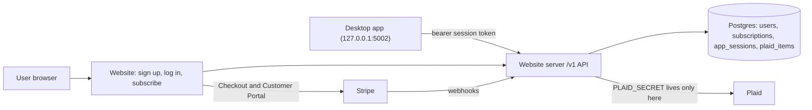

# Paid App — Master Plan

**Goal:** A **$8.99/month** subscription unlocks the whole Workbench Budgeting desktop
app. Plaid bank syncing is included at no extra cost. The reserved **Sample** profile
stays free for anyone, with no account needed, so people can try the app first. The
website (`budget_app_website`) becomes the hosted server that owns accounts, billing,
and all Plaid API calls. The desktop app (`budget_app`) becomes a client of that server.

The project started as "paid Plaid" (only bank syncing was paid) and changed scope on
2026-10-05 (see the Decisions log). The folder is still `docs/paid_plaid/` so existing
links keep working.

- API contract (desktop <-> server): [API_CONTRACT.md](API_CONTRACT.md)
- Prompt for running a step with an agent: [AGENT_PROMPT.md](AGENT_PROMPT.md)
- Existing token-storage design notes (desktop repo): `../budget_app/docs/plaid_token_storage.md`

**Status legend:** `todo` · `in-progress` · `blocked` · `done`

**Run the steps in number order.** Every step depends only on earlier steps, so the next
step is always the lowest-numbered one that is not `done`.

---

## Checklist

| # | Step | Repo |
| --- | --- | --- |
| 1 | Database and app scaffolding | website |
| 3 | Provision hosting (manual) | website + dashboards |
| 4 | Users, sign up, log in, log out | website |
| 5 | Password reset and email verification | website |
| 6 | My account page | website |
| 7 | Sign in with Google | website |
| 8 | Stripe Checkout and webhooks | website |
| 9 | Customer Portal and the paid-access check | website |
| 10 | App sessions and desktop sign-in API | website |
| 11 | Plaid link and exchange on the server | website |
| 12 | Transaction sync endpoint | website |
| 13 | Plaid connection lifecycle | website |
| 13a | Whole-app paid access and a 1-week free trial | website |
| 14 | Desktop cloud client and sign-in | desktop |
| 14a | Lock everything except the Sample profile behind the subscription | desktop |
| 15 | Route desktop Plaid through the server | desktop |
| 16 | Re-link prompt for existing connections | desktop |
| 17 | Legal pages | website |
| 18 | Go live with Stripe, Plaid, and Google (manual) | dashboards |
| 18a | Security hardening: headers, verified email for desktop sign-in, security logs, pinned dependencies, CI | website |
| 18b | Email code at sign-in (MFA) | website |
| 18c | Written security policies and Plaid questionnaire answers | website (docs) |
| 19 | Launch | desktop + website |
| 20 | Remove the direct Plaid path | desktop |

Update the status in the step section below; this table is only an index.

There is no step 2: it (serving downloads from GitHub Releases) was dropped, and the
other steps keep their numbers so existing references stay valid. For the same reason,
the steps added for the whole-app subscription are 13a and 14a: run them in table order
(13 → 13a → 14 → 14a → 15).

Steps 18a–18c (security work for Plaid's security questionnaire) are the one exception to
"lowest-numbered first": they run while step 18's dashboard work is still in progress,
because the questionnaire (part of step 18) is submitted only after 18c. Run them in
order: 18a → 18b → 18c.

---

## Architecture



## Ground rules (keep every step shippable)

1. **One step = one agent session = one PR in one repo** (step 19 is the only step with
   a PR in each repo). Each PR must be mergeable on its own without breaking anything
   that already works.
2. **In order.** Steps are numbered in a safe run order; don't start a step until every
   step it depends on is `done`.
3. **Feature flags:**
   - Website: new public-facing account/billing features stay behind
     `ACCOUNTS_ENABLED` (default **off** in production) until step 19.
   - Desktop: everything cloud-related (sign-in, the subscription lock from step 14a,
     and Plaid through the server) stays behind `BUDGET_APP_CLOUD` (default **off**)
     until step 19. With it off, the app is free and unlocked exactly as today, and
     today's direct Plaid path keeps working. (This flag was called
     `BUDGET_APP_CLOUD_PLAID` before 2026-10-05; nothing used that name yet.)
4. **Contract first.** Any new or changed endpoint updates
   [API_CONTRACT.md](API_CONTRACT.md) in the same PR.
5. **Branch naming:** `feature/mhoff/<short_topic>_<yyyymmdd>`.
6. **Close out every step:** set its status, add the PR link, log any decisions, and
   add a Handoff notes entry.
7. **Secrets never go in git.** Use environment variables (and `.env.example` for names only).

---

## Phase A — Groundwork (website)

### 1. Database and app scaffolding
- **Repo:** budget_app_website
- **Depends on:** —
- **Scope:** Add SQLAlchemy + Flask-Migrate (Alembic). Read `DATABASE_URL`, falling back
  to a local SQLite file for dev. Add `/healthz`, a pytest setup with a test client
  fixture, `.env.example`, and the `ACCOUNTS_ENABLED` flag (read from env, default off).
  Restructure `serve.py` only as much as needed (e.g. an app factory or `app/` package);
  `gunicorn serve:app` must still work.
- **Done when:** Existing pages render unchanged, `flask db upgrade` runs locally,
  `pytest` passes, `/healthz` returns 200.
- **Status:** done
- **PR:** [#38](https://github.com/maxwell-hoff/budget_app_website/pull/38)

### 3. Provision hosting (manual — you)
- **Repo:** budget_app_website (Render dashboard + `render.yaml`)
- **Depends on:** 1
- **Scope:** Create Postgres (Render or Neon), move the web service off the free tier,
  set env vars (`DATABASE_URL`, `SECRET_KEY`, `ACCOUNTS_ENABLED=false`), run migrations
  on deploy (`preDeployCommand: flask db upgrade` in `render.yaml`), set billing alerts.
  An agent can prepare the `render.yaml` change; the dashboard work is manual.
- **Done when:** Production deploy is healthy (`/healthz` 200) and connected to Postgres.
- **Status:** done
- **PR:** [#39](https://github.com/maxwell-hoff/budget_app_website/pull/39)

## Phase B — Accounts (website, behind `ACCOUNTS_ENABLED`)

### 4. Users, sign up, log in, log out
- **Repo:** budget_app_website
- **Depends on:** 1
- **Scope:** `users` table (`id`, `email` unique/lowercased, `password_hash` (nullable,
  so Google-only users from step 7 fit), `created_at`, `email_verified_at`). Flask-Login
  sessions, strong password hashing, CSRF protection on forms, basic rate limiting on
  login. Routes: `/signup`, `/login`, `/logout`. All return 404 when `ACCOUNTS_ENABLED`
  is off.
- **Done when:** With the flag on, a user can sign up, log in, and log out; with it off,
  the routes 404 and the site looks unchanged. Tests cover both.
- **Status:** done
- **PR:** [#40](https://github.com/maxwell-hoff/budget_app_website/pull/40)

### 5. Password reset and email verification
- **Repo:** budget_app_website
- **Depends on:** 4
- **Scope:** Transactional email provider (Resend or Postmark) behind a small `send_email`
  helper (logs to console in dev). Signed, expiring tokens for reset and verification.
  Routes: `/forgot-password`, `/reset-password/<token>`, `/verify-email/<token>`.
- **Done when:** Reset and verify flows work end to end in dev (console email) and tests
  cover token expiry/reuse.
- **Status:** done
- **PR:** [#41](https://github.com/maxwell-hoff/budget_app_website/pull/41)

### 6. My account page
- **Repo:** budget_app_website
- **Depends on:** 4
- **Scope:** `/account` (login required): email, verification status, placeholder for
  subscription status, change password, nav link when logged in (flag on only).
- **Done when:** Page renders for logged-in users, redirects to login otherwise.
- **Status:** done
- **PR:** [#42](https://github.com/maxwell-hoff/budget_app_website/pull/42)

### 7. Sign in with Google
- **Repo:** budget_app_website
- **Depends on:** 4, 6
- **Scope:** Google OpenID Connect via Authlib. `oauth_identities` table (`user_id`,
  `provider` = `google`, `provider_subject` (Google `sub`, unique per provider),
  `email`, `created_at`). Routes: `/auth/google` (starts the flow with `state` and
  `nonce`) and `/auth/google/callback` (verifies the ID token, then logs in). Account
  matching: look up by `provider_subject` first; if not found and Google says the email
  is verified, link to the existing user with that email (or create a new user with no
  password and `email_verified_at` set). "Continue with Google" button on `/login` and
  `/signup`. On `/account`, show linked sign-in methods, and let a Google-only user
  set a password; never allow removing the last sign-in method. Env: `GOOGLE_CLIENT_ID`,
  `GOOGLE_CLIENT_SECRET`. Routes 404 when `ACCOUNTS_ENABLED` is off, and the button is
  hidden if the Google env vars are missing. The desktop sign-in flow (step 10) needs
  no changes because `/app-login` uses whatever web login the user picks.
- **Before starting (manual):** Create an OAuth client in Google Cloud Console (type
  "Web application") with redirect URI `http://127.0.0.1:5001/auth/google/callback`.
- **Done when:** A new user can sign up with Google, an existing password user can sign
  in with Google and end up on the same account. Tests mock Google's token and userinfo
  responses, including an unverified email (must not link) and a bad `state` (rejected).
- **Status:** done
- **PR:** [#43](https://github.com/maxwell-hoff/budget_app_website/pull/43)

## Phase C — Billing (website, Stripe test mode)

### 8. Stripe Checkout and webhooks
- **Repo:** budget_app_website
- **Depends on:** 6
- **Before starting (manual):** Create a Stripe account; in test mode create the
  product and the $8.99/month price; install the Stripe CLI.
- **Scope:** `subscriptions` table (`user_id`, `stripe_customer_id`,
  `stripe_subscription_id`, `status`, `current_period_end`, `cancel_at_period_end`) and
  `stripe_events` table (processed event ids, for idempotency). `POST /billing/checkout`
  creates a Checkout Session for the $8.99/month price (`STRIPE_PRICE_ID`).
  `POST /stripe/webhook` verifies the signature (`STRIPE_WEBHOOK_SECRET`) and handles
  `checkout.session.completed`, `customer.subscription.created|updated|deleted`,
  `invoice.paid`, `invoice.payment_failed`.
- **Done when:** In Stripe test mode (Stripe CLI forwarding webhooks), subscribing
  creates an `active` subscription row; canceling updates it. Webhook tests use signed
  fixture payloads; duplicate events are ignored.
- **Status:** done
- **PR:** [#44](https://github.com/maxwell-hoff/budget_app_website/pull/44)

### 9. Customer Portal and the paid-access check
- **Repo:** budget_app_website
- **Depends on:** 8
- **Scope:** `POST /billing/portal` redirects to the Stripe Customer Portal.
  `has_plaid_access(user)` is the **single** place that decides access: true if status
  is `active`/`trialing`, or `past_due` within a short grace period, or canceled but
  `now < current_period_end`. Show status + Subscribe/Manage buttons on `/account`.
- **Done when:** Unit tests cover every status branch of `has_plaid_access`; the account
  page shows the right button for each state.
- **Status:** done
- **PR:** [#45](https://github.com/maxwell-hoff/budget_app_website/pull/45)

## Phase D — Desktop sign-in API (website)

### 10. App sessions and desktop sign-in API
- **Repo:** budget_app_website
- **Depends on:** 9
- **Scope:** `app_sessions` table (`user_id`, `token_hash`, `device_name`, `created_at`,
  `last_used_at`, `expires_at`, `revoked_at`) and short-lived one-time `auth_codes`.
  `GET /app-login` (browser; requires web login, then redirects to
  `http://127.0.0.1:5002/auth/callback?code=...&state=...`; only loopback redirect URIs
  allowed). `POST /v1/auth/token` (code + PKCE verifier -> session token),
  `GET /v1/me`, `POST /v1/auth/logout`. A `require_app_session` decorator for `/v1/*`.
  `/app-login` returns 404 while `ACCOUNTS_ENABLED` is off, like the other account pages.
- **Done when:** A scripted test performs the full code -> token -> `/v1/me` flow
  (after both a password login and a Google login); tokens are stored hashed;
  revoked/expired tokens get 401. Contract updated.
- **Status:** done
- **PR:** [#46](https://github.com/maxwell-hoff/budget_app_website/pull/46)

## Phase E — Hosted Plaid (website, Plaid sandbox)

### 11. Plaid link and exchange on the server
- **Repo:** budget_app_website
- **Depends on:** 10
- **Before starting (manual):** Get Plaid sandbox keys from the Plaid Dashboard.
- **Scope:** `plaid_items` table (`user_id`, `item_id`, `access_token_encrypted`
  (Fernet, key from `PLAID_TOKEN_KEY`), `institution_id`, `institution_name`, `status`,
  `transactions_cursor`, `created_at`). Endpoints: `POST /v1/plaid/link-token`,
  `POST /v1/plaid/exchange`, `GET /v1/plaid/items`, `DELETE /v1/plaid/items/<id>`
  (calls Plaid `/item/remove`). All require an app session (401) **and**
  `has_plaid_access` (402). Port client setup from
  `../budget_app/backend/plaid_data_retreiver.py`. Env: `PLAID_CLIENT_ID`,
  `PLAID_SECRET`, `PLAID_ENVIRONMENT`.
- **Done when:** Against Plaid sandbox, a test user can create a link token, exchange a
  sandbox public token, list, and delete items. Access tokens are never returned to
  the client. Contract updated.
- **Status:** done
- **PR:** [#47](https://github.com/maxwell-hoff/budget_app_website/pull/47)

### 12. Transaction sync endpoint
- **Repo:** budget_app_website
- **Depends on:** 11
- **Scope:** `POST /v1/plaid/sync` returns accounts and transactions for the user's items
  (or one item) in the shape the desktop ingest already consumes (see
  `../budget_app/backend/plaid_data_fetcher.py` and `plaid_data_retreiver.py`), with
  `days_back` support for the initial pull. Transaction data is passed through, not
  stored. Map Plaid `ITEM_LOGIN_REQUIRED` to 409.
- **Done when:** Sandbox sync returns data that the desktop ingest code accepts
  unchanged (verified with a fixture shared in the contract). Contract updated.
- **Status:** done
- **PR:** [#48](https://github.com/maxwell-hoff/budget_app_website/pull/48)

### 13. Plaid connection lifecycle
- **Repo:** budget_app_website
- **Depends on:** 12
- **Scope:** `POST /plaid/webhook` (verify Plaid webhook JWT) to mark items needing
  re-link; update-mode link token support (`POST /v1/plaid/items/<id>/relink-token`).
  When a subscription fully ends (Stripe webhook), call `/item/remove` for that user's
  items so Plaid stops billing. Account deletion (`/account/delete`) purges items,
  sessions, and the user.
- **Done when:** Tests cover subscription-ended -> items removed, and webhook-driven
  status changes. Contract updated.
- **Status:** done
- **PR:** [#49](https://github.com/maxwell-hoff/budget_app_website/pull/49) (merged)

### 13a. Whole-app paid access and a 1-week free trial
- **Repo:** budget_app_website
- **Depends on:** 13
- **Scope:** Renames and wording, plus the free trial. Who has access stays the same
  (every status rule from step 9 is kept; `trialing` already counts as paid).
  - `billing.has_plaid_access` → `has_paid_access`, still the **single** place that
    decides access. `plaid_api.require_plaid_access` → `require_paid_access`.
  - API (no desktop client exists yet, so renaming now breaks nothing): `/v1/me`
    `plaid_access` → `paid_access`, and add `access_until`, the time until which access
    is already guaranteed with no further payment (`current_period_end` for
    `active`/`trialing`/canceled-at-request, the grace deadline for `past_due`, `null`
    when there's no access). The desktop uses it to keep working offline (step 14a).
    Error 402 `plaid_access_required` → `subscription_required`.
  - The Plaid endpoints keep requiring the subscription, so bank syncing is simply one of
    the things the subscription unlocks. Removing banks when a subscription ends
    (step 13) is unchanged.
  - `/account` copy: "Workbench Budgeting, $8.99/month (includes bank syncing)" instead
    of "Bank syncing, $8.99/month"; the status lines say the app, not bank syncing,
    stays on until a date.
  - **Free trial (7 days):**
    - `/billing/checkout` adds `subscription_data.trial_period_days` from a new
      `TRIAL_DAYS` setting (default 7; 0 turns trials off) for users who haven't had a
      trial yet. Nobody gets a second trial: a new `subscriptions.trial_used_at`
      column (migration) is set when Stripe first reports a subscription with a
      trial, and resubscribing after that has no trial.
    - The card is collected up front (Checkout's default). Stripe charges $8.99 when
      the trial ends unless the user cancels first. Canceling during the trial keeps
      access until the trial's end, the same rule as canceling a paid month.
    - Handle `customer.subscription.trial_will_end` (Stripe sends it 3 days before the
      trial ends) by emailing a reminder through `mailer.py`: the end date, the
      $8.99/month charge, and a link to `/account` to cancel. Add the event to the
      `stripe listen --events` list and the webhook docs.
    - `/account`: "Start your free week" (with "then $8.99/month, cancel anytime")
      when the user can still get a trial, otherwise "Subscribe for $8.99/month";
      while trialing, "Free trial: ends on <date>, then $8.99/month".
    - `/v1/me`: `access_until` for `trialing` is the trial's end. Add
      `trial_available` (true when the user has never had a trial) so the desktop lock
      screen can say "Start your free week".
    - Trial users can link banks like any paid user, within the existing 10-bank cap.
  - Update `scripts/desktop_flow_check.py`, tests, `CLAUDE.md`, and `API_CONTRACT.md`.
- **Before starting (manual):** In the Stripe dashboard (test mode), rename the product
  to "Workbench Budgeting" with a description like "Full access to the Workbench
  Budgeting app, including bank syncing". The price and tax code stay the same. If
  `stripe listen` is running, restart it with `customer.subscription.trial_will_end`
  added to `--events`.
- **Done when:** All existing tests pass with the new names; `/v1/me` returns
  `paid_access`, `trial_available`, and a correct `access_until` for every
  subscription state (tests); no `plaid_access` names remain outside the Decisions log
  and Handoff notes. Trial tests: a first Checkout includes the 7-day trial, a second
  one (after `trial_used_at` is set) doesn't, `TRIAL_DAYS=0` turns it off, and
  `trial_will_end` sends one reminder email (not repeated for a duplicate event). Live
  in Stripe test mode with a test clock: subscribe → `trialing` with access → advance
  4 days → reminder email → advance past day 7 → `active` and the first $8.99
  invoice paid; a second test user cancels during the trial and loses access at the
  trial's end.
- **Status:** done
- **PR:** [#51](https://github.com/maxwell-hoff/budget_app_website/pull/51) (merged)

## Phase F — Desktop client (budget_app, behind `BUDGET_APP_CLOUD`)

### 14. Desktop cloud client and sign-in
- **Repo:** budget_app
- **Depends on:** 10, 13a
- **Scope:** `backend/cloud_client.py` (base URL from `BUDGET_APP_CLOUD_URL`, bearer
  token, typed errors for 401/402/409). Routes in `serve.py`: `/auth/start` (generates
  PKCE + state, opens browser to `/app-login`), `/auth/callback` (exchanges code, stores
  token via `keyring`), `/api/cloud/me`, `/api/cloud/logout`. Actions menu in
  `frontend/templates/index.html`: Sign in / Signed in as ... / Manage subscription.
  Only visible when the flag is on. **No Plaid behavior changes and nothing is locked
  yet** (step 14a adds the lock).
- **Done when:** With the flag on, sign-in round-trips against a local website server
  and the menu shows the subscription status from `/v1/me`; with it off, nothing in the
  UI changes. Tests mock the server.
- **Status:** done
- **PR:** [budget_app #118](https://github.com/maxwell-hoff/budget_app/pull/118) (merged)

### 14a. Lock everything except the Sample profile behind the subscription
- **Repo:** budget_app
- **Depends on:** 13a, 14
- **Before starting (decide, then log in the Decisions log):**
  - What a lapsed or never-subscribed user sees on their own profiles. Default: **fully
    locked** (a lock screen; the data stays untouched on disk and comes back when they
    subscribe). Alternative: read-only (view and export, no edits or imports), which is
    more work because every write endpoint has to be sorted.
  - (Free trial: decided on 2026-10-05, one week, built in step 13a.)
  - Offline grace. Default: keep working until `access_until` plus **3 days** without
    reaching the server.
  - Existing users of today's free version. Default: same rules as everyone (they see
    the lock until they subscribe; their data is kept). Alternative: a time-limited
    grace period for installs that already have non-Sample profiles.
- **Scope:** With `BUDGET_APP_CLOUD` on:
  - `backend/entitlement.py` keeps `{user_id, paid_access, access_until, checked_at}`
    from `/v1/me` in the keychain next to the session token. Refresh on startup, on
    sign-in, every 6 hours while running, and from an "I've subscribed, check again"
    button. Unlocked while `paid_access` is true and `now < access_until` (+ offline
    grace when the server can't be reached). 401 clears it.
  - A `before_request` guard in `serve.py`: any `/api/*` request whose profile
    (`_get_profile_id_from_request() or _active_profile_id`) isn't the Sample profile
    (`_is_sample_profile`) gets 402 `subscription_required` unless unlocked. A short
    allowlist stays open: listing and switching profiles (so the user can pick Sample),
    the sign-in and `/api/cloud/*` routes, and static files.
  - `frontend/templates/index.html`: on a 402, show a lock screen ("Subscribe to use
    your own budgets. The Sample profile is free.") with Sign in / Subscribe (opens
    `account_url`; labeled "Start your free week" when `/v1/me` says
    `trial_available` or the user isn't signed in yet) / "I've subscribed, check
    again" / "Open the Sample profile". The profile picker marks locked profiles.
  - Creating a profile and the guided setup (`gui.py`, `setup_wizard.py`) ask the user
    to sign in and subscribe first; "Use the Sample profile" (`gui.py`
    `_use_sample_profile`) stays available without an account.
  - No profile other than the reserved one can be named or renamed "Sample".
  - The Sample profile can't connect banks (hide Connect bank there); the server would
    refuse anyway without a subscription.
  - Locking never deletes or changes data.
- **Done when:** Flag off: identical to today. Flag on and signed out: the Sample
  profile works fully, other profiles show the lock screen, and a test walks
  `app.url_map` to prove every non-allowlisted `/api/*` route returns 402 for a
  non-Sample profile. Subscribed: everything works. Expired `access_until`: locks.
  Offline within the grace period: works; past it: locks. Tests mock the server and
  the clock.
- **Status:** done
- **PR:** [budget_app #119](https://github.com/maxwell-hoff/budget_app/pull/119) (merged)

### 15. Route desktop Plaid through the server
- **Repo:** budget_app
- **Depends on:** 12, 14a
- **Scope:** When the flag is on, the local Plaid routes in `serve.py`
  (`/api/plaid/create-link-token`, `/api/plaid/exchange-public-token`,
  `/api/plaid/connections`, `.../refresh`, `DELETE .../<id>`) call `cloud_client`
  instead of Plaid directly; synced data flows into the existing ingest code.
  `frontend/templates/plaid_connect.html` keeps calling the local endpoints. A 402
  `subscription_required` from the server (the subscription lapsed since the last
  check) refreshes the entitlement and shows step 14a's lock screen; 409 -> re-link
  prompt using the relink-token endpoint from step 13.
- **Done when:** With the flag on, link + sync + re-link works end to end against
  sandbox via the local website server; with the flag off, behavior is identical to today.
- **Status:** done
- **PR:** [budget_app #120](https://github.com/maxwell-hoff/budget_app/pull/120) (merged)

### 16. Re-link prompt for existing connections
- **Repo:** budget_app
- **Depends on:** 13, 15
- **Scope:** With the flag on, detect connections that exist only locally (direct-path
  tokens in `plaid_tokens`) and, once the user is subscribed (step 14a's lock comes
  first), show a one-time prompt to re-link them through the cloud; keep their existing
  transactions. The flag stays **off by default** in this step; turning it on happens at
  launch (step 19).
- **Done when:** With the flag on, an app with existing local connections keeps all its
  data and, after subscribing, walks the user through re-linking. With the flag off,
  nothing changes.
- **Status:** done
- **PR:** [budget_app #121](https://github.com/maxwell-hoff/budget_app/pull/121) (merged; not yet checked by hand)

## Phase G — Launch

### 17. Legal pages
- **Repo:** budget_app_website
- **Depends on:** 1
- **Scope:** `/privacy`, `/terms`, `/refunds` pages linked in the footer (Stripe,
  Plaid, and Google all require them). Content drafted for you to review. These are
  public from the start (not behind `ACCOUNTS_ENABLED`). The terms describe one
  $8.99/month subscription for the whole app (bank syncing included, the Sample
  profile free), the 1-week free trial (one per person, card required, charged
  $8.99/month when it ends unless canceled first), what happens to local data when a subscription ends (kept on the
  user's computer, locked until they resubscribe), and the refund policy.
- **Done when:** Pages render and are linked from every page footer.
- **Status:** done
- **PR:** [#56](https://github.com/maxwell-hoff/budget_app_website/pull/56) (merged)

### 18. Go live with Stripe, Plaid, and Google (manual — you)
- **Repo:** — (dashboards)
- **Depends on:** 13, 17
- **Scope:** Stripe live mode (product named "Workbench Budgeting" for the whole app,
  price, webhook endpoint including `customer.subscription.trial_will_end`, portal
  config; `TRIAL_DAYS` left at 7 on Render); Plaid
  production access and security questionnaire; Google OAuth consent screen published
  with the production redirect URI (`https://workbenchbudgeting.com/auth/google/callback`),
  privacy policy and terms links, and brand verification if Google requests it; set
  production env vars. Keep `ACCOUNTS_ENABLED=false` until step 19.
  First decide which Plaid team goes live (see the 2026-10-05 decision): the original team
  if Plaid support has restored an Admin, otherwise the new "Workbench Budgeting" team
  (apply for production access there).
- **Done when:** With `ACCOUNTS_ENABLED` turned on briefly for yourself (or on a
  staging service), a real $8.99 subscription unlocks the app and a real bank link
  works in production.
- **Checklist:** [GO_LIVE.md](GO_LIVE.md), with `scripts/go_live_check.py` (read-only
  preflight, run in the Render Shell) to confirm the dashboards match the code.
- **Security questionnaire:** submit Plaid's security questionnaire only after steps
  18a–18c are done, using the answers drafted in 18c. The rest of the Plaid application
  (company and application profiles, use case, pricing) and the Google and Stripe parts
  can go ahead meanwhile.
- **Status:** done (marked by Max on 2026-10-07; the Plaid security questionnaire is still submitted after 18c, per the note above)
- **PR:** [#57](https://github.com/maxwell-hoff/budget_app_website/pull/57) (merged: checklist and preflight)

### 18a. Security hardening
- **Repo:** budget_app_website
- **Depends on:** 17 (runs while 18 is in progress; see the note under the checklist)
- **Scope:**
  - **Security headers** on every response (an `after_request` hook in `serve.py`):
    `Strict-Transport-Security: max-age=31536000` (only when cookies are secure, i.e. on
    Render; no `includeSubDomains` or preload yet), `X-Content-Type-Options: nosniff`,
    `Referrer-Policy: strict-origin-when-cross-origin`, `X-Frame-Options: DENY` plus
    `Content-Security-Policy: frame-ancestors 'none'` (so `/app-login`'s Continue button
    can't be clickjacked). Add a fuller CSP (scripts, styles, Google Fonts) only if every
    page still works under it; otherwise ship it as `Content-Security-Policy-Report-Only`
    or leave it as a logged follow-up. These apply to the public pages too: they don't
    change how any page looks or behaves, so they aren't behind `ACCOUNTS_ENABLED`.
  - **Verified email before desktop sign-in:** `/app-login` (GET and POST) requires a
    verified email. An unverified user sees a page explaining why, with the existing
    "resend verification email" button, and no code is issued. Since Plaid Link is only
    reachable from a desktop session, this also means nobody links a bank with an
    unverified address. No `/v1` change. Existing desktop sessions are unaffected (none
    exist in production).
  - **Security event logs** (`logger.info`/`warning` through a small helper so the format
    is consistent): sign-up, login success and failure, logout, password change and
    reset, email verified, Google sign-in / link / unlink, desktop code issued, app
    session created and revoked, Plaid item linked / removed, account deleted, and
    rate-limit hits on auth routes. Log the user ID and client IP, never passwords,
    tokens, codes, or full email addresses (for failed logins of unknown emails, log a
    short keyed hash). Tests check the events are logged and contain no secrets.
  - **Pinned dependencies:** `requirements.in` / `requirements-dev.in` with today's
    ranges, compiled with `pip-compile` into pinned `requirements.txt` /
    `requirements-dev.txt` (Render keeps running `pip install -r requirements.txt`).
    Document the upgrade command in `CLAUDE.md`.
  - **CI:** `.github/workflows/ci.yml` runs `pytest` and `pip-audit -r requirements.txt`
    on pull requests and pushes to `main` (the live Plaid tests skip without secrets).
    `.github/dependabot.yml` for `pip` and `github-actions`, weekly.
- **Done when:** Tests cover the headers (HSTS only when secure), the `/app-login` gate
  (unverified → no code; verified → unchanged flow), and the security log events; the
  full suite passes with the pinned requirements; the CI workflow passes on the PR;
  `pip-audit` reports nothing unfixed (or the exceptions are listed in the handoff note);
  every page renders the same with the headers on (checked in a browser).
- **Manual (you):** turn on Dependabot alerts and security updates in both repos' GitHub
  settings; two-factor on Plaid, Render, Stripe, GitHub, Google Cloud, Resend, your DNS
  registrar, and the `max@gardenstudiosoftware.com` mailbox; FileVault, automatic
  updates, and screen lock on your laptop. Step 18c's answers assume these are done.
- **Status:** done (code; the manual items above are yours)
- **PR:** [#59](https://github.com/maxwell-hoff/budget_app_website/pull/59) (merged)

### 18b. Email code at sign-in (MFA)
- **Repo:** budget_app_website
- **Depends on:** 18a
- **Scope:** Every password sign-in needs a one-time code sent to the account's email,
  behind `ACCOUNTS_ENABLED` like the rest of the account pages. Sign in with Google
  doesn't (it relies on Google's own sign-in security, including the user's Google
  two-step verification).
  - `/login`: a correct password no longer logs in. It stores a pending login in the
    session (user ID, password fingerprint, time) and emails a 6-digit code, then
    redirects to a new `GET, POST /login/code` page ("We sent a code to m•••@example.com").
    The right code logs in and continues to `next` (so `/app-login`, and therefore the
    desktop sign-in, goes through it too). A wrong email or password still shows the
    same error as today, and no code is sent.
  - **Sign-up:** creating an account sends a code instead of logging in straight away;
    entering it logs in and marks the email verified (it proves the inbox, like the
    verification link). The verification link (`/verify-email/<token>`) keeps working.
  - **Codes:** 6 digits from `secrets`, valid 10 minutes, single-use, one active code
    per pending login (a resend replaces it). Stored as an HMAC keyed by `SECRET_KEY`
    (a plain hash of 6 digits could be reversed by trying them all). Compared in
    constant time. 5 wrong tries void the code and the pending login (back to
    `/login`). "Send a new code" at most once a minute and 5 times an hour; `/login/code`
    POST rate limited. A password change or reset voids pending codes (the fingerprint
    no longer matches). New table `login_codes` (migration).
  - **Email:** "Your Workbench Budgeting sign-in code", with the code, the 10-minute
    expiry, and "If you didn't try to sign in, change your password." Sent with
    `send_email`; if sending fails, the page says so and nothing is logged in.
  - **Password reset** keeps logging in after the new password is set: the reset link
    already proves inbox access, so it isn't asked again.
  - No "remember this browser" option: people sign in on the website rarely (to
    subscribe, manage billing, or sign in the desktop app every 180 days), so the code
    is asked every time, and the answer to Plaid is simply "required".
  - `/account` says "Sign-in codes are sent to <email>" under sign-in methods.
  - 18a's security logs gain code sent, code failed, code locked out, and code accepted.
  - Update `API_CONTRACT.md` (server-only table: `/login`, `/signup`, new `/login/code`)
    and `scripts/desktop_flow_check.py` if it logs in with a password.
- **Done when:** Tests: password login needs the code (right code → logged in and
  redirected to `next`; wrong code → error; 5 wrong → locked out; expired; reused;
  resend replaces the old code and is rate limited; a password change voids it); sign-up
  needs the code and verifies the email; Google sign-in needs no code; the desktop flow
  (`/app-login` → login → code → Continue) works; codes are stored only as HMACs and
  never logged. Live: with the console email backend locally and then with Resend,
  sign up, log out, log in with the emailed code, and sign in the desktop app through it.
- **Status:** done (code, tests, and the live run with the console email backend; the live run with Resend is yours, see the handoff note)
- **PR:** branch `feature/mhoff/login_code_mfa_20261007` (open the PR and paste its link here)

### 18c. Written security policies and Plaid questionnaire answers
- **Repo:** budget_app_website (docs only)
- **Depends on:** 18a, 18b
- **Scope:** Short, honest documents for a one-person company, in `docs/security/`,
  describing what the code and your accounts actually do after 18a and 18b:
  - `information_security_policy.md`: scope, owner (you), the principles (least data:
    transactions aren't stored on the server; encryption; MFA everywhere), and a yearly
    review date.
  - `access_control.md`: who can reach production (you only), which systems, MFA on
    each, how access would be granted and removed if anyone else joins, and a
    quarterly review of who has access.
  - `vulnerability_management.md`: Dependabot, `pip-audit` in CI, patch targets (e.g.
    critical within 7 days, high within 30), how the laptop is kept updated.
  - `incident_response.md`: how a problem is noticed (security logs, provider alerts),
    first steps (rotate keys: `PLAID_SECRET`, `PLAID_TOKEN_KEY` with `NEW,OLD`,
    `SECRET_KEY`, Stripe, Google; revoke app sessions), who to notify and when (affected
    users, Plaid and other providers per their agreements, and any legal deadlines;
    check the agreements for the exact notice periods), and a short post-incident review.
  - `data_retention_and_deletion.md`: what the server stores and for how long, matching
    the privacy policy (banks removed when a subscription ends or on request; account
    deletion; Stripe's own records), and that data on the user's computer is theirs.
  - `vendors.md`: Render, Stripe, Plaid, Google, Resend, GitHub: what each holds and why.
  - `plaid_questionnaire.md`: a draft answer for each questionnaire question (as you
    see them in the dashboard; paste them in at the start of the session), pointing at
    the code or policy behind each answer, with any honest "no"s and the plan for them.
  - Update `GO_LIVE.md`'s questionnaire cheat sheet to point here.
- **Done when:** You've read and agreed with every document (they describe what you do,
  not aspirations), and the questionnaire answers are ready to paste. Then submit the
  questionnaire (step 18).
- **Status:** todo
- **PR:** —

### 19. Launch
- **Repo:** both (one PR in each, plus a production env change)
- **Depends on:** 16, 18, 18a, 18b, 18c
- **Scope:** Desktop PR: default `BUDGET_APP_CLOUD` to on, point
  `BUDGET_APP_CLOUD_URL` at production, bump the app version, and publish the
  release. The release notes tell existing users plainly that the app now needs a
  subscription (except the Sample profile), that their data is kept, and about any
  grace period chosen in step 14a. Website PR: replace the installers in
  `frontend/static/downloads/` with the new release's builds and update the
  marketing copy and pricing section: $8.99/month for the app, bank syncing
  included, a 1-week free trial, and the Sample profile free to explore. Then set `ACCOUNTS_ENABLED=true` in
  production. Order: set the env var and merge the website PR first, then publish the
  desktop release, so the app never points users at sign-up pages that 404.
- **Done when:** A new user can download, explore the Sample profile without an
  account, sign up, start the free week, create their own profile, and sync a bank; an existing
  user who upgrades sees the lock screen until they subscribe, keeps all their data,
  and is then walked through re-linking.
- **Status:** todo
- **PR:** —

### 20. Remove the direct Plaid path
- **Repo:** budget_app
- **Depends on:** 19 (released and stable for a while)
- **Scope:** Remove direct Plaid calls and `PLAID_SECRET` handling from the shipped build
  (`serve.py`, `backend/env_config.py`, `setup_wizard.py`, `budget_app.spec`,
  local `plaid_tokens` usage). Remove the `BUDGET_APP_CLOUD` flag, so sign-in, the
  subscription lock, and cloud Plaid are always on. Keep local data tables intact.
- **Done when:** The built app contains no Plaid secret handling; tests updated.
- **Status:** todo
- **PR:** —

---

## Decisions log

Newest last. One line each: date — decision — reason.

- 2026-09-30 — The hosted server is built into `budget_app_website` — sign-up, billing, webhooks, and Plaid all share one users/subscriptions database and one deploy.
- 2026-09-30 — Plaid access tokens are stored encrypted on the server, keyed by `user_id` — lets the server call `/item/remove` when a subscription ends and handle Plaid webhooks.
- 2026-09-30 — Payments use Stripe Billing (Checkout + Customer Portal + webhooks) — no card handling or billing UI to build.
- 2026-09-30 — Auth is built in-house with Flask-Login and hashed passwords — fewest vendors; revisit before starting step 4 if a managed provider is preferred.
- 2026-09-30 — Transaction data passes through the server and is not stored there — the desktop app stays local-first.
- 2026-09-30 — Add optional "Sign in with Google" (step 7) alongside email and password — many users prefer it, it gives them Google's two-factor protection, and fewer passwords stored here means less risk. Accounts link by verified email; the desktop flow is unchanged.
- 2026-09-30 — Desktop sign-in uses a browser redirect to the local server (`127.0.0.1:5002/auth/callback`) with PKCE; the session token is stored in the OS keychain via `keyring`.
- 2026-09-30 — Steps renumbered 1–20 in run order. Turning cloud Plaid on by default moved from the old desktop migration step into Launch (step 19), so existing users are never switched to cloud Plaid before sign-up is public.
- 2026-09-30 — Keep a flat layout (`serve.py` with `create_app()` plus `config.py` and `extensions.py`) instead of an `app/` package — smallest change that keeps `gunicorn serve:app` and existing endpoint names; revisit if the route count grows.
- 2026-09-30 — Postgres driver is psycopg 3 (`psycopg[binary]`); `DATABASE_URL` values starting `postgres://` or `postgresql://` are rewritten to `postgresql+psycopg://` — Render hands out `postgres://`, which SQLAlchemy 2 rejects.
- 2026-09-30 — `/healthz` runs `SELECT 1` and returns 503 if the database is unreachable — lets Render's health check catch a broken database connection, not just a dead process.
- 2026-09-30 — Migrations start from an empty baseline revision (`07f88d99736f`); `.flaskenv` sets `FLASK_APP=serve:app` so `flask db upgrade` needs no flags — step 3's `preDeployCommand` and later model steps chain onto it.
- 2026-09-30 — Production runs on Render Postgres, linked by pasting its Internal Database URL into `DATABASE_URL` in the dashboard. `render.yaml` lists `DATABASE_URL` and `SECRET_KEY` with `sync: false` rather than using `fromDatabase` — the service is managed in the dashboard, and a mismatched database name in a Blueprint sync could create a second, empty database.
- 2026-09-30 — Production base URL is `https://workbenchbudgeting.com` (API at `/v1`).
- 2026-09-30 — Step 2 (serve downloads from GitHub Releases) is dropped permanently — installers stay in `frontend/static/downloads/` on the website. Other step numbers are unchanged.
- 2026-09-30 — Account blueprints are registered only when `ACCOUNTS_ENABLED` is on (read at startup), rather than checking the flag per request — every route truly 404s when off (including wrong-method requests), and rate limits never fire on disabled routes. Later account steps (5–7, 10) should follow the same pattern.
- 2026-09-30 — Password hashing uses Werkzeug's default (scrypt) — strong and needs no extra dependency.
- 2026-09-30 — CSRF uses per-form Flask-WTF tokens, not global `CSRFProtect` — keeps `/notify` (JSON from the landing page) and future JSON/webhook endpoints (`/v1/*`, `/stripe/webhook`, `/plaid/webhook`) unaffected.
- 2026-09-30 — Rate limiting uses Flask-Limiter with in-memory storage, keyed by client IP via `ProxyFix(x_for=1)` — "basic" per the plan; limits are per gunicorn worker. Move to a shared store (e.g. Redis) if it becomes a problem.
- 2026-09-30 — The app refuses to start on Render (`RENDER=true`) without `SECRET_KEY`, and session cookies are `Secure` there by default.
- 2026-09-30 — Database constraints follow a naming convention (`uq_users_email`, `pk_users`, …) and Alembic uses batch mode — so later migrations can alter constraints, including on SQLite.
- 2026-09-30 — Transactional email uses Resend, called over its HTTP API with the standard library (no SDK) and isolated in `mailer.py` — simple API and a free tier; switching to Postmark means replacing one function. Emails are plain text.
- 2026-09-30 — Reset and verification tokens are stateless `itsdangerous` signed tokens (no tokens table). Reset tokens embed a keyed fingerprint of the password hash, so they stop working once the password changes (single-use); verification tokens embed the email address. Reset expires in 1 hour, verification in 48 hours.
- 2026-09-30 — The Flask-Login session ID is `<user_id>:<password fingerprint>`, so changing the password (reset now, change-password in step 6) logs out every other session.
- 2026-09-30 — A successful password reset also marks the email verified (the link proves inbox access) and lets password-less (Google-only, step 7) users set a password.
- 2026-09-30 — Links in emails are built from `PUBLIC_BASE_URL` (default `https://workbenchbudgeting.com` on Render), never from the request's Host header, so a forged Host can't redirect reset links.
- 2026-09-30 — Added `POST /verify-email/resend` (not in the original step 5 scope) — without it, an expired verification link was a dead end.
- 2026-10-01 — `/account` is the landing page after sign-up, log-in, password reset, and email verification; it replaces the interim "You're signed in" page from step 4.
- 2026-10-01 — The "Account" nav link is added to the existing marketing pages with an inline `` placed so the HTML is byte-identical when the flag is off or the visitor is logged out. No "Log in" link for logged-out visitors yet; that's launch copy (step 19).
- 2026-10-01 — `/account` already lets password-less users set a password (the form hides "Current password" for them), so step 7 only needs to show linked sign-in methods and guard against removing the last one.
- 2026-10-01 — When Google sign-in links to an existing account whose email was never verified, that account's password is removed (and its sessions end) — otherwise someone could pre-register a victim's email with a password and keep access after the real owner signs in with Google. Verified accounts keep their password.
- 2026-10-01 — A logged-in user can connect Google from `/account` even if the Google email differs from their account email; a Google account already linked to another user is refused rather than switching accounts. One Google account per user (`uq_oauth_identities_user_id`).
- 2026-10-01 — "Removing a sign-in method" means disconnecting Google (`POST /account/google/unlink`); it's refused when the user has no password. There's no way to remove a password, so that's the only guard needed.
- 2026-10-01 — The Google client is registered per app instance in `create_app` (Authlib `OAuth(app)`), not as a module-level extension — keeps test apps with different credentials independent. The redirect URI is built from `PUBLIC_BASE_URL` like email links.
- 2026-10-01 — `subscriptions` has one row per user (unique `user_id`) holding their Stripe customer and current or most recent subscription; `status` is Stripe's own status string, null until the first subscription. Resubscribing reuses the customer and replaces the subscription ID.
- 2026-10-01 — The Stripe customer is created in `/billing/checkout` (with `metadata.user_id`) before Checkout starts, so every webhook maps to a user by customer ID regardless of event order. `client_reference_id` and subscription metadata carry the user ID as a fallback.
- 2026-10-01 — Webhooks re-fetch the subscription from Stripe instead of trusting the event body — out-of-order or stale events can't roll the row back. Events for a different subscription are ignored while the row's current one is still live.
- 2026-10-01 — `/billing/checkout` refuses while the status is `active`, `trialing`, `past_due`, `unpaid`, `incomplete`, or `paused` (`billing.LIVE_STATUSES`), so nobody can pay twice. Step 9's `has_plaid_access` decides access separately.
- 2026-10-01 — `cancel_at_period_end` is true when Stripe reports either `cancel_at_period_end` or a `cancel_at` date (newer Stripe API versions and the portal may use `cancel_at`). The renewal date is read from the subscription or, for API versions from 2025-03-31 on, its items.
- 2026-10-01 — Billing routes are registered only when `ACCOUNTS_ENABLED` is on **and** `STRIPE_SECRET_KEY`, `STRIPE_PRICE_ID`, and `STRIPE_WEBHOOK_SECRET` are all set; otherwise they 404 and `/account` keeps the "coming soon" text. Uses `stripe` (Python SDK) v16 via `StripeClient`, converting responses to plain dicts.
- 2026-10-01 — The Stripe product is "bank syncing through Plaid"; its name and description come from the Stripe dashboard (shown on the Checkout page), not from code.
- 2026-10-02 — Stripe Managed Payments (Stripe as merchant of record, handling sales tax/VAT) stays on; the product's tax code is `txcd_10103000` (SaaS, personal use), set in the dashboard. Repeat for the live-mode product at step 18.
- 2026-10-02 — `has_plaid_access(user)` lives in `billing.py`. The `past_due` grace period is 7 days (`PAST_DUE_GRACE`), measured from `current_period_start` — Stripe moves the period forward when it creates the renewal invoice, so the start is when the failed payment was first tried, while `current_period_end` is a month out.
- 2026-10-02 — "Canceled but before `current_period_end`" keeps access only when Stripe's `cancellation_details.reason` is `cancellation_requested`. A subscription canceled for non-payment (`payment_failed`, `payment_disputed`) loses access immediately; otherwise it would get a free month, since its period end was already moved forward. Added `subscriptions.current_period_start` and `subscriptions.cancellation_reason` (migration `ae5881f0b12c`).
- 2026-10-02 — Stripe API errors in Checkout and the portal send the user back to `/account` with a "couldn't reach our payment provider" message (logged) instead of a 500 page.
- 2026-10-04 — `/app-login` shows a confirmation page ("The Workbench Budgeting app on <device> wants to sign in as <email>": Continue / Use a different account / Cancel) and only issues a code on a CSRF-protected POST, instead of redirecting straight away — RFC 8252 §8.6: any program on the computer can start a loopback flow, so a code is never handed out without the user clicking. Cancel redirects with `error=access_denied`; bad parameters show a 400 page and never redirect.
- 2026-10-04 — App session tokens and one-time codes are 256-bit `secrets.token_urlsafe` values stored as SHA-256 hashes (no slow hash needed at that entropy). Codes last 5 minutes and are used up by the first redemption attempt, even with a wrong verifier. Sessions last 180 days from sign-in with no sliding renewal; `last_used_at` is written at most every 5 minutes.
- 2026-10-04 — App sessions store the user's password fingerprint and stop working when it changes, matching web sessions — so a password reset/change, or Google sign-in removing an unverified account's password (step 7), also signs out the desktop app. Otherwise someone who pre-registered a victim's email could keep a desktop session after the owner takes the account back.
- 2026-10-04 — The `/v1` API lives in `api.py` (blueprint `api`, prefix `/v1`) with `api_error`, `require_app_session` (sets `g.user`, `g.app_session`), and a blueprint error handler that turns every HTTP error (including 429 with `Retry-After`) into the contract's JSON error format. Steps 11–13 add their endpoints to this blueprint (or another one using these helpers). Email verification isn't required to sign the app in; `/v1/me` reports `email_verified`.
- 2026-10-04 — `/logout` now honors a local-only `?next=`, used by "Use a different account".
- 2026-10-04 — Plaid endpoints live in `plaid_api.py` (blueprint `plaid_api`, prefix `/v1/plaid`, reusing `api.json_http_error` for JSON errors) and are registered only when `ACCOUNTS_ENABLED` is on and `PLAID_CLIENT_ID`, `PLAID_SECRET`, `PLAID_TOKEN_KEY` are all set. `PLAID_ENVIRONMENT` is `sandbox` (default) or `production`; Plaid's `development` environment no longer exists. A bad environment or malformed key stops the app at startup, but only while `ACCOUNTS_ENABLED` is on, so production can't be taken down by them before launch.
- 2026-10-04 — Access tokens are encrypted with `MultiFernet`: `PLAID_TOKEN_KEY` is one key, or `NEW,OLD` during rotation (the first encrypts, any decrypts). Losing the key means every user re-links.
- 2026-10-04 — Link tokens request `transactions` with `days_requested=730`. Plaid only gathers 90 days unless asked at link time, and the desktop's first pull is 24 months. `client_user_id` is the user's ID.
- 2026-10-04 — At most 10 Plaid items per user (`MAX_ITEMS_PER_USER`; 400 `item_limit_reached`, checked before creating a link token and before exchanging), because Plaid bills per item per month.
- 2026-10-04 — `DELETE /v1/plaid/items/<id>` needs only an app session, not Plaid access, so a lapsed subscriber can still stop Plaid billing for their banks. If Plaid says the item is already gone, it's still deleted here; other Plaid errors keep the row and return 502.
- 2026-10-04 — Every Plaid failure, including network errors and timeouts (30 s per call), returns 502 `plaid_error`; only Plaid's error code and request ID are logged, never tokens. The Plaid client uses `certifi`'s CA bundle (python.org's macOS Python has no system CA store).
- 2026-10-04 — Institution ID and name on exchange come from the client (Plaid Link's metadata) and are display-only. They aren't looked up from Plaid, which saves two API calls per link.
- 2026-10-04 — Live Plaid tests use separate `PLAID_SANDBOX_CLIENT_ID` / `PLAID_SANDBOX_SECRET` variables and skip without them. Max's `~/.zshrc` exports `PLAID_CLIENT_ID`/`PLAID_SECRET` (rejected by the sandbox as `INVALID_API_KEYS`), and real environment variables override `.env`, so tests must never pick those up. Every step now ends with live test instructions (`AGENT_PROMPT.md` item 9).
- 2026-10-05 — Sandbox keys come from a new Plaid team, "Workbench Budgeting", which Max created and administers. His original team has no Admin or Team Management members, so its keys page is blocked, and Max has asked Plaid support to restore Admin. The desktop app's current direct-path keys (`~/.zshrc`) likely belong to the original team. Production access, billing, and OAuth registrations are per team, so step 18 picks the team: the original if Admin is restored, otherwise the new one. If the new team is used, existing desktop users still re-link at step 16, and the old team's items stop billing once removed (step 20).
- 2026-10-05 — Plaid answers a repeat `/item/public_token/exchange` of the same public token with the same Item and access token, as found in the live sandbox test; it doesn't error. `/v1/plaid/exchange` therefore updates the existing row, so a retried exchange never creates a duplicate.
- 2026-10-05 — `POST /v1/plaid/sync` uses Plaid's `/transactions/get` over a `days_back` window (all pages, 500 per page), not `/transactions/sync` with the stored cursor. The desktop ingest only inserts and dedupes by `hash_id`, so it can't apply `/transactions/sync`'s modified/removed deltas, and a cursor kept on the server would tie sync state to one device. `plaid_items.transactions_cursor` stays unused.
- 2026-10-05 — Sync passes Plaid's own `/transactions/get` JSON through unchanged (`plaid.ApiClient.sanitize_for_serialization`), per item, rather than reshaping it into desktop records. The desktop's existing conversion code (sign flips, account-type mapping, `hash_id`) then stays the single source of truth. Because that code reads attributes, the desktop wraps the JSON in `SimpleNamespace` (step 15); this saves rows identical to today's direct path, so hash IDs match and nothing duplicates.
- 2026-10-05 — Shared fixture `docs/paid_plaid/fixtures/plaid_sync_response.json` is a trimmed real sandbox response. Server tests require the endpoint to reproduce it exactly; `scripts/check_sync_fixture_with_desktop.py` runs the desktop's unchanged `fetch_and_save_plaid_data` on it.
- 2026-10-05 — With `item_id`, sync errors are HTTP statuses (409 `plaid_relink_required`, 503 `plaid_not_ready`, 502). Without it, the response is 200 and each failed bank carries its own `error`, so one bad bank doesn't block the rest. Only `ITEM_LOGIN_REQUIRED` marks an item `relink_required`; other failures leave `status` alone (step 13's webhook handles the rest). A successful sync sets `status` back to `ok`.
- 2026-10-05 — Plaid's `PRODUCT_NOT_READY` (seen live for about a second right after linking) maps to a new error, 503 `plaid_not_ready` with `Retry-After: 10`, rather than 502, so the desktop knows to retry instead of showing a failure.
- 2026-10-05 — gunicorn's worker timeout is raised to 120 s (`render.yaml` `startCommand`): a first 24-month pull is several Plaid calls of up to 30 s each, and the 30 s default would kill the worker mid-sync. The desktop should sync one item per request.
- 2026-10-05 — Item status gains `relink_recommended` (Plaid's `PENDING_EXPIRATION` / `PENDING_DISCONNECT`: still syncs, consent ends soon), so the desktop can nudge without blocking sync. A successful sync doesn't clear it. Plaid sends no webhook when update mode succeeds in our app, so a new `POST /v1/plaid/items/<id>/relink-complete` lets the client set `relink_required` / `relink_recommended` back to `ok`; if the login wasn't really fixed, the next sync sets `relink_required` again.
- 2026-10-05 — `ITEM` `ERROR` webhooks map to `relink_required` (Plaid resolves them through update mode), except `ITEM_NOT_FOUND` → `error`. `USER_PERMISSION_REVOKED` → `error`. Sync or relink-token getting `ITEM_NOT_FOUND` / `INVALID_ACCESS_TOKEN` also sets `error` (step 12 left it unchanged). Webhooks for another Plaid environment are ignored, so sandbox and production can't touch each other's rows.
- 2026-10-05 — Plaid webhook JWTs are verified with `cryptography` directly (ES256 pinned, key by `kid` from `/webhook_verification_key/get`, cached 1 hour, `iat` within 5 minutes, body SHA-256 compared in constant time), not Authlib's JOSE module, which is deprecated in Authlib 1.8. No new dependency.
- 2026-10-05 — The webhook URL comes only from `PUBLIC_BASE_URL` (`<base>/plaid/webhook`, set per Item by `link-token`), never from the request's Host header. Without `PUBLIC_BASE_URL` no webhook is registered. Items linked before step 13 have no webhook; they still work (sync reports 409), and step 16 re-links everyone anyway.
- 2026-10-05 — Banks are removed at Plaid only when the subscription has ended for good: `canceled` or `incomplete_expired` with no paid time left (`billing.subscription_ended`). `unpaid` and `past_due` keep them, because a payment restores access without re-linking. The Stripe webhook does it in `_sync`; a failed Plaid removal is logged and doesn't fail the webhook (Stripe would resend an event already handled). `flask plaid-remove-lapsed` retries failures and catches the case no Stripe event announces (a subscription canceled immediately keeps access until `current_period_end`).
- 2026-10-05 — Account deletion (`POST /account/delete`) asks for the email and, if set, the password, then removes banks at Plaid and **deletes the Stripe customer**, which cancels any subscription immediately without a refund. It's one call that also covers incomplete or past-due subscriptions.   If Plaid or Stripe fails, the account is kept so nothing is left billing without an owner. The local database cascade removes sign-in methods, desktop sessions, the subscription row, and bank rows. Stripe's later `customer.subscription.deleted` for the vanished customer is acknowledged.
- 2026-10-05 — **Scope change:** the $8.99/month subscription now unlocks the whole desktop app, with Plaid included at no extra cost; only the reserved Sample profile stays free. The server's access rules don't change (steps 8–13 stand as built); step 13a renames the Plaid-specific names (`has_plaid_access` → `has_paid_access`, `plaid_access` → `paid_access`, `plaid_access_required` → `subscription_required`) and adds `access_until` to `/v1/me`. Renaming is done now because no desktop client uses these names yet. New step 14a adds the desktop lock. The desktop flag `BUDGET_APP_CLOUD_PLAID` becomes `BUDGET_APP_CLOUD`, covering sign-in, the lock, and cloud Plaid. Step 14a's open choices (lapsed users fully locked vs read-only, free trial, offline grace, existing users) have defaults listed in the step and are settled before it starts.
- 2026-10-05 — A **1-week free trial**, built in step 13a with Stripe's own trial (`trial_period_days`, from `TRIAL_DAYS`, default 7). One trial per account (`subscriptions.trial_used_at`); the card is collected up front and charged $8.99 when the trial ends unless canceled; trial users get full access, including bank syncing. A reminder email goes out on `customer.subscription.trial_will_end`. People could make extra accounts for extra trials; accepted for now, since each needs a card and the trial is short. Trial users' banks cost Plaid fees even if they never pay; watch this after launch, and lower the bank cap for trials if it becomes a problem. This settles step 14a's free-trial choice.
- 2026-10-05 — The desktop lock is a client-side check and can't stop someone who modifies the app's code; it's there to keep honest users honest. Bank syncing stays enforced on the server, because the Plaid secret never leaves it. A server-signed entitlement could make the local check harder to tamper with later if that becomes a problem.
- 2026-10-05 — `access_until` (`billing.access_until`) is `current_period_end` for `active`, `trialing` (Stripe's period end is the trial's end), and canceled-at-request, and the 7-day grace deadline for `past_due`. It's `null` whenever `has_paid_access` is false. Two edge cases keep `paid_access` as the authority while online: `access_until` can be a little in the past around renewal (a late webhook doesn't cut access, per step 9), and it's `null` if Stripe hasn't reported a period end. The desktop uses `access_until` only for offline grace.
- 2026-10-05 — `subscriptions.trial_used_at` (migration `5d37c731d08c`) is set from Stripe's `trial_start` the first time `_sync` sees any subscription with `trial_start`/`trial_end`, even one ignored because another is live, and is never cleared. Users whose earlier subscriptions had no trial (only test users so far) can still get one. `trial_available` is also false when `TRIAL_DAYS` is 0, so the desktop never offers a trial that Checkout won't give.
- 2026-10-05 — `TRIAL_DAYS` is read leniently (`config.trial_days`); a non-number or a value outside 0–730 (Stripe's limit) stops startup only when `ACCOUNTS_ENABLED` and Stripe are both on, the same rule as Plaid's settings, so a typo can't take down the site before launch. The button reads "Start your free week" at 7 days and "Start your N-day free trial" otherwise.
- 2026-10-05 — The `trial_will_end` reminder skips users who already canceled the trial (`cancel_at_period_end`) or are no longer `trialing`, checked against a fresh fetch from Stripe. Unlike other emails (`try_send_email`), a failed send raises, so the webhook returns 500 and Stripe resends; the event is recorded only after the email goes out, so a duplicate sends nothing. Stripe's own trial-reminder emails (Billing settings) aren't needed.
- 2026-10-05 — Checkout keeps Stripe's default `payment_method_collection: always` with a trial, so the card is collected up front and the trial converts automatically. No `trial_settings.end_behavior` is needed.
- 2026-10-05 — `BUDGET_APP_CLOUD_URL` is the server's site root, not the `/v1` URL (a trailing `/v1` is stripped), and defaults to `https://workbenchbudgeting.com`. The desktop needs both `/v1` and `/app-login`, and step 19 then only has to flip `BUDGET_APP_CLOUD`.
- 2026-10-05 — The desktop's cloud routes live in a blueprint (`backend/cloud_auth.py`) that `serve.py` registers only when `BUDGET_APP_CLOUD` is on, the same pattern as the website's `ACCOUNTS_ENABLED` blueprints: with the flag off the routes 404. The menu markup and script sit in `` blocks, so with the flag off `index.html` renders byte-identical to before (checked against `main_v2`).
- 2026-10-05 — `/auth/start` is a browser redirect, not a server-side `webbrowser.open`, because the desktop UI already runs in the user's browser (`gui.py` opens `127.0.0.1:5002`). "Sign in" opens it in a new tab. The `redirect_uri` uses the UI's own host and port (`127.0.0.1` or `localhost`; any other host gets 400), so the callback is same-origin and its page tells the UI tab through a `localStorage` event. Pending `state` + PKCE verifier pairs are kept in memory (10 minutes, at most 20, single-use, consumed even on cancel or failure).
- 2026-10-05 — The desktop keeps its session in one keychain entry per server (`keyring` service "Workbench Budgeting cloud session", username = the server's base URL) as JSON `{session_token, expires_at, user}`, so a local test server's login never mixes with production. Expired or unreadable entries are deleted on read. `keyring` is the only new desktop dependency; HTTP uses `urllib` with `certifi`'s CA bundle (already installed with plaid-python). PyInstaller's built-in `keyring` hook bundles the OS backends and their entry-point metadata.
- 2026-10-05 — `/api/cloud/me` always answers 200 with `signed_in` and `reachable`. A 401 from the server clears the keychain (signed out); an unreachable server keeps the session and reports `reachable: false` with the stored email, so step 14a can treat `CloudUnavailable` as "offline" for its grace period. `/api/cloud/logout` always forgets the token locally, even if revoking it on the server fails, and accepts only JSON so another website can't sign the app out with a form post.
- 2026-10-05 — **Step 14a choices (the defaults):** lapsed and never-subscribed users are **fully locked** on their own profiles (a lock screen; the data stays on disk untouched and comes back when they subscribe); the **offline grace is 3 days**; **existing users of the free version get the same rules** as everyone (no extra grace period for installs that already have profiles).
- 2026-10-05 — The desktop entitlement (`backend/entitlement.py`) is a separate keychain entry (service "Workbench Budgeting entitlement", username = server base URL) holding `{user_id, paid_access, access_until, checked_at}`, not stored inside the session entry, so step 14's session code stays unchanged and one can be cleared without rewriting the other. The rule: unlocked while `paid_access` is true and `now < max(access_until, checked_at) + 3 days`; with `access_until` null, measured from `checked_at`. Using the later of the two keeps the server's `paid_access` as the authority online (a late renewal webhook doesn't lock anyone), while offline the app works for at most 3 days past whatever the server last promised. A 401 clears both entries; an unreachable server (`CloudUnavailable`, 5xx, other errors) keeps the stored entitlement.
- 2026-10-05 — Entitlement refreshes: a background thread checks at startup and every 6 hours; sign-in and every `/api/cloud/me` call also refresh (so the "I've subscribed, check again" button and opening the Actions menu re-check). The guard itself asks the server synchronously (10 s timeout) only the first time in a process and, once `access_until` has passed, at most every 15 minutes, so a lapsed subscription locks within minutes of its end and a renewed one keeps working; otherwise it never touches the network. `/api/cloud/me` gains `unlocked`, `unlocked_until`, and `offline`.
- 2026-10-05 — Lock guard semantics (`backend/subscription_lock.py`, installed by `serve.py` only with `BUDGET_APP_CLOUD` on): it checks every profile a request names, not just one: `profile_id` (query or JSON), the import source (`source_profile_id`/`source_id`), and the `id` of a profile being deleted or renamed. With no `profile_id`, it checks both profile 1 and the active profile (routes fall back to either). Any non-Sample or unparsable id gets 402 `subscription_required` while locked. The allowlist is only `GET /api/profiles`, `GET`/`POST /api/active-profile`, and `/api/cloud/*`; non-`/api/` paths (page, static, `/auth/*`) aren't guarded. Creating a profile needs the subscription. With the flag on, "Sample" (any case) is reserved and the Sample profile can't be renamed (400 `reserved_name`); otherwise a user could rename Sample away and their own profile to "Sample" to get past the lock. On Sample, `create-link-token`/`exchange-public-token` get 403 `sample_profile`; refreshing existing connections is left alone. The lock is client-side enforcement on the user's own machine (data is local), so it keeps honest users honest rather than being tamper-proof.
- 2026-10-05 — Lock UI: the frontend shows the lock screen on any 402 `subscription_required` and when `/api/cloud/me` says locked while a locked profile is open; it reloads once (guarded by `sessionStorage`) when the state flips to unlocked. `/?subscribe=1` opens the lock screen directly. The launcher (`gui.py`) treats only a 402 from `/api/setup/status` as "locked": it skips the setup wizard and opens the app in the browser (where the lock screen appears), and creating a profile while locked offers "Sign in or subscribe" (opens `/?subscribe=1`) / "Use the Sample profile".
- 2026-10-05 — A bank linked through the server is an ordinary `plaid_connections` row with `token_label` `cloud:<item_id>` (and `item_id` set), so the desktop needs no schema change and no token in `TokenStorage`. With `BUDGET_APP_CLOUD` on, only those rows use the server; rows linked before keep the direct path (and its `.env` keys) until step 16 re-links them, so turning the flag on never breaks an existing bank.
- 2026-10-05 — Ingest: `plaid_data_fetcher.save_plaid_accounts_and_transactions` was split out of `fetch_and_save_plaid_data` (which now calls it; unchanged behavior) and is fed the server's JSON wrapped in `SimpleNamespace`. A test checks that the fixture saves the same rows and `hash_id`s both ways, so moving a bank to the server doesn't duplicate transactions.
- 2026-10-05 — Sync timing: one item per request, 120 s timeout, one sync at a time (a lock; they all write the same tables). `plaid_not_ready` is retried up to 4 times, waiting `min(Retry-After, 10)` s. A newly linked bank gets one follow-up sync 45 s after the exchange (Plaid's backfill); derived data is recomputed then only if it saved anything. The exchange itself doesn't recompute, the same as the direct path.
- 2026-10-05 — Server problems on the desktop: 401 and 402 both refresh the entitlement and answer the UI with 402 `subscription_required` (the lock screen). 409 sets the local status to `relink_required` (badge "Needs sign-in", Reconnect). Network/5xx → 502 `cloud_unavailable` ("can't reach the server"). The connections list asks `GET /v1/plaid/items` (5 s) only when the profile has cloud rows and shows the server's status without storing it, so an offline server never breaks the list. Remove deletes on the server first and keeps the local row if that fails (no orphaned Item still billed at Plaid).
- 2026-10-05 — Re-link UI lives on the existing connect page: `/plaid-connect?relink=<connection_id>` gets a relink token, opens Link in update mode, and calls the new local `POST /api/plaid/connections/<id>/relink-complete` (which calls the server's `relink-complete`, then syncs and recomputes). It never calls `exchange`. The relink routes exist only with the flag on; with it off `index.html` and `plaid_connect.html` render byte-identical to `main_v2`.
- 2026-10-05 — Moving an old bank (step 16) is a normal new cloud link, not an update-mode re-link: the server has no copy of the old access token, and the old Item may belong to a different Plaid team. `/plaid-connect?move=<connection_id>` opens Link with the server's link token, and the local `exchange-public-token` gets `replaces_connection_id`. After the server exchange succeeds, the old row is replaced only if the bank matches: unless both `institution_id`s are known and differ. If they differ, the new bank stays as an extra connection, the old one keeps syncing the old way, and the page says so. Transactions are never touched; `hash_id`s don't depend on the Plaid Item, so the new link's syncs add no duplicates.
- 2026-10-05 — On a move, the old Item is removed at Plaid (best effort, 30 s timeout) with the `.env` keys in `PLAID_ENVIRONMENT` (default production, as the old connect page used), so the user's own Plaid account stops billing for it. `ITEM_NOT_FOUND` / `INVALID_ACCESS_TOKEN` count as removed. If removal fails (no keys, no token, Plaid error), the move still goes ahead: the old row and its token are deleted locally, and the page warns that it couldn't be removed at Plaid. The move is recorded in a new local table `cloud_bank_moves` (old label, old item id, new connection id, `removed_at_plaid`, `removal_error`). A moved `legacy` row is never re-registered from `PLAID_ACCESS_TOKEN` / `~/.zshrc`, even if the profile later has no connections.
- 2026-10-05 — The one-time prompt ("Reconnect your banks", `#cloudMoveOverlay`) appears on the dashboard once the profile is unlocked (after the lock check, never on top of the lock screen), never on Sample, and only if the profile has direct-path connections. Either button ("Reconnect banks" or "Not now") dismisses it for that profile (new table `cloud_bank_move_prompt`). "Reconnect banks" opens the first bank; the connect page then offers the next one until none are left. After dismissal, each old bank keeps a "Move to account" link in both connection lists. Two flag-only local routes: `GET /api/plaid/move-to-cloud` and `POST /api/plaid/move-to-cloud/dismiss`; the 14a lock guard covers them (402 while locked). The Sample profile never gets the `legacy` row registered by these routes. No server endpoint changed.
- 2026-10-06 — Legal pages (`/privacy`, `/terms`, `/refunds`) are public from the start, not behind `ACCOUNTS_ENABLED`, because Stripe, Plaid, and Google need live URLs before launch. They name **Garden Studio** as the operator and **max@gardenstudiosoftware.com** as the contact (`serve.LEGAL_CONTACT_EMAIL`, one place to change it). `serve.LEGAL_UPDATED` is the "Last updated" date on all three; change it whenever the wording changes. Links come from one partial, `_legal_links.html`, included in all three footers (`index.html`, `about.html`, `auth/base.html`) and the legal layout; a test walks `app.url_map` so a new page without them fails.
- 2026-10-06 — The terms describe the subscription as it will be after step 19 but stay true before it: versions of the app released before subscriptions "keep working as they did, free of charge". So the pages don't need editing at launch, even though the landing page still says "Free to use" until step 19 changes it.
- 2026-10-06 — Draft refund policy (for review): cancel any time and keep access to the end of the period; no refunds for partial months; a mistaken charge (forgot to cancel a trial or renewal) is refunded in full if the user emails within 7 days; billing errors are always refunded; deleting the account cancels immediately with no automatic refund (matching `POST /account/delete`), so users should ask before deleting; if the service shuts down, unused paid time is refunded. Refunds are issued by hand in the Stripe dashboard; there's no refund code.
- 2026-10-06 — Draft commitments in the terms and privacy policy (for review): 18+ to subscribe; the service isn't for children under 13; 30 days' email notice before a price change; 14 days' email notice before significant changes to the terms (privacy: email before significant changes); 30 days' notice and a refund of unused time if the service shuts down; liability capped at what the user paid in the last 12 months. Garden Studio is based in Illinois, so the terms are governed by Illinois law, ask users to email first, and send unresolved disputes to the state or federal courts in Illinois (no arbitration clause or class-action waiver); consumer laws that can't be waived abroad still apply.
- 2026-10-06 — Stripe live mode's failed-payment setting is "cancel the subscription" after Smart Retries, not "mark as unpaid" — the server keeps banks connected while `unpaid` (a payment can still restore access), so `unpaid` would leave Plaid billing for non-payers indefinitely; `canceled` removes their banks (step 13).
- 2026-10-06 — Step 18's end-to-end test runs in production with `ACCOUNTS_ENABLED` on for a short window, not on a staging service — the account pages aren't linked for logged-out visitors, and staging would need its own domain, Google redirect URI, Stripe webhook, and database. The desktop side uses a throwaway `--db-path` with the `~/.zshrc` Plaid variables unset, so the real budget and its direct-path bank aren't touched.
- 2026-10-06 — Go-live settings are verified by `scripts/go_live_check.py`, a read-only preflight run in the Render Shell (so live secrets never leave Render). Its expectations come from the code where possible (the webhook events are `billing._HANDLERS`), and `--mode test` runs the same checks against test mode and the sandbox.
- 2026-10-07 — Security work before Plaid's security questionnaire: new steps 18a (headers, verified email for desktop sign-in, security logs, pinned dependencies, CI), 18b (MFA), and 18c (written policies and drafted answers). They run while step 18's dashboard work is in progress; the questionnaire is submitted after 18c, and step 19 depends on all three. Gaps from the review: no MFA for password users, no written policies, no dependency scanning or pinning, no security headers, thin security logging. Accepted without a fix: transactions are stored unencrypted on the user's own computer (protected by their disk encryption; the server stores none), and there's no outside audit or SOC 2.
- 2026-10-07 — MFA is a **required email code at every password sign-in** (and at sign-up, where it also verifies the email), chosen over optional authenticator-app codes so the answer to Plaid is "MFA is required". Google sign-ins don't get a code; they rely on Google's own security. No "remember this browser", since website sign-ins are rare. Password reset still logs in without a code because the reset link already proves inbox access.
- 2026-10-07 — "Verified email before linking a bank" is enforced at `/app-login` (no desktop session without a verified email), not with a new `/v1/plaid` error, so the API contract and the desktop don't change. Plaid Link is only reachable from a desktop session.
- 2026-10-07 — The full CSP is **enforced**, not report-only: `default-src 'self'`; scripts only from the site with a per-response nonce (`csp_nonce()` in templates; every inline `<script>` carries it, and a test walks every page to check); styles allow `'unsafe-inline'` because the landing page has many `style=""` attributes that nonces can't cover; fonts from Google Fonts; `img-src 'self' data:`; `object-src 'none'`; `base-uri 'self'`; `frame-ancestors 'none'`. Screenshots of every public and sign-in page were pixel-identical to `main`. `form-action` is left out because Chrome applies it to redirects, and our forms redirect to Stripe Checkout and the desktop app's loopback address. HSTS is `max-age=31536000` only when `SESSION_COOKIE_SECURE` (Render), so local HTTP keeps working.
- 2026-10-07 — Security logs go through `security_log.log_event` to the `security` logger as one line `security event=<name> user=<id> ip=<ip> key=value…`, with their own stderr handler at INFO (Python's default only prints warnings, so they'd be lost on Render). Failed logins, rejected desktop codes, and rate-limit hits are WARNING. Unknown emails are logged as a 12-hex-character HMAC-SHA256 keyed by `SECRET_KEY`. Plaid item IDs and app-session row IDs are logged (not secrets); device names aren't (user-supplied). Rate-limit hits are logged for every limited route, via Flask-Limiter's `on_breach`. Alembic's `fileConfig` now passes `disable_existing_loggers=False`, so running migrations in-process can't silence these.
- 2026-10-07 — An unverified user on `/app-login` gets a 403 "Verify your email first" page (resend button, Use a different account, Cancel), and no code. `POST /verify-email/resend` now honors a local-only `?next=` so the resend returns to the same `/app-login` URL; after clicking the email link, refreshing that page shows Continue as before.
- 2026-10-07 — Dependencies are pinned with pip-tools (`requirements.in` → `requirements.txt`; `requirements-dev.in` → `requirements-dev.txt`, constrained by `requirements.txt` and adding pytest, pip-tools, pip-audit), compiled with **Python 3.12** (Render's version) and `--strip-extras --no-emit-index-url`. No hashes yet (`--generate-hashes` can come later). CI (`.github/workflows/ci.yml`, Python 3.12) installs the dev pins, runs `pip check`, `pytest`, and `pip-audit --no-deps --disable-pip -r requirements.txt` (the pins are complete, so no install is needed for the audit). Dependabot updates pip and GitHub Actions weekly.
- 2026-10-07 — **Any** accepted sign-in code marks the email verified, not only the sign-up one: a login code arrives in the same inbox as the verification link, so it proves the address just as well, and a user who signed up but never entered the code isn't later stopped at `/app-login` to click a link after just entering a code. So after 18b, a logged-in password user is always verified unless their session predates 18b (none in production); 18a's `/app-login` gate stays as the backstop. Sign-up sends only the code email, not the verification link as well; `/verify-email/<token>` and "Resend verification link" still work.
- 2026-10-07 — The pending login lives in Flask's signed session cookie (`pending_login`: `login_codes` row ID, user ID, password fingerprint, start time, purpose, `next`), so a code only works in the browser that asked for it. A new login in the same browser replaces its earlier row; other browsers get their own. Used and locked-out rows are deleted (no `used_at`); rows more than a day past expiry are deleted whenever a login starts. The HMAC input is `login-code:<user_id>:<code>`, keyed by `SECRET_KEY`.
- 2026-10-07 — Sign-in code limits: code valid 10 minutes; a pending login lasts at most 30 minutes (resends included), then it's back to `/login`; 5 wrong tries per pending login, **not** reset by a resend; input that isn't 6 digits (after removing spaces and dashes) and tries on an expired code don't count. Resend: once a minute per pending login (`login_codes.sent_at`, shown as a message rather than a 429) and 5/hour per IP (Flask-Limiter). `POST /login/code`: 10/minute, 60/hour per IP. Together with `/login`'s 30/hour, a guesser who has the password gets at most about 150 tries an hour per IP at a 1-in-a-million code, and every failure is logged.
- 2026-10-07 — If the code email fails to send, the pending login is still created and `/login/code` says the email couldn't be sent; `sent_at` stays null so "send a new code" works straight away. Nobody is logged in until a code is entered.
- 2026-10-07 — New security events: `login_code_sent` (`purpose` login or signup), `login_code_failed` (`attempts`, WARNING), `login_code_locked_out` (WARNING), `login_code_accepted` (`purpose`), followed by `email_verified` (`method=login_code`) when newly verified and the usual `login` (`method=password`). A correct password now logs `login_code_sent` instead of `login`; `login` means the whole sign-in finished.

## Handoff notes

Newest first. Template:

```
### YYYY-MM-DD — step N — <repo> — <branch>
- Done:
- Not done / follow-ups:
- Manual actions needed (env vars, dashboards, deploys):
- Next step:
```

### 2026-10-07 — step 18b — budget_app_website — feature/mhoff/login_code_mfa_20261007
- Done: 18a's PR line set to [#59](https://github.com/maxwell-hoff/budget_app_website/pull/59) (merged). **Sign-in codes:** new `login_codes.py` (pending login in the session, 6-digit codes from `secrets`, HMAC with `SECRET_KEY`, constant-time compare, 10-minute codes, 30-minute pending logins, 5 tries, atomic single use) and model `LoginCode` (migration `4eafc53ce707`, table `login_codes`). `auth.py`: a correct password on `/login` and a new sign-up on `/signup` now start a pending login and redirect to the new `GET, POST /login/code`; new `POST /login/code/resend`; logout drops a pending login. New template `auth/login_code.html` ("Check your email" / "Confirm your email", masked address, one-time-code input, "send a new code", "Start over"). `/account` says "Sign-in codes are sent to <email>" for users with a password. Password reset and Google sign-in are unchanged (no code). New security events (see the Decisions log). Docs: `API_CONTRACT.md` (`/signup`, `/login`, `/reset-password`, `/account`, new `/login/code` and `/login/code/resend`, and step 3 of the desktop sign-in flow), `GO_LIVE.md`'s questionnaire cheat sheet (an MFA entry and the new log events), `CLAUDE.md`, `scripts/desktop_flow_check.py`'s docstring. Tests: new `tests/test_login_codes.py` (47: password alone doesn't log in; right code → `next`; offsite `next` ignored; spaces OK; wrong password or unknown email → no code; email wording; wrong code; malformed input not counted; 5 wrong → locked out and the right code no longer works; resend doesn't reset tries; expired; almost expired; 30-minute pending limit; single use; other browser can't use it; resend replaces the code, once a minute, 5/hour; `/login/code` rate limit; CSRF; email failure; password change and reset void it; reset still logs in without a code; sign-up needs the code and verifies; an abandoned sign-up can log in later; Google needs no code; the desktop flow `/app-login` → `/login` → code → Continue → token; stored only as HMACs, not in the session; never logged; levels; cascade on user delete; cleanup). `conftest.py` gained `password_login`, `signup_with_code`, `enter_code`, `last_code`, `log_in_as`, and every test file's login helper now goes through the code. Tests that need a logged-in **unverified** user (the 18a gate, resend verification, the Google takeover case) now put the session in directly, since entering a code verifies. Full suite: 723 passed, including the 5 live Plaid sandbox tests. Migration upgrade → `flask db check` (no changes) → downgrade → upgrade on a scratch SQLite database. Live, with `EMAIL_BACKEND=console`: signed up in the browser, got "Confirm your email" with `m•••@example.com`, a wrong code showed the error, the printed code logged in with **Verified** and the new note on `/account`; then `scripts/desktop_flow_check.py` → "Use a different account" → `/login` → password → "Check your email" → code → back on the desktop confirmation page → Continue → token, `/v1/me` (`email_verified: true`), logout, 401. The server printed `signup`, `login_code_sent`, `login_code_failed`, `login_code_accepted`, `email_verified`, `login`, `logout`, `app_code_issued`, `app_session_created`, `app_session_revoked`, with no code or email address in any of them.
- Not done / follow-ups: The live run **with Resend** wasn't possible here (`RESEND_API_KEY` is empty in the local `.env`); it's in the manual actions. Possible later: authenticator-app codes as an option for people who want them; a "remember this browser" option if website sign-ins become frequent (decided against for now).
- Manual actions needed: Push the branch, open the PR (`feature/mhoff/login_code_mfa_20261007` → `main`), check CI passes, paste the PR link into 18b's PR line, and merge. Deploying is safe with `ACCOUNTS_ENABLED=false` (every new route 404s); Render's `preDeployCommand` (`flask db upgrade`) creates the new `login_codes` table; check the deploy log shows `4eafc53ce707`. No new env var. Run the Resend live check (below in the summary): locally with a Resend API key in `.env`, or on Render during step 18's accounts-on window; the code email comes from `EMAIL_FROM` and should arrive within seconds (check spam the first time).
- Next step: 18c (website, docs only): written security policies and Plaid questionnaire answers. Paste the questionnaire's questions at the start of that session.

### 2026-10-07 — step 18a — budget_app_website — feature/mhoff/security_hardening_20261007
- Done: Step 18 marked `done` (per Max; #57 merged). **Headers:** `serve.security_headers` (an `after_request` hook) adds `X-Content-Type-Options`, `Referrer-Policy`, `X-Frame-Options: DENY`, an enforced CSP with a per-response script nonce (added to the five inline `<script>` tags), and HSTS only when cookies are secure. **Verified email for desktop sign-in:** `/app-login` GET and POST answer 403 with the new `auth/app_login_unverified.html` until the email is verified; `/verify-email/resend` honors `?next=`. **Security logs:** new `security_log.py`; events `signup`, `login`, `login_failed`, `logout`, `password_reset_requested`, `password_reset`, `password_changed`, `password_set`, `email_verified`, `google_login_failed`, `google_linked`, `google_unlinked`, `password_removed`, `app_code_issued`, `app_code_refused`, `app_session_created`, `app_token_rejected`, `app_session_revoked`, `plaid_item_linked`, `plaid_item_removed` (reason `user_request`, `subscription_ended`, or `account_deleted`; `remove_items_at_plaid` now takes the reason), `account_deleted`, `rate_limited`. **Pinned dependencies** (`requirements*.in` → `.txt`, Python 3.12), **CI** and **Dependabot** (see the Decisions log). Docs: `CLAUDE.md` (architecture, a Dependencies section with the upgrade commands), `API_CONTRACT.md` (`/app-login`'s verified-email rule, `/verify-email/resend`'s `next`, the headers), `GO_LIVE.md`'s questionnaire cheat sheet (headers, logging, verified email, pinned deps and CI), `scripts/desktop_flow_check.py`'s docstring. Tests: new `tests/test_security.py` (30: headers on pages/API/static/404, HSTS only when secure, the CSP's directives, a fresh nonce per response, every page's inline scripts carry the nonce with no inline handlers or external scripts (flag off, on and signed out, signed in, and `/app-login`), the gate (unverified → 403 and no code on GET and POST, cancel and switch account still there, resend returns to `/app-login`, offsite `next` ignored, verify then refresh → code → token), every log event's fields, levels, and that no password, email, token, code, verifier, reset or verify link, or Plaid token appears). Two existing tests adjusted: the flag-off/on byte comparison ignores nonces, and the Google-takeover session test creates its unverified user's session directly (the gate now stops that through `/app-login`). Full suite: 671 passed plus 5 live sandbox tests; the same run in a clean Python 3.12 venv from the pins, without `.env`, as CI does: 671 passed, 5 skipped. `pip-audit`: no known vulnerabilities in either requirements file. Live: headless Chrome screenshots of `/`, `/about`, `/privacy`, `/terms`, `/refunds`, `/login`, `/signup`, `/forgot-password` were pixel-identical to `main` with no CSP errors (the only difference, on `/login` and `/signup`, was the Google button, because `main` ran without `.env`); in the browser, a new unverified account got "Verify your email first" from `scripts/desktop_flow_check.py`'s link, resend came back to it, and after the email link the same page showed Continue and the script got a token, `/v1/me`, logout, then 401. The server printed `signup`, `email_verified`, `app_code_issued`, `app_session_created`, `app_session_revoked`, with no email or token.
- Not done / follow-ups: The CI workflow hasn't run on GitHub yet (it runs when the PR opens; it passed in a local simulation). Possible later hardening: `--generate-hashes` for the pins; a `form-action` CSP directive listing Stripe and the loopback hosts; HSTS `includeSubDomains`/preload once every subdomain is HTTPS-only.
- Manual actions needed: Push the branch, open the PR (`feature/mhoff/security_hardening_20261007` → `main`), check the **CI** workflow passes on it, paste the PR link into 18a's PR line, and merge. Deploying it is safe with `ACCOUNTS_ENABLED=false`: the public pages only gain headers, Render keeps `pip install -r requirements.txt` (now pinned), and there's no migration or env var. After deploying, `curl -sI https://workbenchbudgeting.com/ | grep -i -E 'strict-transport|content-security'` should show both. In GitHub (both repos) → Settings → Code security: turn on Dependabot alerts and security updates. Do the account two-factor and laptop items listed under 18a.
- Next step: 18b (website): email code at sign-in (MFA).

### 2026-10-07 — plan update (security steps 18a–18c) — budget_app_website — feature/mhoff/security_steps_plan_20261007
- Done: Step 18's PR line set to [#57](https://github.com/maxwell-hoff/budget_app_website/pull/57) (merged). Added steps 18a (security hardening), 18b (email code at sign-in), and 18c (written security policies and Plaid questionnaire answers) to the checklist and as sections, with a note that they run while step 18 is in progress and before the questionnaire is submitted; step 18 now says to submit the questionnaire after 18c; step 19 depends on 18a–18c. Three decisions logged (why these steps, the MFA choice, where the verified-email rule lives). `GO_LIVE.md`: the questionnaire cheat sheet no longer claims dependencies are pinned (they aren't until 18a), and part 1 says to submit the questionnaire after 18c.
- Not done / follow-ups: None for this update.
- Manual actions needed: Open the PR (`feature/mhoff/security_steps_plan_20261007` → `main`, docs only) and merge it. Do 18a's manual items (two-factor on every provider account and your mailbox, laptop settings, Dependabot alerts in both repos) any time; 18c's answers assume them. Carry on with the non-questionnaire parts of step 18 meanwhile.
- Next step: 18a (website): security hardening.

### 2026-10-06 — step 18 (prep) — budget_app_website — feature/mhoff/go_live_20261006
- Done: Step 17's PR line set to [#56](https://github.com/maxwell-hoff/budget_app_website/pull/56) (merged); step 16 was already #121 (merged). New `docs/paid_plaid/GO_LIVE.md`: the step 18 checklist in order (Plaid production first because its review is slowest, with a security-questionnaire cheat sheet drawn from the code; Google Auth Platform branding, scopes, publishing, and the production client; Stripe live account, public details, product copy with tax code, portal, failed-payment setting, receipts, the seven-event webhook, keys; Resend; the Render env var table; the preflight; the end-to-end test; turning accounts back off; an optional daily Render Cron Job for `flask plaid-remove-lapsed`). New `scripts/go_live_check.py`: read-only preflight of config, database and migrations, Stripe (key mode, account, price, product name and tax code, webhook endpoint and events, portal), Plaid (environment, keys via the unbilled `/institutions/get`, `PLAID_TOKEN_KEY`, stored tokens decrypt), Google (credential format), Resend (sender domain verified), and the public pages; exits 1 on any failure. No app code or endpoint changed, so `API_CONTRACT.md` is unchanged; `CLAUDE.md` lists the script and checklist. Tests: `tests/test_go_live_check.py` (29, fake Stripe/Plaid/Resend/HTTP). Full suite: 646 passed. Live run of `python scripts/go_live_check.py --mode test` against your test-mode Stripe and the Plaid sandbox: 0 failed, 7 warnings (expected locally: no `SECRET_KEY`, console email, no test-mode webhook endpoint since `stripe listen` is used, the test account can't take payments or receive payouts, and the test-mode portal has no privacy/terms links). It also confirmed production serves `/healthz`, `/privacy`, `/terms`, `/refunds` with 200 and `/login` 404s (accounts off).
- Not done / follow-ups: All of step 18's dashboard work and its live test (yours; `GO_LIVE.md`). Step 16's manual check is still open. Before step 19, consider the cron job (part 9 of `GO_LIVE.md`).
- Manual actions needed: Follow `GO_LIVE.md` parts 1–8. Start with the Plaid team choice and production application. Run `python scripts/go_live_check.py` in the Render Shell after setting the env vars; when the end-to-end test passes and accounts are off again, set step 18 to `done`. Open the PR (`feature/mhoff/go_live_20261006` → `main`) and paste its URL into step 18's PR line; merging it is safe any time (docs, a script, and tests only).
- Next step: finish 18 (manual), then 19 (launch).

### 2026-10-06 — step 17 — budget_app_website — feature/mhoff/legal_pages_20261006
- Done: Step 16's PR line set to [budget_app #121](https://github.com/maxwell-hoff/budget_app/pull/121) (merged); step 15's already pointed to #120. New public routes `/privacy`, `/terms`, `/refunds` in `serve.py` (not behind `ACCOUNTS_ENABLED`), rendered from `frontend/templates/legal/` on a shared layout (`legal/base.html`, the About page's look, a "Last updated" line, and a Contact section). `_legal_links.html` adds Privacy · Terms · Refunds to the footer of every page (landing, About, every account page, the legal pages; the current page is marked). New `.footer__legal` and `.legal__*` styles in `styles.css`. Content, drafted from what the code actually does: the privacy policy (data stays on the user's computer; what the server keeps for the account, Google sign-in, Stripe, and Plaid; transactions pass through and aren't stored; the one session cookie; Google Fonts; the service providers with links, including Plaid's End User Privacy Policy and Google's Limited Use statement; retention; rights; deletion), the terms ($8.99/month for the whole app, bank syncing included, the free Sample profile, the free week with a card and the $8.99 charge unless canceled, one trial per person, renewal and cancellation, the 7-day grace for a failed payment, local data kept and locked when a subscription ends and banks disconnected, the 3-day offline grace, up to 10 banks, not financial advice, acceptable use, disclaimers, liability), and the refund policy (see the Decisions log). `API_CONTRACT.md` lists the three pages in the server-only table; `CLAUDE.md` mentions them. Tests: 8 new in `tests/test_pages.py` (each page renders with its key terms, the contact email, no `noindex`, and its own footer link marked current; public with accounts on; every HTML GET page found in `app.url_map`, with accounts off, on and signed out, and signed in, plus a 400 page, has all three footer links). Full suite: 617 passed (the live Plaid sandbox tests need network access). Checked in a browser at desktop and phone widths: the three pages and the footers on the landing and login pages.
- Not done / follow-ups: The wording is a draft for you to review, not legal advice; a lawyer's read before launch is worth it. Step 19's landing-page copy should match these pages (the pricing section still says "Free to use"). Step 16's manual check is still yours to do (the steps are in its handoff note below).
- Manual actions needed: (1) Read the three pages (`python serve.py`, then `/privacy`, `/terms`, `/refunds`) and change anything you don't agree with, especially the refund rules and the commitments listed in the Decisions log; update `LEGAL_UPDATED` in `serve.py` if you change wording after this PR. (2) The contact address is **max@gardenstudiosoftware.com** (`LEGAL_CONTACT_EMAIL`); it's on all three pages. (3) Open the PR (`feature/mhoff/legal_pages_20261006` → `main`) and paste its URL into step 17's PR line. Deploying publishes the pages right away; no env vars or migrations. (4) Step 18: use `https://workbenchbudgeting.com/privacy` and `/terms` in Stripe (public business details), Plaid (the production application), and Google's OAuth consent screen.
- Next step: 18 (manual, dashboards): go live with Stripe, Plaid, and Google.

### 2026-10-05 — step 16 — budget_app (plus plan docs in budget_app_website) — feature/mhoff/relink_prompt_20261005
- Done: Desktop branch cut from `main_v2` (includes step 15, #120); step 15's PR line set to #120 (merged). New `backend/cloud_bank_move.py`: lists direct-path connections, tracks the one-time prompt and the moves (two new local tables, created on first use), removes the old Item at Plaid (best effort), and finishes a move. `serve.py`: the cloud `exchange-public-token` accepts `replaces_connection_id` and answers with a `move` result (`moved`, or `different_bank` / `not_found` / `error` with a message); two flag-only routes `GET /api/plaid/move-to-cloud` and `POST /api/plaid/move-to-cloud/dismiss`; a moved `legacy` row isn't registered again. `index.html` (inside ``): the "Reconnect your banks" prompt after the lock check, and "Move to account" on old banks in the connections panel. `plaid_connect.html` (cloud script only): `?move=<id>` mode with an intro, the move result, and "N more bank(s) to reconnect. Next: …" until all are moved. Desktop `CLAUDE.md` and `budget_app.spec` list the new module. No server endpoint changed; `API_CONTRACT.md` gets a short section on how the desktop moves old connections. Tests: `test/test_cloud_bank_move.py` (24): prompt and dismissal per profile, Sample, the same-bank rule, Item removal (success, already gone, Plaid error, timeout, missing token or keys), transactions unchanged by a move and no duplicates when the fixture is saved again through the new path, and the real `serve.py` in a subprocess with the flag on (locked → 402 and nothing changes; subscribed → prompt, move, different bank kept, move when removal fails, already moved, dismiss, the `legacy` row moved and not re-registered, Sample gets neither a prompt nor a `legacy` row) and off (no routes, no module calls, `legacy` still registered). Cloud suites (bank move, cloud Plaid, lock): 111 passed. Full desktop suite: 343 passed, 47 failed. 41 are the same pre-existing failures as before; the other 6 are `test/test_plaid_data_retriever.py`, live Plaid sandbox tests that fail the same way on `main_v2` (`PRODUCT_NOT_READY`) and only run with network access. Flag-off `/` and `/plaid-connect` render byte-identical to `main_v2`; the flag-on pages' scripts parse cleanly. Live run against the local website and Plaid sandbox, with a throwaway desktop database: seeded Personal with an old-style sandbox bank (48 transactions). Signed out: lock screen, no prompt. After signing in (trial): the dashboard showed "Reconnect your banks"; "Reconnect banks" opened `/plaid-connect?move=1`, which got a link token from the server. With a sandbox public token in place of clicking through Plaid's iframe, the page showed "Moved" and "All your banks now sync through your account". The old row and token were gone, the old Item answered `ITEM_NOT_FOUND` at Plaid, and transactions went 30 → 31 checking (one genuinely new row) and 18 → 18 credit card. The 45 s follow-up sync added nothing. After a restart and reload, there was no prompt. The live run caught two bugs, both fixed (the first has a test): asking for the prompt on Sample registered the `legacy` row there from the env token, and the move intro stayed visible after the move.
- Not done / follow-ups: Clicking through Plaid Link's iframe by hand wasn't done (automation can't reach it); the server exchange, sync, and removal all ran for real. The packaged (PyInstaller) build wasn't run. A bank whose old token is missing (or no `.env` keys) is still moved locally, but its old Item may keep billing on the user's Plaid account until they remove it in the Plaid dashboard; the page says so. Step 20 removes the direct path: by then, any rows still direct can only be moved or removed, and `cloud_bank_move.remove_direct_item` is the last user of the local Plaid keys.
- Manual actions needed: Open the desktop PR (`feature/mhoff/relink_prompt_20261005` → `main_v2`) and paste its URL into step 16's PR line; merge the website plan-docs branch (`feature/mhoff/relink_prompt_20261005` → `main`, docs only). No new packages, env vars, or production changes. Optionally try the move by hand: with both servers running (website with a fixed `SECRET_KEY`), on a desktop database with an old bank, sign in and subscribe (or trial), choose "Reconnect banks", and sign in through Plaid Link with sandbox `user_good` / `pass_good`.
- Next step: 17 (website): legal pages.

### 2026-10-05 — step 15 — budget_app (plus plan docs in budget_app_website) — feature/mhoff/cloud_plaid_20261005
- Done: Desktop branch cut from `main_v2` (includes 14a, #119); step 14a's PR line set to #119. New `backend/cloud_plaid.py` (link, exchange, sync with the `plaid_not_ready` retry, list with server status, remove, relink-token, relink-complete, and the error mapping). `CloudClient` gained the `/v1/plaid` methods. `serve.py`'s existing Plaid routes dispatch to it when `BUDGET_APP_CLOUD` is on (refresh only for `cloud:` rows), plus two flag-only routes `POST /api/plaid/connections/<id>/relink-token` and `.../relink-complete`, and a follow-up sync after linking. `plaid_connections.mark_result` can set `relink_required`. `plaid_connect.html` and `index.html` (inside ``): a "Bank syncing" card in place of the Plaid keys card, "Needs sign-in" + Reconnect, the relink mode, and 402 → lock screen. Desktop `CLAUDE.md` and `budget_app.spec` list the new module. No server endpoint changed; `API_CONTRACT.md` gets a section on how the desktop uses the Plaid endpoints. Tests: `test/test_cloud_plaid.py` (51) with a Plaid fake added to `test/conftest.py` and the shared sync fixture copied to `test/fixtures/`: client methods, direct-path vs server-JSON parity (identical rows and `hash_id`s), the operations and error cases, and the real `serve.py` in a subprocess with the flag on (link → sync → follow-up → 409 → relink → delete, lapse → 402, Sample → 403) and off (direct path, no relink routes). Full desktop suite: 315 passed, 41 failed, 10 skipped (the same 41 pre-existing failures as `main_v2`). Flag-off `/` and `/plaid-connect` render byte-identical to `main_v2`. `scripts/check_sync_fixture_with_desktop.py` still prints OK. Live run against the local website and Plaid sandbox: sign-in, Connect opened Plaid Link with the server's link token; the exchange (with a sandbox public token, since the automated browser can't click inside Plaid's iframe) saved 48 transactions; the first sync got 503 `plaid_not_ready` and the retry succeeded; the 45 s follow-up and a manual refresh saved 0 new rows (no duplicates). After `/sandbox/item/reset_login`, refresh showed "Needs sign-in" + Reconnect; Reconnect opened Link in update mode with the server's relink token; `relink-complete` without actually signing in correctly got 409 again and stayed "Needs sign-in". Remove deleted the Item on the server (204) and the local row. A website restart signed the desktop out (401 → lock screen), as expected. The test user was deleted and the keychain entries for the local server cleared.
- Not done / follow-ups: Finishing update-mode Link (actually signing in again in the Plaid window, then a sync returning 200) wasn't done live: it needs a person to click through Plaid's iframe (sandbox `user_good` / `pass_good`); the same flow passes against the fake server. The packaged (PyInstaller) build wasn't run. Pre-existing on the direct path, left alone: `/plaid-connect` never sends `profile_id`, so banks linked there land on profile 1 (cloud mode sends the active profile); and the exchange doesn't recompute derived data (the next refresh does). The local website `.env` has `SECRET_KEY=` empty, so for live tests set one (e.g. `SECRET_KEY=dev`) or every website restart signs the desktop out. Step 16: direct-path rows are `token_label` other than `cloud:…`; re-linking one = the normal cloud Link flow, then delete the old row and its `TokenStorage` token (transactions stay, and the same `hash_id`s mean no duplicates).
- Manual actions needed: Open the desktop PR (`feature/mhoff/cloud_plaid_20261005` → `main_v2`) and paste its URL into step 15's PR line; merge the website plan-docs branch (`feature/mhoff/cloud_plaid_20261005` → `main`, docs only). Nothing changes in production, on Render, or in env vars. Optionally finish the update-mode sign-in by hand: with both servers running and signed in, link a sandbox bank on `/plaid-connect`, run `/sandbox/item/reset_login` on its Item, refresh it, choose Reconnect → Reconnect bank, sign in with `user_good` / `pass_good`; the badge should go back to ok with no new duplicate rows.
- Next step: 16 (desktop): re-link prompt for existing connections.

### 2026-10-05 — step 14a — budget_app (plus plan docs in budget_app_website) — feature/mhoff/subscription_lock_20261005
- Done: Desktop branch cut from `main_v2` (includes step 14, #118). Settled the "Before starting" choices (the defaults; see the Decisions log). New `backend/entitlement.py` (keychain-cached entitlement, the 3-day offline rule, `refresh`, `is_unlocked`, `status`, background refresh thread) and `backend/subscription_lock.py` (the `before_request` guard), installed by `serve.py` only with `BUDGET_APP_CLOUD` on. `backend/cloud_auth.py`: sign-in refreshes the entitlement, `/api/cloud/me` refreshes it and adds `unlocked` / `unlocked_until` / `offline`, sign-out clears it. `index.html` (all inside ``): the lock screen (Sign in, "Start your free week" / Subscribe, "I've subscribed, check again", "Open the Sample profile", "Not now" when opened from Sample), "(locked)" in the profile picker, and "Not available on the Sample profile" in place of Connect bank on Sample. `gui.py`: a locked profile skips the wizard and opens the app; creating a profile while locked offers to subscribe or use Sample. Step 14's PR line set to #118. Desktop `CLAUDE.md` and `budget_app.spec` list the new modules. No server endpoint changed; `API_CONTRACT.md` gets a short note on how the desktop uses `paid_access` / `access_until` / `trial_available`. Tests: 80 new (`test/test_entitlement.py`, `test/test_subscription_lock.py`, `test/test_gui_subscription_lock.py`, more in `test/test_cloud_auth.py`). They cover the unlock rule, the keychain, refresh outcomes, every "Done when" case with a mocked server and clock (signed out, not subscribed, subscribed, expired `access_until` locks, renewal, offline within grace works and past it locks, restart while offline), the refresh schedule, and the guard. A subprocess loads the real `serve.py` with the flag on and walks `app.url_map`: every non-allowlisted `/api/*` route returns 402 for a non-Sample profile, the database file is byte-identical afterwards, cross-profile tricks (import from, delete or rename a locked profile while on Sample, rename into "Sample") are refused, and subscribed requests pass. With the flag off there's no guard and no lock markup, and `/` renders byte-identical to `main_v2`. Full desktop suite: 258 passed, 41 failed, 11 skipped (the same 41 pre-existing failures as `main_v2`; `test/test_accounting_engine.py` still fails to import there). Live run against the local website: signed out, Personal showed the lock screen and its API calls got 402, "Open the Sample profile" switched to Sample, which worked fully, and the picker showed "Personal (locked)". Signed in with no subscription: still locked, "Start your free week". With a `trialing` row in the local database, "I've subscribed, check again" unlocked and reloaded into Personal's data. Website stopped: still unlocked, `offline: true`, `unlocked_until` = trial end + 3 days. Subscription set to canceled: the next check showed "Your subscription has ended" with Subscribe. Sign out: locked again and both keychain entries removed. The test user was deleted afterwards. The live run caught one bug, fixed with a test: after an offline check, a later 401 still reported `offline: true`.
- Not done / follow-ups: The lock is enforced by the local server only (by design; the data is local). Data from a profile loaded before a lapse stays on screen behind the lock screen until the page reloads. The packaged (PyInstaller) build wasn't run. Local testing: start the website with a fixed `SECRET_KEY` (for example `SECRET_KEY=dev`), or every website restart picks a random key, which changes the password fingerprint on app sessions and signs the desktop out. Production already requires `SECRET_KEY`. Step 15: on a Plaid 402, call `entitlement.refresh()` and show the lock screen (`window.__cloudLock`); the 403 `sample_profile` guard already covers bank linking on Sample.
- Manual actions needed: In the desktop's Python, `pip install -r requirements.txt` (no new packages since step 14). Nothing changes in production or on Render. Open the desktop PR (`feature/mhoff/subscription_lock_20261005` → `main_v2`) and paste its URL into step 14a's PR line, and merge the website plan-docs branch (`feature/mhoff/subscription_lock_20261005` → `main`, docs only).
- Next step: 15 (desktop): route Plaid through the server.

### 2026-10-05 — step 14 — budget_app (plus plan docs in budget_app_website) — feature/mhoff/cloud_signin_20261005
- Done: Desktop branch cut from `main_v2` plus the two unmerged plan commits (`paid_init`, `paid_app_plan`; `CLAUDE.md` only), so merging it also merges those. New `backend/cloud_client.py` (`cloud_enabled`, `cloud_base_url`, PKCE + `app_login_url`, `CloudClient` with `exchange_code`, `me`, `logout`, and a generic `request` for later steps; typed errors `CloudUnauthorized` 401, `CloudSubscriptionRequired` 402, `CloudRelinkRequired` 409, `CloudError` with `retry_after`, `CloudUnavailable` for network errors, timeouts, non-JSON replies, and HTML 5xx). New `backend/cloud_session.py` (keychain storage). New `backend/cloud_auth.py` blueprint: `GET /auth/start`, `GET /auth/callback` (with a small result page, `frontend/templates/cloud_auth_result.html`), `GET /api/cloud/me`, `POST /api/cloud/logout`. `serve.py` registers it only with `BUDGET_APP_CLOUD` on and passes `cloud_enabled` to `index.html`. Actions menu (actuals): an "Account" row with "Not signed in" + Sign in, or "Signed in as …" with the subscription line ("Subscribed · renews <date>", "Free trial · ends <date>", "Subscribed · ends <date>", "Payment failed …", "Not subscribed"), a button opening `account_url` ("Manage subscription", or "Start your free week" / "Subscribe" when there's no subscription yet), and Sign out. It refreshes when the menu opens, when the sign-in tab finishes, and on window focus (at most every 15 s). `keyring` added to `requirements.txt`; the three modules added to `budget_app.spec`. Desktop `CLAUDE.md` lists the new modules. Contract: base URL meaning and the desktop side of the sign-in flow (no endpoint changes). Tests: 85 new (`test/test_cloud_client.py`, `test/test_cloud_auth.py`, fixtures in `test/conftest.py`) against a fake website server on a real local port and an in-memory keychain: full start → `/app-login` → callback → token → `/api/cloud/me` round trip, PKCE challenge/verifier match, state single-use, expired and forged states, cancel, wrong verifier, server down, keychain failures, HTML escaping, every `/api/cloud/me` state, logout (revoked, offline, JSON-only), every typed error, and `serve.py` in subprocesses with the flag unset/`0`/`false` (no cloud routes, 404s, no menu) and `1` (routes and menu). Full desktop suite: 184 passed, 41 failed, 10 skipped. The 41 failures are the same as on `main_v2` before this change (they need local fixture files), and `test/test_accounting_engine.py` already fails to import there (`AssetDetector`); I left both alone. Live run: local website (`ACCOUNTS_ENABLED=true`, console email) + desktop (`BUDGET_APP_CLOUD=1`, `BUDGET_APP_CLOUD_URL=http://127.0.0.1:5001`, throwaway database). Signed up a test user, clicked Sign in in the Actions menu, and a new tab showed the website's confirmation ("The Workbench Budgeting app on Max's MacBook Pro wants to sign in as …"). Continue led to "You're signed in", and the app tab updated by itself to "Signed in as … · Not subscribed" with "Start your free week". With a `trialing` row set in the local database, the menu showed "Free trial · ends Oct 12, 2026" and "Manage subscription". After restarting the desktop server, the session was still there (read from the macOS Keychain). Sign out set `revoked_at` on the server's `app_sessions` row, removed the keychain entry, and the menu went back to Sign in. A plain form POST to `/api/cloud/logout` got 400 and didn't sign out. With the flag off, `/` renders byte-identical to `main_v2`. The test user was deleted afterwards.
- Not done / follow-ups: The menu is only in the actuals Actions menu (as scoped). The sign-in result tab doesn't close itself. The PyInstaller build wasn't run; when testing a packaged build, check that the keychain works from the signed app (macOS may ask once to allow access to an entry created by a different binary, e.g. the dev Python). Step 14a: build `entitlement.py` on `cloud_session` (store the entitlement in its own keychain entry or alongside the token) and use `CloudUnavailable` as "offline"; `/api/cloud/me` already returns `paid_access`, `access_until`, and `trial_available`. Step 15: add Plaid methods to `CloudClient` (use `request(..., timeout=120)` for sync), and handle `CloudSubscriptionRequired` / `CloudRelinkRequired`.
- Manual actions needed: In the desktop's Python, `pip install -r requirements.txt` (adds `keyring`). Nothing changes in production or on Render. Open the desktop PR (`feature/mhoff/cloud_signin_20261005` → `main_v2`) and paste its URL into step 14's PR line, and merge the website plan-docs branch (`feature/mhoff/cloud_signin_20261005` → `main`, docs only).
- Next step: 14a (desktop). Settle its "Before starting" choices first and log them in the Decisions log.

### 2026-10-05 — step 13a — budget_app_website — feature/mhoff/paid_access_trial_20261005
- Done: Renames: `billing.has_paid_access` (still the only access decision), `plaid_api.require_paid_access`, 402 `subscription_required`, and `/v1/me` `paid_access`. New `billing.access_until` and `/v1/me` `access_until` and `trial_available`. Free trial: `TRIAL_DAYS` setting (default 7, 0 = off, validated at startup once billing is on); `/billing/checkout` adds `subscription_data.trial_period_days` for users who never had a trial; `subscriptions.trial_used_at` (migration `5d37c731d08c`) is set by the webhook sync; `customer.subscription.trial_will_end` emails a reminder (end date, $8.99/month, `/account` link). `/account` copy: "Workbench Budgeting, $8.99/month (includes bank syncing)", status lines about the app, "Start your free week" with "Then $8.99/month, cancel anytime.", a "Free trial" badge with "Free trial: ends on <date>, then $8.99/month.", and a trial-started message after Checkout. Updated `scripts/desktop_flow_check.py`, `.env.example` (`TRIAL_DAYS`, `stripe listen --events`), `CLAUDE.md`, and `API_CONTRACT.md` (removed the pending-renames note; `/v1/me` fields with a state table, checkout, webhook, `/account`). New `scripts/stripe_trial_check.py`. Tests: 609 pass, including 5 live Plaid sandbox tests; 66 new in `tests/test_paid_access_trial.py`: `access_until` and `/v1/me` for 17 subscription states, `trial_available`, first Checkout has the 7-day trial, no second trial after `trial_used_at`, `TRIAL_DAYS=0` and 14, exact Stripe params, `trial_used_at` recorded and never cleared, one reminder per event (duplicate ignored), no reminder for a canceled or ended trial, a failed email returns 500 and the retry sends it, and the `TRIAL_DAYS` startup checks. Live run in Stripe test mode (local server + `stripe listen` + test clocks, via `scripts/stripe_trial_check.py`), all through real webhooks. Trial 1: `trialing` with access, `/v1/me` `access_until` = trial end and `trial_available` false. After advancing 4 days, `trial_will_end` was handled and one reminder printed. After advancing past day 7, the subscription was `active` and the $8.99 invoice paid. Trial 2: canceled at period end during the trial, kept access until the trial's end, then `canceled` (`cancellation_requested`), no access, never charged, no reminder. In the browser, `/account` shows "Start your free week", and Stripe Checkout shows "7 days free, then $8.99 per month starting October 12, 2026" with $0.00 due today and a card required.
- Not done / follow-ups: The Stripe test-mode product is still named "Workbench Budgeting Bank Sync" (it shows on Checkout); see manual actions. The trial check can't run Checkout on a test clock, so it creates the customer and subscription the way Checkout would (same `trial_period_days` and `metadata.user_id`). Checkout's own trial is covered by the browser check and the unit tests. Steps 9, 11, and 13a's descriptions above still use the old names as history. `has_paid_access` uses real time, so a test-clock subscription canceled at period end still looks paid on the local server until the real date passes; the script checks access at the clock's time instead.
- Manual actions needed: (1) Stripe dashboard, test mode: rename the product to "Workbench Budgeting" with a description like "Full access to the Workbench Budgeting app, including bank syncing" (price and tax code unchanged). (2) Locally, restart `stripe listen` with `customer.subscription.trial_will_end` added to `--events` (full command in `.env.example`). The Stripe CLI's saved login has expired (`stripe listen --print-secret` waits for a login), so run `stripe login` again or pass `--api-key "$STRIPE_SECRET_KEY"`; the signing secret is unchanged. (3) Deploying runs migration `5d37c731d08c` through the Pre-Deploy Command. No new required env vars: `TRIAL_DAYS` defaults to 7 (only set it on Render to change or turn off the trial). Nothing changes in production while `ACCOUNTS_ENABLED=false`. (4) Step 18: add `customer.subscription.trial_will_end` to the live webhook endpoint's events. (5) Open the PR and paste its URL into step 13a's PR line.
- Next step: 14 (desktop repo).

### 2026-10-05 — plan update (free trial, step 13 merged) — budget_app_website — feature/mhoff/paid_app_plan_20261005
- Done: Step 13's PR line set to #49 (merged; its status was already `done`). Added a 1-week free trial to step 13a (renamed "Whole-app paid access and a 1-week free trial"). Updated step 14a's lock screen wording and removed its free-trial choice. Updated steps 17, 18, and 19, the Decisions log, and `API_CONTRACT.md` (`trial_available`, `access_until` during a trial). No code changed.
- Not done / follow-ups: None.
- Manual actions needed: Same as the entry below, plus restarting `stripe listen` with `customer.subscription.trial_will_end` before step 13a's live test.
- Next step: 13a.

### 2026-10-05 — plan update (whole-app subscription) — both repos — feature/mhoff/paid_app_plan_20261005
- Done: Changed the goal: the subscription unlocks the whole app, Plaid included, Sample profile free. Added step 13a (website: rename the paid-access check and API fields, add `access_until`, update `/account` copy) and step 14a (desktop: lock non-Sample profiles). Updated steps 14, 15, 16, 17, 18, 19, and 20 to match; renamed the desktop flag to `BUDGET_APP_CLOUD`. Updated `API_CONTRACT.md` (marked the renames as coming in 13a), `AGENT_PROMPT.md`, and both repos' `CLAUDE.md`. No code changed.
- Not done / follow-ups: Step 13's follow-ups below still apply to step 15. Where they say 402 or `plaid_access`, read them with 13a's new names.
- Manual actions needed: Merge this branch in both repos (the desktop branch is cut from `feature/mhoff/paid_init_20260930`, so merge that first). Before step 13a, rename the Stripe test-mode product (see the step). Before step 14a, settle its remaining choices (the free trial is already decided; see the entry above).
- Next step: 13a.

### 2026-10-05 — step 13 — budget_app_website — feature/mhoff/plaid_lifecycle_20261005
- Done: Step 12's PR link set to #48 (merged). New `plaid_webhook.py`: `POST /plaid/webhook`, JWT-verified, updating item status (table in the contract's `PlaidItem` section). `plaid_api.py`: `link-token` registers `<PUBLIC_BASE_URL>/plaid/webhook`; new `POST /v1/plaid/items/<id>/relink-token` (update mode) and `.../relink-complete`; new status `relink_recommended`; sync and relink-token set `error` when the Item is gone; `remove_items_at_plaid` / `remove_items_if_subscription_ended`; CLI `flask plaid-remove-lapsed`. `billing.py`: `subscription_ended`, `delete_customer`, and `_sync` removes the user's banks when the subscription has ended for good. `account.py`: `POST /account/delete` plus a collapsed "Delete account" section on `/account` (email + password confirmation). No new tables or env vars, so no migration. Tests: 542 pass, including 5 live sandbox tests. The live re-link test now goes `ITEM_LOGIN_REQUIRED` → relink-token → relink-complete → sync 409 again, because sandbox `reset_login` isn't fixed until a real update-mode Link. 121 new mocked tests cover every verification failure, the status table, relink endpoints, subscription-ended removal for each Stripe status, the CLI, and account deletion (including Plaid/Stripe failures keeping the account). Live runs: (1) `scripts/plaid_webhook_check.py` through a cloudflared tunnel. A forged webhook got 400. Six real signed Plaid webhooks were verified and applied: `PENDING_DISCONNECT` → `relink_recommended`, `LOGIN_REPAIRED` → `ok`, `USER_PERMISSION_REVOKED` → `error`, `TRANSACTIONS` `INITIAL_UPDATE`/`HISTORICAL_UPDATE` ignored, `ITEM` `ERROR` → `relink_required`. (2) Stripe test clock with `stripe listen`. A subscription whose first payment failed went `incomplete` → `incomplete_expired` through real webhooks; the server removed the bank and Plaid answered `ITEM_NOT_FOUND`. (3) Deleting an account in the browser for a paying test user with a sandbox bank: the Stripe customer was deleted and the subscription `canceled`, Plaid said `ITEM_NOT_FOUND`, and every row for the user was gone. The follow-up `customer.subscription.deleted` webhook got 200. That run caught duplicate `id="current_password"` inputs on `/account` (both forms); the delete form now uses its own ids.
- Not done / follow-ups: Step 15 should call `relink-token` on a 409 (and offer it for `relink_recommended`), open Link in update mode, call `relink-complete` on success, then sync, and must not call `exchange` after update mode. It should treat `error` as "remove and add the bank again". Items linked before step 13 have no webhook URL; only sync's 409 finds their problems. `HISTORICAL_UPDATE` is ignored for now (it could tell the desktop when backfill is done; not needed since repeat syncs are safe). A subscription canceled immediately leaves banks connected until `flask plaid-remove-lapsed` runs after `current_period_end`; without a cron job they stay until the user's next Stripe event or deletion.
- Manual actions needed: None required now: no env vars, no migration. Confirm the Render **Start Command** (Settings → Start Command, not the Build Command) is `gunicorn --bind 0.0.0.0:$PORT --timeout 120 serve:app`. Optional before launch: a Render Cron Job running `flask plaid-remove-lapsed` daily, with the web service's env vars. On Render, `PUBLIC_BASE_URL` already defaults to `https://workbenchbudgeting.com`, so Items get `https://workbenchbudgeting.com/plaid/webhook`. Only set it if the domain changes. Nothing needs configuring in the Plaid dashboard, since the webhook is set per Item. Open the PR and paste its URL into step 13's PR line.
- Next step: 14 (desktop repo; depends only on 10).

### 2026-10-05 — step 12 — budget_app_website — feature/mhoff/plaid_sync_20261005
- Done: Step 11's PR link set to #47 (merged). `POST /v1/plaid/sync` in `plaid_api.py` (session + Plaid access; one item via `item_id` or all items; `days_back` 1–730, default 730; pages through `/transactions/get`; sets `status`/`last_synced_at`; `ITEM_LOGIN_REQUIRED` → 409 and `relink_required`; `PRODUCT_NOT_READY` → 503 `plaid_not_ready` with `Retry-After`; other failures → 502). No new tables, so no migration. Shared fixture `docs/paid_plaid/fixtures/plaid_sync_response.json` (real sandbox data: checking, savings, credit card, IRA, student loan; 14 transactions). `scripts/check_sync_fixture_with_desktop.py` runs the desktop's unchanged `fetch_and_save_plaid_data` on a sync response, once with plaid-python objects (today's path) and once with `SimpleNamespace`-wrapped JSON. I ran it with the desktop's Python 3.11 on the fixture and on a full untrimmed sandbox response: all transactions saved (fixture: 8 checking, 6 credit card), and both paths saved identical rows including `hash_id`. Plain dicts save 0 rows, which is why the wrapper is needed. Live HTTP run: `scripts/desktop_flow_check.py --plaid` (now also syncs, retrying on 503, with `--save-sync PATH`) against gunicorn with `--timeout 120` and sandbox keys: browser sign-in → link → sync (one 503, then 14 accounts / 48 transactions) → items show `last_synced_at` → delete → logout; the check script accepted the saved live response too (48 saved, identical rows). Contract filled in (endpoint, `plaid_not_ready` error, `PlaidItem.status` meanings). `render.yaml` gunicorn `--timeout 120`. Tests: 421 pass, including 5 live sandbox tests; new live ones sync a real sandbox item (waiting out `PRODUCT_NOT_READY`, checking the fields match the fixture's) and force `ITEM_LOGIN_REQUIRED` with `/sandbox/item/reset_login` to get 409. 38 new mocked tests: fixture round trip, pagination, date window, every error mapping, per-item errors in all-items mode, bad input, 401/402/404.
- Not done / follow-ups: Step 15 must wrap the JSON in `SimpleNamespace` before the existing ingest (see the contract), sync one item per request with a client timeout of at least 120 s, and retry on 503 `plaid_not_ready` (the first sync right after exchange hits it). Even the first 200 can be partial: Plaid backfills older history for a while after linking (sandbox: 16 transactions at 1 s, 48 at 12 s), so step 15 should sync again shortly after linking, and step 13 could use Plaid's `HISTORICAL_UPDATE` webhook to know when the backfill is done. Today's direct desktop path calls `/transactions/get` without `options`, so it only ever gets Plaid's default 100 newest transactions per refresh; the server pages through everything, so a user's first cloud sync will add older transactions they never had (new rows, not duplicates). Step 13: the webhook should set `relink_required`/`error`, and `ITEM_NOT_FOUND`/`INVALID_ACCESS_TOKEN` at sync currently give 502 without changing `status`.
- Manual actions needed: Render dashboard → the web service → Settings → Start Command: change to `gunicorn --bind 0.0.0.0:$PORT --timeout 120 serve:app` (the service is dashboard-managed, so `render.yaml` doesn't apply it). Not urgent while `ACCOUNTS_ENABLED=false`, but needed before launch. No new env vars, no migration. Open the PR and paste its URL into step 12's PR line.
- Next step: 13.

### 2026-10-05 — step 11 (live run) — budget_app_website — feature/mhoff/plaid_link_20261004
- Done: With sandbox keys from the new Plaid team in `.env`, ran the live tests: link token → sandbox public token → exchange → list → delete passes against Plaid's sandbox. The live run showed Plaid accepts a repeat exchange of the same public token, so that test now checks the repeat keeps a single item; added a live test that an invalid public token gets 400. 381 tests pass (3 live). Contract wording fixed. Step 11 marked `done`.
- Not done / follow-ups: Same as the entry below (step 13: remove items at Plaid on account deletion and set the link token `webhook`; step 15: send `institution: {id, name}`).
- Manual actions needed: Keep chasing Plaid support to restore Admin on the original team (only matters for step 18). Open the PR and paste its URL into step 11's PR line.
- Next step: 12.

### 2026-10-04 — step 11 — budget_app_website — feature/mhoff/plaid_link_20261004
- Done: Step 10's PR link set to #46. `plaid_items` table (`PlaidItem`, migration `176bff1b7811`). `plaid_api.py`: `POST /v1/plaid/link-token`, `POST /v1/plaid/exchange`, `GET /v1/plaid/items`, `DELETE /v1/plaid/items/<item_id>`, `require_plaid_access` (401, then 402 via `has_plaid_access`), Fernet/MultiFernet token encryption, Plaid client ported from the desktop's `plaid_data_retreiver.py` (plaid-python 45). Config `PLAID_CLIENT_ID`, `PLAID_SECRET`, `PLAID_ENVIRONMENT`, `PLAID_TOKEN_KEY` (`.env.example`, `render.yaml`). Contract filled in for all four endpoints, `PlaidItem`, and the new `item_limit_reached` error. 57 new mocked tests (378 pass): 401/402 on every endpoint, 404 when unconfigured, startup checks, the access token never appears in any response and is stored encrypted, key rotation, Plaid error and network-failure mapping, re-exchanging an item, another user's item, item limit, deleting lapsed/gone/failed items, and the exact link-token request. 2 live sandbox tests (`tests/test_plaid_sandbox.py`: link token → sandbox public token → exchange → list → delete, plus public-token reuse) are written but skipped until sandbox keys are set. New `scripts/desktop_flow_check.py` plays the desktop app against a running server; I ran it: real browser sign-in → token → `/v1/me` (`plaid_access: true`) → link-token, which returned 502 `plaid_error` because the only Plaid keys available were the `~/.zshrc` ones, which the sandbox rejects as `INVALID_API_KEYS`.
- Not done / follow-ups: The "Done when" sandbox run needs Max's sandbox keys (see manual actions); then set this step to `done`. Deleting a user (cascade) removes `plaid_items` rows without calling Plaid `/item/remove`; step 13's `/account/delete` must remove items at Plaid first. Desktop's `plaid_connect.html` posts `institution_id`/`institution_name` flat; step 15 must send `institution: {id, name}` instead. No webhook URL is set on link tokens yet (step 13 adds `webhook`).
- Manual actions needed: Add to `.env`: `PLAID_SANDBOX_CLIENT_ID` and `PLAID_SANDBOX_SECRET` (Plaid Dashboard → Developers → Keys, Sandbox), and `PLAID_TOKEN_KEY` (generate with `python -c "from cryptography.fernet import Fernet; print(Fernet.generate_key().decode())"`). `pip install -r requirements.txt`, `flask db upgrade`. Production (not needed to merge): set `PLAID_TOKEN_KEY` on Render (keep a copy in a password manager) and the Plaid keys at step 18. Open the PR and paste its URL into step 11's PR line.
- Next step: 11 until the live sandbox run passes, then 12.

### 2026-10-04 — step 10 — budget_app_website — feature/mhoff/app_sessions_20261004
- Done: Set step 9's PR link to #45. `auth_codes` and `app_sessions` tables (`AuthCode`, `AppSession`; migration `0451270d22eb`). `app_auth.py`: `GET/POST /app-login` (login required; strict loopback `redirect_uri` check, S256-only PKCE, `state`, optional `device_name`; confirmation page `auth/app_login.html`), code issue/redeem, session create/lookup. `api.py`: `POST /v1/auth/token`, `GET /v1/me` (uses `has_plaid_access`), `POST /v1/auth/logout`, `require_app_session`, JSON errors. Both are registered only when `ACCOUNTS_ENABLED` is on. `/logout` honors a local `next`. Contract filled in for all three endpoints and `/app-login`. 321 tests pass (82 new: full code → token → `/v1/me` flow after a password login and after a Google login, hashed storage, single-use/expired/wrong-verifier codes, 17 rejected redirect URIs, invalid parameters never redirect, CSRF, cancel, switch account, revoked/expired/password-changed/deleted-user tokens get 401, rate limit 429 with `Retry-After`). Also ran the flow against a live local server with a script and checked the confirmation page in a browser.
- Not done / follow-ups: No UI to list or revoke desktop sessions (only the app's own sign-out, or changing the password); add one to `/account` if wanted, and step 13's account deletion removes them by cascade. Expired codes are deleted when new codes are issued; expired or revoked sessions are kept (small table) — prune them later if needed. Unknown `/v1/...` paths and wrong methods still get Flask's HTML 404/405 (they never reach the blueprint), which the desktop client should treat as generic errors. Step 11's Plaid routes should use `@require_app_session` and then return `api_error(402, 'plaid_access_required', ...)` when `has_plaid_access(g.user)` is false.
- Manual actions needed: Open the PR and paste its URL into step 10's PR line. Deploying runs the new migration via the Pre-Deploy Command (`flask db upgrade`); no new env vars. Nothing is visible in production while `ACCOUNTS_ENABLED=false`.
- Next step: 11 (needs Plaid sandbox keys first; see its "Before starting" note).

### 2026-10-02 — step 9 — budget_app_website — feature/mhoff/billing_portal_20261002
- Done: Step 8 marked done (Max's test-mode subscription worked; PR #44). `POST /billing/portal` (Customer Portal session, returns to `/account`). `has_plaid_access(user)` in `billing.py` per the decisions above, plus `subscription_summary(user)` for the account page. `/account` now shows: Active / Trial with "Renews on" or "Ends on"; "Payment failed" with the grace deadline or "paused"; "Canceled" with "stays on until"; Unpaid / Incomplete as paused; and Subscribe and/or Manage subscription buttons per state. Webhook sync now also records `current_period_start` and `cancellation_reason` (migration `ae5881f0b12c`). Checkout and portal Stripe errors show a friendly message. `CheckoutForm` renamed `BillingForm`. 239 tests pass (unit tests for every `has_plaid_access` branch including exact boundaries and SQLite's naive datetimes; account page for 12 subscription states; portal auth/CSRF/404/errors/params). Account page checked in a browser.
- Not done / follow-ups: The portal needs a saved test-mode configuration in the Stripe dashboard (see manual actions) before Manage works locally. Existing local subscription rows get `current_period_start` on their next webhook. Step 10's `GET /v1/me` should return `has_plaid_access(user)` and step 11's 402 check should call it — nowhere else should look at `subscriptions.status`. Step 8's live cancel check wasn't run separately; canceling through the portal below covers it.
- Manual actions needed: In Stripe test mode, open Settings → Billing → Customer portal, turn on "Cancel subscriptions" (set to cancel at the end of the billing period) and "Update payment methods", and click Save. Then with `stripe listen` running, click Manage subscription on `/account`, cancel, return, and check the page shows "Ends on …". Production (step 18): save the same portal settings in live mode, and set the live product's tax code. Open the PR and paste its URL into step 9's PR line.
- Next step: 10.

### 2026-10-01 — step 8 — budget_app_website — feature/mhoff/stripe_checkout_20261001
- Done: `subscriptions` and `stripe_events` tables (`Subscription`, `StripeEvent`; migration `3baf908ea7df`). `billing.py`: `POST /billing/checkout` (creates the Stripe customer once, then a Checkout Session; refuses if already subscribed) and `POST /stripe/webhook` (signature check, the six event types from the plan, idempotent by event ID, re-fetches the subscription so ordering doesn't matter, handles old and new Stripe API shapes for the renewal date and invoice → subscription link). `/account` shows Active / Past due / etc. with "Renews on" or "Ends on", or a "Subscribe for $8.99/month" button, or the old "coming soon" text when Stripe isn't configured; `?checkout=success` shows a thank-you message. Env: `STRIPE_SECRET_KEY`, `STRIPE_PRICE_ID`, `STRIPE_WEBHOOK_SECRET` (`.env.example`, `render.yaml`). 193 tests pass (44 new: signed fixture payloads, bad/missing/old signatures, tampering, duplicates, out-of-order events, both API shapes, resubscribe, unknown customers, Stripe errors → 500, exact Checkout params). Account page checked in a browser with placeholder keys.
- Not done / follow-ups: The live test-mode run ("Done when") needs Max's Stripe test keys (see manual actions); set the status to `done` once it passes. Step 9 adds the Customer Portal (`POST /billing/portal`, using `subscriptions.stripe_customer_id`), `has_plaid_access`, and the Manage button; until then, cancel test subscriptions in the Stripe dashboard. Step 13 should hook "subscription fully ended" into `_sync` in `billing.py` (status becomes `canceled`).
- Manual actions needed: In Stripe test mode, create the product (e.g. "Workbench Bank Sync", description about syncing banks through Plaid) with a recurring $8.99 USD monthly price. Put `STRIPE_SECRET_KEY` (sk_test_…) and `STRIPE_PRICE_ID` (price_…) in `.env`; run `stripe listen --forward-to 127.0.0.1:5001/stripe/webhook --events checkout.session.completed,customer.subscription.created,customer.subscription.updated,customer.subscription.deleted,invoice.paid,invoice.payment_failed` (newer CLI versions require `--events`) and put the `whsec_…` it prints in `STRIPE_WEBHOOK_SECRET`; run `flask db upgrade`, then `ACCOUNTS_ENABLED=true python serve.py`; subscribe from `/account` with card 4242 4242 4242 4242, then cancel the subscription in the Stripe dashboard and check `/account` updates. Production (step 18): live-mode product/price, a webhook endpoint at `https://workbenchbudgeting.com/stripe/webhook` with the six events, and the three env vars on Render. Open the PR and paste its URL into step 8's PR line.
- Next step: 9.

### 2026-10-01 — step 7 — budget_app_website — feature/mhoff/google_signin_20261001
- Done: `oauth_identities` table (`OAuthIdentity`, migration `f14fb3f708ab`). `google_auth.py` blueprint: `/auth/google`, `/auth/google/callback`, `POST /account/google/unlink`; Authlib OIDC with `state` + `nonce`. Account matching per the plan, plus: connect-while-logged-in, refusing a Google account linked to someone else, and dropping the password of an unverified account on link. "Continue with Google" on `/login` and `/signup` (hidden unless both Google env vars are set). `/account` has a "Sign-in methods" section (password set/not set; Google connected with Disconnect, or Connect Google). 149 tests pass; they stub only Google's metadata, token endpoint, and ID-token signature check, so Authlib's real state/nonce checks run. Existing pages byte-identical. Log-in page checked in a browser.
- Not done / follow-ups: A real round trip against Google needs Max's credentials in a local `.env` (not done in this session; see manual actions). Google profile name/picture aren't stored.
- Manual actions needed: Put `GOOGLE_CLIENT_ID` and `GOOGLE_CLIENT_SECRET` in `.env`, run `ACCOUNTS_ENABLED=true python serve.py` (port 5001), open `http://127.0.0.1:5001/login` (127.0.0.1, not localhost, to match the redirect URI), and sign in with Google. Production (step 18): add `https://workbenchbudgeting.com/auth/google/callback` to the OAuth client and set both env vars on Render. Open the PR and paste its URL into step 7's PR line.
- Next step: 8 (needs a Stripe test-mode account, product, and price first; see its "Before starting" note).

### 2026-10-01 — step 6 — budget_app_website — feature/mhoff/account_page_20261001
- Done: `account.py` blueprint with `/account` (login required; registered only when the flag is on): email, verification status with resend, "Not subscribed" placeholder, change password (current password required if set; "Set a password" for password-less users), log out. Changing the password re-logs in the current session and ends all others. Sign-up, log-in, reset, verify, and resend now land on `/account`; `GET /login` redirects there when logged in; removed `auth/signed_in.html`. "Account" nav link on `/`, `/about`, and account pages when logged in (flag on only); account pages' nav now matches the current landing page (How it works / Philosophy / Pricing / About). 115 tests pass; `/`, `/about`, and the 404 page are byte-identical to `main` with the flag off and with it on while logged out. Checked by hand in a browser.
- Not done / follow-ups: Step 9 replaces the subscription placeholder (`frontend/templates/account/account.html`) with real status and Subscribe/Manage buttons. Step 7 adds linked sign-in methods to this page. Step 13 adds account deletion here. No logged-out "Log in" nav link yet (step 19).
- Manual actions needed: Open the PR and paste its URL into step 6's PR line. No env or dashboard changes.
- Next step: 7 (needs a Google OAuth client first; see its "Before starting" note).

### 2026-09-30 — step 5 — budget_app_website — feature/mhoff/email_flows_20260930
- Done: `mailer.py` (`send_email` with `resend` / `console` / `memory` backends; `try_send_email` logs failures so pages never break on an email outage). `tokens.py` (reset and verify tokens). In `auth.py`: `/forgot-password`, `/reset-password/<token>`, `/verify-email/<token>`, `POST /verify-email/resend`; sign-up now sends a verification email; flash messages on account pages; "Forgot password?" link on login; the signed-in page shows a resend link while unverified. Session IDs carry a password fingerprint so a reset ends other sessions. Config: `RESEND_API_KEY`, `EMAIL_BACKEND`, `EMAIL_FROM`, `PUBLIC_BASE_URL`. 94 tests pass (expiry, tampering, reuse, wrong token type, changed email, other-session logout, Host-header injection, rate limit, CSRF, provider failure). Checked by hand in a browser with console email: sign up, verify, forgot password, reset, and reuse of the reset link (rejected). Existing pages are byte-identical.
- Not done / follow-ups: Step 6 should show verification status on `/account` (and can move the resend button there), and its change-password form should call `user.set_password` and then `login_user(user)` again so the current session survives the new fingerprint. `/forgot-password` responds slightly slower when the account exists (it sends the email inline); sign-up already reveals whether an email is registered, so this was left as is. Email is plain text only.
- Manual actions needed: Before turning `ACCOUNTS_ENABLED` on in production (not needed to merge this): create a Resend account, verify `workbenchbudgeting.com` there (add the DNS records it shows), create an API key, and set `RESEND_API_KEY` on the Render service. Optionally set `EMAIL_FROM` if you want a sender other than `noreply@workbenchbudgeting.com`. Open the PR and paste its URL into step 5's PR line.
- Next step: 6.

### 2026-09-30 — step 4 — budget_app_website — feature/mhoff/accounts_auth_20260930
- Done: `users` table (`models.py`, migration `f750ec1fdb0b`). `auth.py` blueprint with `/signup`, `/login`, `/logout`, registered only when `ACCOUNTS_ENABLED` is on. Flask-Login sessions, scrypt hashing, Flask-WTF CSRF on every form, Flask-Limiter on POSTs (login 5/min and 30/hour; signup 10/hour). Emails are trimmed and lowercased; login uses a generic error and constant-cost hashing for unknown or password-less accounts; `?next=` accepts local paths only. Templates in `frontend/templates/auth/` with `frontend/static/auth.css` (existing `styles.css` untouched). `ProxyFix` for the real client IP behind Render. `SECRET_KEY` required on Render; secure cookies there. Removed step 2 from this plan at Max's request. 59 tests pass; `/` and `/about` render byte-identical with the flag off or on; sign up, wrong password, log in, and log out checked by hand in a browser.
- Not done / follow-ups: Until step 6 adds `/account`, logging in lands on `/login`, which shows "Signed in as …" and a Log out button; step 6 should change `after_login_url()` in `auth.py` to `/account` and add the nav link. Before turning the flag on in production, check that the rate limiter sees real client IPs on Render (if Render adds more than one proxy hop, all users would share one limit; adjust `ProxyFix` `x_for`). Email verification is step 5 (`email_verified_at` stays null for now).
- Manual actions needed: Confirm `SECRET_KEY` is set on the Render service; this release refuses to start there without it. Confirm the dashboard's Pre-Deploy Command is `flask db upgrade` so the `users` table is created on deploy. Open the PR and paste its URL into step 4's PR line.
- Next step: 5.

### 2026-09-30 — step 3 — budget_app_website — feature/mhoff/render_yaml_update_20260930
- Done (dashboard, by Max): Created Render Postgres in the web service's region; set `DATABASE_URL` (internal URL), `SECRET_KEY`, and `ACCOUNTS_ENABLED=false` on the web service; moved the web service to a paid instance type (workspace stays on Hobby). Production `/healthz` returns `{"status": "ok"}`.
- Done (repo): `render.yaml` now records the paid plan (`starter`), `preDeployCommand: flask db upgrade`, `healthCheckPath: /healthz`, `ACCOUNTS_ENABLED`, and `DATABASE_URL`/`SECRET_KEY` as `sync: false`. Filled in `https://workbenchbudgeting.com` in `API_CONTRACT.md` and the step 18 Google redirect URI. Set step 1's PR link to #38.
- Not done / follow-ups: Confirm the dashboard's Pre-Deploy Command is `flask db upgrade` and Health Check Path is `/healthz` (the service is dashboard-managed, so `render.yaml` doesn't apply them). Confirm the instance type name and correct `plan:` in `render.yaml` if it isn't Starter. Billing alerts: check the Render workspace billing settings.
- Manual actions needed: Open the PR (the `gh` CLI isn't installed) and paste its URL into step 3's PR line.
- Next step: 2.

### 2026-09-30 — step 1 — budget_app_website — feature/mhoff/db_scaffolding_20260930
- Done: `serve.py` now has `create_app()` (module-level `app` kept for gunicorn). Added `config.py` (`DATABASE_URL` with SQLite fallback at `instance/app.db`, `SECRET_KEY`, `ACCOUNTS_ENABLED` default off, `.env` loading in dev), `extensions.py` (`db`, `migrate`), `migrations/` with an empty baseline revision, `.flaskenv`, `GET /healthz`, `pytest.ini` + `tests/` (27 tests), `requirements-dev.txt`, `.env.example`. Updated `CLAUDE.md` and the `/healthz` entry in `API_CONTRACT.md`. Verified `/`, `/about`, and the 404 page render byte-identical to before, `flask db upgrade` runs, and `gunicorn serve:app` serves pages, downloads, and `/healthz`.
- Not done / follow-ups: The `ACCOUNTS_ENABLED` flag is only read into `app.config` so far; step 4 should add the helper that 404s account routes when it's off. `SECRET_KEY` falls back to a random per-process value when unset; step 3 must set it in production (step 4 may want to fail at startup if it's missing outside dev). This branch was cut from `feature/mhoff/paid_init_20260930`, which isn't merged yet, so merge that first.
- Manual actions needed: Open the PR (the `gh` CLI wasn't available) and paste its URL into this step's PR line. Merge `feature/mhoff/paid_init_20260930` first. No production env changes needed yet: with `DATABASE_URL` unset, Render keeps working on a throwaway SQLite file until step 3.
- Next step: 2 (step 3 also only depends on 1, but run in order).

### 2026-09-30 — plan update — budget_app_website — feature/mhoff/paid_init_20260930
- Done: Renumbered all steps 1–20 in run order and added the checklist. Old -> new: 0.2->1, 0.1->2, 0.3->3, 1.1->4, 1.2->5, 1.3->6, 1.4->7, 2.1->8, 2.2->9, 3.1->10, 4.1->11, 4.2->12, 4.3->13, 5.1->14, 5.2->15, 5.3->16 (+ flag flip moved to 19), 6.1->17, 6.2->18, 6.3->19, 5.4->20. Added "Before starting (manual)" notes to steps 7, 8, and 11. Updated step references in `API_CONTRACT.md` and `AGENT_PROMPT.md`.
- Not done / follow-ups: None.
- Manual actions needed: None.
- Next step: 1.

### 2026-09-30 — plan update — budget_app_website — feature/mhoff/paid_init_20260930
- Done: Added Sign in with Google (now step 7), made `password_hash` nullable (now step 4), added Google OAuth setup to go-live (now step 18), logged the decision, and listed the Google routes in `API_CONTRACT.md`.
- Not done / follow-ups: None.
- Manual actions needed: Before starting step 7, create an OAuth client in Google Cloud Console.
- Next step: 1.

### 2026-09-30 — setup — both repos — feature/mhoff/paid_init_20260930
- Done: Created this plan, `API_CONTRACT.md`, `AGENT_PROMPT.md`, website `CLAUDE.md`, a pointer in the desktop `CLAUDE.md`, and `../budget_app.code-workspace`.
- Not done / follow-ups: None.
- Manual actions needed: Merge the setup branches in both repos.
- Next step: 1.
