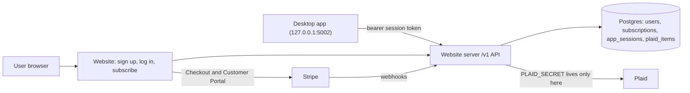

# Paid App — Master Plan

**Goal:** A **$8.99/month** subscription unlocks the whole Workbench Budgeting desktop
app. Plaid bank syncing is included at no extra cost. The reserved **Sample** profile
stays free for anyone, with no account needed, so people can try the app first. The
website (`budget_app_website`) becomes the hosted server that owns accounts, billing,
and all Plaid API calls. The desktop app (`budget_app`) becomes a client of that server.

The project started as "paid Plaid" (only bank syncing was paid) and changed scope on
2026-10-05 (see the Decisions log). The folder is still `docs/paid_plaid/` so existing
links keep working.

- API contract (desktop <-> server): [API_CONTRACT.md](API_CONTRACT.md)
- Prompt for running a step with an agent: [AGENT_PROMPT.md](AGENT_PROMPT.md)
- Existing token-storage design notes (desktop repo): `../budget_app/docs/plaid_token_storage.md`

**Status legend:** `todo` · `in-progress` · `blocked` · `done`

**Run the steps in number order.** Every step depends only on earlier steps, so the next
step is always the lowest-numbered one that is not `done`.

---

## Checklist

| # | Step | Repo |
| --- | --- | --- |
| 1 | Database and app scaffolding | website |
| 3 | Provision hosting (manual) | website + dashboards |
| 4 | Users, sign up, log in, log out | website |
| 5 | Password reset and email verification | website |
| 6 | My account page | website |
| 7 | Sign in with Google | website |
| 8 | Stripe Checkout and webhooks | website |
| 9 | Customer Portal and the paid-access check | website |
| 10 | App sessions and desktop sign-in API | website |
| 11 | Plaid link and exchange on the server | website |
| 12 | Transaction sync endpoint | website |
| 13 | Plaid connection lifecycle | website |
| 13a | Whole-app paid access and a 1-week free trial | website |
| 14 | Desktop cloud client and sign-in | desktop |
| 14a | Lock everything except the Sample profile behind the subscription | desktop |
| 15 | Route desktop Plaid through the server | desktop |
| 16 | Re-link prompt for existing connections | desktop |
| 17 | Legal pages | website |
| 18 | Go live with Stripe, Plaid, and Google (manual) | dashboards |
| 19 | Launch | desktop + website |
| 20 | Remove the direct Plaid path | desktop |

Update the status in the step section below; this table is only an index.

There is no step 2: it (serving downloads from GitHub Releases) was dropped, and the
other steps keep their numbers so existing references stay valid. For the same reason,
the steps added for the whole-app subscription are 13a and 14a: run them in table order
(13 → 13a → 14 → 14a → 15).

---

## Architecture



## Ground rules (keep every step shippable)

1. **One step = one agent session = one PR in one repo** (step 19 is the only step with
   a PR in each repo). Each PR must be mergeable on its own without breaking anything
   that already works.
2. **In order.** Steps are numbered in a safe run order; don't start a step until every
   step it depends on is `done`.
3. **Feature flags:**
   - Website: new public-facing account/billing features stay behind
     `ACCOUNTS_ENABLED` (default **off** in production) until step 19.
   - Desktop: everything cloud-related (sign-in, the subscription lock from step 14a,
     and Plaid through the server) stays behind `BUDGET_APP_CLOUD` (default **off**)
     until step 19. With it off, the app is free and unlocked exactly as today, and
     today's direct Plaid path keeps working. (This flag was called
     `BUDGET_APP_CLOUD_PLAID` before 2026-10-05; nothing used that name yet.)
4. **Contract first.** Any new or changed endpoint updates
   [API_CONTRACT.md](API_CONTRACT.md) in the same PR.
5. **Branch naming:** `feature/mhoff/<short_topic>_<yyyymmdd>`.
6. **Close out every step:** set its status, add the PR link, log any decisions, and
   add a Handoff notes entry.
7. **Secrets never go in git.** Use environment variables (and `.env.example` for names only).

---

## Phase A — Groundwork (website)

### 1. Database and app scaffolding
- **Repo:** budget_app_website
- **Depends on:** —
- **Scope:** Add SQLAlchemy + Flask-Migrate (Alembic). Read `DATABASE_URL`, falling back
  to a local SQLite file for dev. Add `/healthz`, a pytest setup with a test client
  fixture, `.env.example`, and the `ACCOUNTS_ENABLED` flag (read from env, default off).
  Restructure `serve.py` only as much as needed (e.g. an app factory or `app/` package);
  `gunicorn serve:app` must still work.
- **Done when:** Existing pages render unchanged, `flask db upgrade` runs locally,
  `pytest` passes, `/healthz` returns 200.
- **Status:** done
- **PR:** [#38](https://github.com/maxwell-hoff/budget_app_website/pull/38)

### 3. Provision hosting (manual — you)
- **Repo:** budget_app_website (Render dashboard + `render.yaml`)
- **Depends on:** 1
- **Scope:** Create Postgres (Render or Neon), move the web service off the free tier,
  set env vars (`DATABASE_URL`, `SECRET_KEY`, `ACCOUNTS_ENABLED=false`), run migrations
  on deploy (`preDeployCommand: flask db upgrade` in `render.yaml`), set billing alerts.
  An agent can prepare the `render.yaml` change; the dashboard work is manual.
- **Done when:** Production deploy is healthy (`/healthz` 200) and connected to Postgres.
- **Status:** done
- **PR:** [#39](https://github.com/maxwell-hoff/budget_app_website/pull/39)

## Phase B — Accounts (website, behind `ACCOUNTS_ENABLED`)

### 4. Users, sign up, log in, log out
- **Repo:** budget_app_website
- **Depends on:** 1
- **Scope:** `users` table (`id`, `email` unique/lowercased, `password_hash` (nullable,
  so Google-only users from step 7 fit), `created_at`, `email_verified_at`). Flask-Login
  sessions, strong password hashing, CSRF protection on forms, basic rate limiting on
  login. Routes: `/signup`, `/login`, `/logout`. All return 404 when `ACCOUNTS_ENABLED`
  is off.
- **Done when:** With the flag on, a user can sign up, log in, and log out; with it off,
  the routes 404 and the site looks unchanged. Tests cover both.
- **Status:** done
- **PR:** [#40](https://github.com/maxwell-hoff/budget_app_website/pull/40)

### 5. Password reset and email verification
- **Repo:** budget_app_website
- **Depends on:** 4
- **Scope:** Transactional email provider (Resend or Postmark) behind a small `send_email`
  helper (logs to console in dev). Signed, expiring tokens for reset and verification.
  Routes: `/forgot-password`, `/reset-password/<token>`, `/verify-email/<token>`.
- **Done when:** Reset and verify flows work end to end in dev (console email) and tests
  cover token expiry/reuse.
- **Status:** done
- **PR:** [#41](https://github.com/maxwell-hoff/budget_app_website/pull/41)

### 6. My account page
- **Repo:** budget_app_website
- **Depends on:** 4
- **Scope:** `/account` (login required): email, verification status, placeholder for
  subscription status, change password, nav link when logged in (flag on only).
- **Done when:** Page renders for logged-in users, redirects to login otherwise.
- **Status:** done
- **PR:** [#42](https://github.com/maxwell-hoff/budget_app_website/pull/42)

### 7. Sign in with Google
- **Repo:** budget_app_website
- **Depends on:** 4, 6
- **Scope:** Google OpenID Connect via Authlib. `oauth_identities` table (`user_id`,
  `provider` = `google`, `provider_subject` (Google `sub`, unique per provider),
  `email`, `created_at`). Routes: `/auth/google` (starts the flow with `state` and
  `nonce`) and `/auth/google/callback` (verifies the ID token, then logs in). Account
  matching: look up by `provider_subject` first; if not found and Google says the email
  is verified, link to the existing user with that email (or create a new user with no
  password and `email_verified_at` set). "Continue with Google" button on `/login` and
  `/signup`. On `/account`, show linked sign-in methods, and let a Google-only user
  set a password; never allow removing the last sign-in method. Env: `GOOGLE_CLIENT_ID`,
  `GOOGLE_CLIENT_SECRET`. Routes 404 when `ACCOUNTS_ENABLED` is off, and the button is
  hidden if the Google env vars are missing. The desktop sign-in flow (step 10) needs
  no changes because `/app-login` uses whatever web login the user picks.
- **Before starting (manual):** Create an OAuth client in Google Cloud Console (type
  "Web application") with redirect URI `http://127.0.0.1:5001/auth/google/callback`.
- **Done when:** A new user can sign up with Google, an existing password user can sign
  in with Google and end up on the same account. Tests mock Google's token and userinfo
  responses, including an unverified email (must not link) and a bad `state` (rejected).
- **Status:** done
- **PR:** [#43](https://github.com/maxwell-hoff/budget_app_website/pull/43)

## Phase C — Billing (website, Stripe test mode)

### 8. Stripe Checkout and webhooks
- **Repo:** budget_app_website
- **Depends on:** 6
- **Before starting (manual):** Create a Stripe account; in test mode create the
  product and the $8.99/month price; install the Stripe CLI.
- **Scope:** `subscriptions` table (`user_id`, `stripe_customer_id`,
  `stripe_subscription_id`, `status`, `current_period_end`, `cancel_at_period_end`) and
  `stripe_events` table (processed event ids, for idempotency). `POST /billing/checkout`
  creates a Checkout Session for the $8.99/month price (`STRIPE_PRICE_ID`).
  `POST /stripe/webhook` verifies the signature (`STRIPE_WEBHOOK_SECRET`) and handles
  `checkout.session.completed`, `customer.subscription.created|updated|deleted`,
  `invoice.paid`, `invoice.payment_failed`.
- **Done when:** In Stripe test mode (Stripe CLI forwarding webhooks), subscribing
  creates an `active` subscription row; canceling updates it. Webhook tests use signed
  fixture payloads; duplicate events are ignored.
- **Status:** done
- **PR:** [#44](https://github.com/maxwell-hoff/budget_app_website/pull/44)

### 9. Customer Portal and the paid-access check
- **Repo:** budget_app_website
- **Depends on:** 8
- **Scope:** `POST /billing/portal` redirects to the Stripe Customer Portal.
  `has_plaid_access(user)` is the **single** place that decides access: true if status
  is `active`/`trialing`, or `past_due` within a short grace period, or canceled but
  `now < current_period_end`. Show status + Subscribe/Manage buttons on `/account`.
- **Done when:** Unit tests cover every status branch of `has_plaid_access`; the account
  page shows the right button for each state.
- **Status:** done
- **PR:** [#45](https://github.com/maxwell-hoff/budget_app_website/pull/45)

## Phase D — Desktop sign-in API (website)

### 10. App sessions and desktop sign-in API
- **Repo:** budget_app_website
- **Depends on:** 9
- **Scope:** `app_sessions` table (`user_id`, `token_hash`, `device_name`, `created_at`,
  `last_used_at`, `expires_at`, `revoked_at`) and short-lived one-time `auth_codes`.
  `GET /app-login` (browser; requires web login, then redirects to
  `http://127.0.0.1:5002/auth/callback?code=...&state=...`; only loopback redirect URIs
  allowed). `POST /v1/auth/token` (code + PKCE verifier -> session token),
  `GET /v1/me`, `POST /v1/auth/logout`. A `require_app_session` decorator for `/v1/*`.
  `/app-login` returns 404 while `ACCOUNTS_ENABLED` is off, like the other account pages.
- **Done when:** A scripted test performs the full code -> token -> `/v1/me` flow
  (after both a password login and a Google login); tokens are stored hashed;
  revoked/expired tokens get 401. Contract updated.
- **Status:** done
- **PR:** [#46](https://github.com/maxwell-hoff/budget_app_website/pull/46)

## Phase E — Hosted Plaid (website, Plaid sandbox)

### 11. Plaid link and exchange on the server
- **Repo:** budget_app_website
- **Depends on:** 10
- **Before starting (manual):** Get Plaid sandbox keys from the Plaid Dashboard.
- **Scope:** `plaid_items` table (`user_id`, `item_id`, `access_token_encrypted`
  (Fernet, key from `PLAID_TOKEN_KEY`), `institution_id`, `institution_name`, `status`,
  `transactions_cursor`, `created_at`). Endpoints: `POST /v1/plaid/link-token`,
  `POST /v1/plaid/exchange`, `GET /v1/plaid/items`, `DELETE /v1/plaid/items/<id>`
  (calls Plaid `/item/remove`). All require an app session (401) **and**
  `has_plaid_access` (402). Port client setup from
  `../budget_app/backend/plaid_data_retreiver.py`. Env: `PLAID_CLIENT_ID`,
  `PLAID_SECRET`, `PLAID_ENVIRONMENT`.
- **Done when:** Against Plaid sandbox, a test user can create a link token, exchange a
  sandbox public token, list, and delete items. Access tokens are never returned to
  the client. Contract updated.
- **Status:** done
- **PR:** [#47](https://github.com/maxwell-hoff/budget_app_website/pull/47)

### 12. Transaction sync endpoint
- **Repo:** budget_app_website
- **Depends on:** 11
- **Scope:** `POST /v1/plaid/sync` returns accounts and transactions for the user's items
  (or one item) in the shape the desktop ingest already consumes (see
  `../budget_app/backend/plaid_data_fetcher.py` and `plaid_data_retreiver.py`), with
  `days_back` support for the initial pull. Transaction data is passed through, not
  stored. Map Plaid `ITEM_LOGIN_REQUIRED` to 409.
- **Done when:** Sandbox sync returns data that the desktop ingest code accepts
  unchanged (verified with a fixture shared in the contract). Contract updated.
- **Status:** done
- **PR:** [#48](https://github.com/maxwell-hoff/budget_app_website/pull/48)

### 13. Plaid connection lifecycle
- **Repo:** budget_app_website
- **Depends on:** 12
- **Scope:** `POST /plaid/webhook` (verify Plaid webhook JWT) to mark items needing
  re-link; update-mode link token support (`POST /v1/plaid/items/<id>/relink-token`).
  When a subscription fully ends (Stripe webhook), call `/item/remove` for that user's
  items so Plaid stops billing. Account deletion (`/account/delete`) purges items,
  sessions, and the user.
- **Done when:** Tests cover subscription-ended -> items removed, and webhook-driven
  status changes. Contract updated.
- **Status:** done
- **PR:** [#49](https://github.com/maxwell-hoff/budget_app_website/pull/49) (merged)

### 13a. Whole-app paid access and a 1-week free trial
- **Repo:** budget_app_website
- **Depends on:** 13
- **Scope:** Renames and wording, plus the free trial. Who has access stays the same
  (every status rule from step 9 is kept; `trialing` already counts as paid).
  - `billing.has_plaid_access` → `has_paid_access`, still the **single** place that
    decides access. `plaid_api.require_plaid_access` → `require_paid_access`.
  - API (no desktop client exists yet, so renaming now breaks nothing): `/v1/me`
    `plaid_access` → `paid_access`, and add `access_until`, the time until which access
    is already guaranteed with no further payment (`current_period_end` for
    `active`/`trialing`/canceled-at-request, the grace deadline for `past_due`, `null`
    when there's no access). The desktop uses it to keep working offline (step 14a).
    Error 402 `plaid_access_required` → `subscription_required`.
  - The Plaid endpoints keep requiring the subscription, so bank syncing is simply one of
    the things the subscription unlocks. Removing banks when a subscription ends
    (step 13) is unchanged.
  - `/account` copy: "Workbench Budgeting, $8.99/month (includes bank syncing)" instead
    of "Bank syncing, $8.99/month"; the status lines say the app, not bank syncing,
    stays on until a date.
  - **Free trial (7 days):**
    - `/billing/checkout` adds `subscription_data.trial_period_days` from a new
      `TRIAL_DAYS` setting (default 7; 0 turns trials off) for users who haven't had a
      trial yet. Nobody gets a second trial: a new `subscriptions.trial_used_at`
      column (migration) is set when Stripe first reports a subscription with a
      trial, and resubscribing after that has no trial.
    - The card is collected up front (Checkout's default). Stripe charges $8.99 when
      the trial ends unless the user cancels first. Canceling during the trial keeps
      access until the trial's end, the same rule as canceling a paid month.
    - Handle `customer.subscription.trial_will_end` (Stripe sends it 3 days before the
      trial ends) by emailing a reminder through `mailer.py`: the end date, the
      $8.99/month charge, and a link to `/account` to cancel. Add the event to the
      `stripe listen --events` list and the webhook docs.
    - `/account`: "Start your free week" (with "then $8.99/month, cancel anytime")
      when the user can still get a trial, otherwise "Subscribe for $8.99/month";
      while trialing, "Free trial: ends on <date>, then $8.99/month".
    - `/v1/me`: `access_until` for `trialing` is the trial's end. Add
      `trial_available` (true when the user has never had a trial) so the desktop lock
      screen can say "Start your free week".
    - Trial users can link banks like any paid user, within the existing 10-bank cap.
  - Update `scripts/desktop_flow_check.py`, tests, `CLAUDE.md`, and `API_CONTRACT.md`.
- **Before starting (manual):** In the Stripe dashboard (test mode), rename the product
  to "Workbench Budgeting" with a description like "Full access to the Workbench
  Budgeting app, including bank syncing". The price and tax code stay the same. If
  `stripe listen` is running, restart it with `customer.subscription.trial_will_end`
  added to `--events`.
- **Done when:** All existing tests pass with the new names; `/v1/me` returns
  `paid_access`, `trial_available`, and a correct `access_until` for every
  subscription state (tests); no `plaid_access` names remain outside the Decisions log
  and Handoff notes. Trial tests: a first Checkout includes the 7-day trial, a second
  one (after `trial_used_at` is set) doesn't, `TRIAL_DAYS=0` turns it off, and
  `trial_will_end` sends one reminder email (not repeated for a duplicate event). Live
  in Stripe test mode with a test clock: subscribe → `trialing` with access → advance
  4 days → reminder email → advance past day 7 → `active` and the first $8.99
  invoice paid; a second test user cancels during the trial and loses access at the
  trial's end.
- **Status:** todo
- **PR:** —

## Phase F — Desktop client (budget_app, behind `BUDGET_APP_CLOUD`)

### 14. Desktop cloud client and sign-in
- **Repo:** budget_app
- **Depends on:** 10, 13a
- **Scope:** `backend/cloud_client.py` (base URL from `BUDGET_APP_CLOUD_URL`, bearer
  token, typed errors for 401/402/409). Routes in `serve.py`: `/auth/start` (generates
  PKCE + state, opens browser to `/app-login`), `/auth/callback` (exchanges code, stores
  token via `keyring`), `/api/cloud/me`, `/api/cloud/logout`. Actions menu in
  `frontend/templates/index.html`: Sign in / Signed in as ... / Manage subscription.
  Only visible when the flag is on. **No Plaid behavior changes and nothing is locked
  yet** (step 14a adds the lock).
- **Done when:** With the flag on, sign-in round-trips against a local website server
  and the menu shows the subscription status from `/v1/me`; with it off, nothing in the
  UI changes. Tests mock the server.
- **Status:** todo
- **PR:** —

### 14a. Lock everything except the Sample profile behind the subscription
- **Repo:** budget_app
- **Depends on:** 13a, 14
- **Before starting (decide, then log in the Decisions log):**
  - What a lapsed or never-subscribed user sees on their own profiles. Default: **fully
    locked** (a lock screen; the data stays untouched on disk and comes back when they
    subscribe). Alternative: read-only (view and export, no edits or imports), which is
    more work because every write endpoint has to be sorted.
  - (Free trial: decided on 2026-10-05, one week, built in step 13a.)
  - Offline grace. Default: keep working until `access_until` plus **3 days** without
    reaching the server.
  - Existing users of today's free version. Default: same rules as everyone (they see
    the lock until they subscribe; their data is kept). Alternative: a time-limited
    grace period for installs that already have non-Sample profiles.
- **Scope:** With `BUDGET_APP_CLOUD` on:
  - `backend/entitlement.py` keeps `{user_id, paid_access, access_until, checked_at}`
    from `/v1/me` in the keychain next to the session token. Refresh on startup, on
    sign-in, every 6 hours while running, and from an "I've subscribed, check again"
    button. Unlocked while `paid_access` is true and `now < access_until` (+ offline
    grace when the server can't be reached). 401 clears it.
  - A `before_request` guard in `serve.py`: any `/api/*` request whose profile
    (`_get_profile_id_from_request() or _active_profile_id`) isn't the Sample profile
    (`_is_sample_profile`) gets 402 `subscription_required` unless unlocked. A short
    allowlist stays open: listing and switching profiles (so the user can pick Sample),
    the sign-in and `/api/cloud/*` routes, and static files.
  - `frontend/templates/index.html`: on a 402, show a lock screen ("Subscribe to use
    your own budgets. The Sample profile is free.") with Sign in / Subscribe (opens
    `account_url`; labeled "Start your free week" when `/v1/me` says
    `trial_available` or the user isn't signed in yet) / "I've subscribed, check
    again" / "Open the Sample profile". The profile picker marks locked profiles.
  - Creating a profile and the guided setup (`gui.py`, `setup_wizard.py`) ask the user
    to sign in and subscribe first; "Use the Sample profile" (`gui.py`
    `_use_sample_profile`) stays available without an account.
  - No profile other than the reserved one can be named or renamed "Sample".
  - The Sample profile can't connect banks (hide Connect bank there); the server would
    refuse anyway without a subscription.
  - Locking never deletes or changes data.
- **Done when:** Flag off: identical to today. Flag on and signed out: the Sample
  profile works fully, other profiles show the lock screen, and a test walks
  `app.url_map` to prove every non-allowlisted `/api/*` route returns 402 for a
  non-Sample profile. Subscribed: everything works. Expired `access_until`: locks.
  Offline within the grace period: works; past it: locks. Tests mock the server and
  the clock.
- **Status:** todo
- **PR:** —

### 15. Route desktop Plaid through the server
- **Repo:** budget_app
- **Depends on:** 12, 14a
- **Scope:** When the flag is on, the local Plaid routes in `serve.py`
  (`/api/plaid/create-link-token`, `/api/plaid/exchange-public-token`,
  `/api/plaid/connections`, `.../refresh`, `DELETE .../<id>`) call `cloud_client`
  instead of Plaid directly; synced data flows into the existing ingest code.
  `frontend/templates/plaid_connect.html` keeps calling the local endpoints. A 402
  `subscription_required` from the server (the subscription lapsed since the last
  check) refreshes the entitlement and shows step 14a's lock screen; 409 -> re-link
  prompt using the relink-token endpoint from step 13.
- **Done when:** With the flag on, link + sync + re-link works end to end against
  sandbox via the local website server; with the flag off, behavior is identical to today.
- **Status:** todo
- **PR:** —

### 16. Re-link prompt for existing connections
- **Repo:** budget_app
- **Depends on:** 13, 15
- **Scope:** With the flag on, detect connections that exist only locally (direct-path
  tokens in `plaid_tokens`) and, once the user is subscribed (step 14a's lock comes
  first), show a one-time prompt to re-link them through the cloud; keep their existing
  transactions. The flag stays **off by default** in this step; turning it on happens at
  launch (step 19).
- **Done when:** With the flag on, an app with existing local connections keeps all its
  data and, after subscribing, walks the user through re-linking. With the flag off,
  nothing changes.
- **Status:** todo
- **PR:** —

## Phase G — Launch

### 17. Legal pages
- **Repo:** budget_app_website
- **Depends on:** 1
- **Scope:** `/privacy`, `/terms`, `/refunds` pages linked in the footer (Stripe,
  Plaid, and Google all require them). Content drafted for you to review. These are
  public from the start (not behind `ACCOUNTS_ENABLED`). The terms describe one
  $8.99/month subscription for the whole app (bank syncing included, the Sample
  profile free), the 1-week free trial (one per person, card required, charged
  $8.99/month when it ends unless canceled first), what happens to local data when a subscription ends (kept on the
  user's computer, locked until they resubscribe), and the refund policy.
- **Done when:** Pages render and are linked from every page footer.
- **Status:** todo
- **PR:** —

### 18. Go live with Stripe, Plaid, and Google (manual — you)
- **Repo:** — (dashboards)
- **Depends on:** 13, 17
- **Scope:** Stripe live mode (product named "Workbench Budgeting" for the whole app,
  price, webhook endpoint including `customer.subscription.trial_will_end`, portal
  config; `TRIAL_DAYS` left at 7 on Render); Plaid
  production access and security questionnaire; Google OAuth consent screen published
  with the production redirect URI (`https://workbenchbudgeting.com/auth/google/callback`),
  privacy policy and terms links, and brand verification if Google requests it; set
  production env vars. Keep `ACCOUNTS_ENABLED=false` until step 19.
  First decide which Plaid team goes live (see the 2026-10-05 decision): the original team
  if Plaid support has restored an Admin, otherwise the new "Workbench Budgeting" team
  (apply for production access there).
- **Done when:** With `ACCOUNTS_ENABLED` turned on briefly for yourself (or on a
  staging service), a real $8.99 subscription unlocks the app and a real bank link
  works in production.
- **Status:** todo
- **PR:** —

### 19. Launch
- **Repo:** both (one PR in each, plus a production env change)
- **Depends on:** 16, 18
- **Scope:** Desktop PR: default `BUDGET_APP_CLOUD` to on, point
  `BUDGET_APP_CLOUD_URL` at production, bump the app version, and publish the
  release. The release notes tell existing users plainly that the app now needs a
  subscription (except the Sample profile), that their data is kept, and about any
  grace period chosen in step 14a. Website PR: replace the installers in
  `frontend/static/downloads/` with the new release's builds and update the
  marketing copy and pricing section: $8.99/month for the app, bank syncing
  included, a 1-week free trial, and the Sample profile free to explore. Then set `ACCOUNTS_ENABLED=true` in
  production. Order: set the env var and merge the website PR first, then publish the
  desktop release, so the app never points users at sign-up pages that 404.
- **Done when:** A new user can download, explore the Sample profile without an
  account, sign up, start the free week, create their own profile, and sync a bank; an existing
  user who upgrades sees the lock screen until they subscribe, keeps all their data,
  and is then walked through re-linking.
- **Status:** todo
- **PR:** —

### 20. Remove the direct Plaid path
- **Repo:** budget_app
- **Depends on:** 19 (released and stable for a while)
- **Scope:** Remove direct Plaid calls and `PLAID_SECRET` handling from the shipped build
  (`serve.py`, `backend/env_config.py`, `setup_wizard.py`, `budget_app.spec`,
  local `plaid_tokens` usage). Remove the `BUDGET_APP_CLOUD` flag, so sign-in, the
  subscription lock, and cloud Plaid are always on. Keep local data tables intact.
- **Done when:** The built app contains no Plaid secret handling; tests updated.
- **Status:** todo
- **PR:** —

---

## Decisions log

Newest last. One line each: date — decision — reason.

- 2026-09-30 — The hosted server is built into `budget_app_website` — sign-up, billing, webhooks, and Plaid all share one users/subscriptions database and one deploy.
- 2026-09-30 — Plaid access tokens are stored encrypted on the server, keyed by `user_id` — lets the server call `/item/remove` when a subscription ends and handle Plaid webhooks.
- 2026-09-30 — Payments use Stripe Billing (Checkout + Customer Portal + webhooks) — no card handling or billing UI to build.
- 2026-09-30 — Auth is built in-house with Flask-Login and hashed passwords — fewest vendors; revisit before starting step 4 if a managed provider is preferred.
- 2026-09-30 — Transaction data passes through the server and is not stored there — the desktop app stays local-first.
- 2026-09-30 — Add optional "Sign in with Google" (step 7) alongside email and password — many users prefer it, it gives them Google's two-factor protection, and fewer passwords stored here means less risk. Accounts link by verified email; the desktop flow is unchanged.
- 2026-09-30 — Desktop sign-in uses a browser redirect to the local server (`127.0.0.1:5002/auth/callback`) with PKCE; the session token is stored in the OS keychain via `keyring`.
- 2026-09-30 — Steps renumbered 1–20 in run order. Turning cloud Plaid on by default moved from the old desktop migration step into Launch (step 19), so existing users are never switched to cloud Plaid before sign-up is public.
- 2026-09-30 — Keep a flat layout (`serve.py` with `create_app()` plus `config.py` and `extensions.py`) instead of an `app/` package — smallest change that keeps `gunicorn serve:app` and existing endpoint names; revisit if the route count grows.
- 2026-09-30 — Postgres driver is psycopg 3 (`psycopg[binary]`); `DATABASE_URL` values starting `postgres://` or `postgresql://` are rewritten to `postgresql+psycopg://` — Render hands out `postgres://`, which SQLAlchemy 2 rejects.
- 2026-09-30 — `/healthz` runs `SELECT 1` and returns 503 if the database is unreachable — lets Render's health check catch a broken database connection, not just a dead process.
- 2026-09-30 — Migrations start from an empty baseline revision (`07f88d99736f`); `.flaskenv` sets `FLASK_APP=serve:app` so `flask db upgrade` needs no flags — step 3's `preDeployCommand` and later model steps chain onto it.
- 2026-09-30 — Production runs on Render Postgres, linked by pasting its Internal Database URL into `DATABASE_URL` in the dashboard. `render.yaml` lists `DATABASE_URL` and `SECRET_KEY` with `sync: false` rather than using `fromDatabase` — the service is managed in the dashboard, and a mismatched database name in a Blueprint sync could create a second, empty database.
- 2026-09-30 — Production base URL is `https://workbenchbudgeting.com` (API at `/v1`).
- 2026-09-30 — Step 2 (serve downloads from GitHub Releases) is dropped permanently — installers stay in `frontend/static/downloads/` on the website. Other step numbers are unchanged.
- 2026-09-30 — Account blueprints are registered only when `ACCOUNTS_ENABLED` is on (read at startup), rather than checking the flag per request — every route truly 404s when off (including wrong-method requests), and rate limits never fire on disabled routes. Later account steps (5–7, 10) should follow the same pattern.
- 2026-09-30 — Password hashing uses Werkzeug's default (scrypt) — strong and needs no extra dependency.
- 2026-09-30 — CSRF uses per-form Flask-WTF tokens, not global `CSRFProtect` — keeps `/notify` (JSON from the landing page) and future JSON/webhook endpoints (`/v1/*`, `/stripe/webhook`, `/plaid/webhook`) unaffected.
- 2026-09-30 — Rate limiting uses Flask-Limiter with in-memory storage, keyed by client IP via `ProxyFix(x_for=1)` — "basic" per the plan; limits are per gunicorn worker. Move to a shared store (e.g. Redis) if it becomes a problem.
- 2026-09-30 — The app refuses to start on Render (`RENDER=true`) without `SECRET_KEY`, and session cookies are `Secure` there by default.
- 2026-09-30 — Database constraints follow a naming convention (`uq_users_email`, `pk_users`, …) and Alembic uses batch mode — so later migrations can alter constraints, including on SQLite.
- 2026-09-30 — Transactional email uses Resend, called over its HTTP API with the standard library (no SDK) and isolated in `mailer.py` — simple API and a free tier; switching to Postmark means replacing one function. Emails are plain text.
- 2026-09-30 — Reset and verification tokens are stateless `itsdangerous` signed tokens (no tokens table). Reset tokens embed a keyed fingerprint of the password hash, so they stop working once the password changes (single-use); verification tokens embed the email address. Reset expires in 1 hour, verification in 48 hours.
- 2026-09-30 — The Flask-Login session ID is `<user_id>:<password fingerprint>`, so changing the password (reset now, change-password in step 6) logs out every other session.
- 2026-09-30 — A successful password reset also marks the email verified (the link proves inbox access) and lets password-less (Google-only, step 7) users set a password.
- 2026-09-30 — Links in emails are built from `PUBLIC_BASE_URL` (default `https://workbenchbudgeting.com` on Render), never from the request's Host header, so a forged Host can't redirect reset links.
- 2026-09-30 — Added `POST /verify-email/resend` (not in the original step 5 scope) — without it, an expired verification link was a dead end.
- 2026-10-01 — `/account` is the landing page after sign-up, log-in, password reset, and email verification; it replaces the interim "You're signed in" page from step 4.
- 2026-10-01 — The "Account" nav link is added to the existing marketing pages with an inline `` placed so the HTML is byte-identical when the flag is off or the visitor is logged out. No "Log in" link for logged-out visitors yet; that's launch copy (step 19).
- 2026-10-01 — `/account` already lets password-less users set a password (the form hides "Current password" for them), so step 7 only needs to show linked sign-in methods and guard against removing the last one.
- 2026-10-01 — When Google sign-in links to an existing account whose email was never verified, that account's password is removed (and its sessions end) — otherwise someone could pre-register a victim's email with a password and keep access after the real owner signs in with Google. Verified accounts keep their password.
- 2026-10-01 — A logged-in user can connect Google from `/account` even if the Google email differs from their account email; a Google account already linked to another user is refused rather than switching accounts. One Google account per user (`uq_oauth_identities_user_id`).
- 2026-10-01 — "Removing a sign-in method" means disconnecting Google (`POST /account/google/unlink`); it's refused when the user has no password. There's no way to remove a password, so that's the only guard needed.
- 2026-10-01 — The Google client is registered per app instance in `create_app` (Authlib `OAuth(app)`), not as a module-level extension — keeps test apps with different credentials independent. The redirect URI is built from `PUBLIC_BASE_URL` like email links.
- 2026-10-01 — `subscriptions` has one row per user (unique `user_id`) holding their Stripe customer and current or most recent subscription; `status` is Stripe's own status string, null until the first subscription. Resubscribing reuses the customer and replaces the subscription ID.
- 2026-10-01 — The Stripe customer is created in `/billing/checkout` (with `metadata.user_id`) before Checkout starts, so every webhook maps to a user by customer ID regardless of event order. `client_reference_id` and subscription metadata carry the user ID as a fallback.
- 2026-10-01 — Webhooks re-fetch the subscription from Stripe instead of trusting the event body — out-of-order or stale events can't roll the row back. Events for a different subscription are ignored while the row's current one is still live.
- 2026-10-01 — `/billing/checkout` refuses while the status is `active`, `trialing`, `past_due`, `unpaid`, `incomplete`, or `paused` (`billing.LIVE_STATUSES`), so nobody can pay twice. Step 9's `has_plaid_access` decides access separately.
- 2026-10-01 — `cancel_at_period_end` is true when Stripe reports either `cancel_at_period_end` or a `cancel_at` date (newer Stripe API versions and the portal may use `cancel_at`). The renewal date is read from the subscription or, for API versions from 2025-03-31 on, its items.
- 2026-10-01 — Billing routes are registered only when `ACCOUNTS_ENABLED` is on **and** `STRIPE_SECRET_KEY`, `STRIPE_PRICE_ID`, and `STRIPE_WEBHOOK_SECRET` are all set; otherwise they 404 and `/account` keeps the "coming soon" text. Uses `stripe` (Python SDK) v16 via `StripeClient`, converting responses to plain dicts.
- 2026-10-01 — The Stripe product is "bank syncing through Plaid"; its name and description come from the Stripe dashboard (shown on the Checkout page), not from code.
- 2026-10-02 — Stripe Managed Payments (Stripe as merchant of record, handling sales tax/VAT) stays on; the product's tax code is `txcd_10103000` (SaaS, personal use), set in the dashboard. Repeat for the live-mode product at step 18.
- 2026-10-02 — `has_plaid_access(user)` lives in `billing.py`. The `past_due` grace period is 7 days (`PAST_DUE_GRACE`), measured from `current_period_start` — Stripe moves the period forward when it creates the renewal invoice, so the start is when the failed payment was first tried, while `current_period_end` is a month out.
- 2026-10-02 — "Canceled but before `current_period_end`" keeps access only when Stripe's `cancellation_details.reason` is `cancellation_requested`. A subscription canceled for non-payment (`payment_failed`, `payment_disputed`) loses access immediately; otherwise it would get a free month, since its period end was already moved forward. Added `subscriptions.current_period_start` and `subscriptions.cancellation_reason` (migration `ae5881f0b12c`).
- 2026-10-02 — Stripe API errors in Checkout and the portal send the user back to `/account` with a "couldn't reach our payment provider" message (logged) instead of a 500 page.
- 2026-10-04 — `/app-login` shows a confirmation page ("The Workbench Budgeting app on <device> wants to sign in as <email>": Continue / Use a different account / Cancel) and only issues a code on a CSRF-protected POST, instead of redirecting straight away — RFC 8252 §8.6: any program on the computer can start a loopback flow, so a code is never handed out without the user clicking. Cancel redirects with `error=access_denied`; bad parameters show a 400 page and never redirect.
- 2026-10-04 — App session tokens and one-time codes are 256-bit `secrets.token_urlsafe` values stored as SHA-256 hashes (no slow hash needed at that entropy). Codes last 5 minutes and are used up by the first redemption attempt, even with a wrong verifier. Sessions last 180 days from sign-in with no sliding renewal; `last_used_at` is written at most every 5 minutes.
- 2026-10-04 — App sessions store the user's password fingerprint and stop working when it changes, matching web sessions — so a password reset/change, or Google sign-in removing an unverified account's password (step 7), also signs out the desktop app. Otherwise someone who pre-registered a victim's email could keep a desktop session after the owner takes the account back.
- 2026-10-04 — The `/v1` API lives in `api.py` (blueprint `api`, prefix `/v1`) with `api_error`, `require_app_session` (sets `g.user`, `g.app_session`), and a blueprint error handler that turns every HTTP error (including 429 with `Retry-After`) into the contract's JSON error format. Steps 11–13 add their endpoints to this blueprint (or another one using these helpers). Email verification isn't required to sign the app in; `/v1/me` reports `email_verified`.
- 2026-10-04 — `/logout` now honors a local-only `?next=`, used by "Use a different account".
- 2026-10-04 — Plaid endpoints live in `plaid_api.py` (blueprint `plaid_api`, prefix `/v1/plaid`, reusing `api.json_http_error` for JSON errors) and are registered only when `ACCOUNTS_ENABLED` is on and `PLAID_CLIENT_ID`, `PLAID_SECRET`, `PLAID_TOKEN_KEY` are all set. `PLAID_ENVIRONMENT` is `sandbox` (default) or `production`; Plaid's `development` environment no longer exists. A bad environment or malformed key stops the app at startup, but only while `ACCOUNTS_ENABLED` is on, so production can't be taken down by them before launch.
- 2026-10-04 — Access tokens are encrypted with `MultiFernet`: `PLAID_TOKEN_KEY` is one key, or `NEW,OLD` during rotation (the first encrypts, any decrypts). Losing the key means every user re-links.
- 2026-10-04 — Link tokens request `transactions` with `days_requested=730`. Plaid only gathers 90 days unless asked at link time, and the desktop's first pull is 24 months. `client_user_id` is the user's ID.
- 2026-10-04 — At most 10 Plaid items per user (`MAX_ITEMS_PER_USER`; 400 `item_limit_reached`, checked before creating a link token and before exchanging), because Plaid bills per item per month.
- 2026-10-04 — `DELETE /v1/plaid/items/<id>` needs only an app session, not Plaid access, so a lapsed subscriber can still stop Plaid billing for their banks. If Plaid says the item is already gone, it's still deleted here; other Plaid errors keep the row and return 502.
- 2026-10-04 — Every Plaid failure, including network errors and timeouts (30 s per call), returns 502 `plaid_error`; only Plaid's error code and request ID are logged, never tokens. The Plaid client uses `certifi`'s CA bundle (python.org's macOS Python has no system CA store).
- 2026-10-04 — Institution ID and name on exchange come from the client (Plaid Link's metadata) and are display-only. They aren't looked up from Plaid, which saves two API calls per link.
- 2026-10-04 — Live Plaid tests use separate `PLAID_SANDBOX_CLIENT_ID` / `PLAID_SANDBOX_SECRET` variables and skip without them. Max's `~/.zshrc` exports `PLAID_CLIENT_ID`/`PLAID_SECRET` (rejected by the sandbox as `INVALID_API_KEYS`), and real environment variables override `.env`, so tests must never pick those up. Every step now ends with live test instructions (`AGENT_PROMPT.md` item 9).
- 2026-10-05 — Sandbox keys come from a new Plaid team, "Workbench Budgeting", which Max created and administers. His original team has no Admin or Team Management members, so its keys page is blocked, and Max has asked Plaid support to restore Admin. The desktop app's current direct-path keys (`~/.zshrc`) likely belong to the original team. Production access, billing, and OAuth registrations are per team, so step 18 picks the team: the original if Admin is restored, otherwise the new one. If the new team is used, existing desktop users still re-link at step 16, and the old team's items stop billing once removed (step 20).
- 2026-10-05 — Plaid answers a repeat `/item/public_token/exchange` of the same public token with the same Item and access token, as found in the live sandbox test; it doesn't error. `/v1/plaid/exchange` therefore updates the existing row, so a retried exchange never creates a duplicate.
- 2026-10-05 — `POST /v1/plaid/sync` uses Plaid's `/transactions/get` over a `days_back` window (all pages, 500 per page), not `/transactions/sync` with the stored cursor. The desktop ingest only inserts and dedupes by `hash_id`, so it can't apply `/transactions/sync`'s modified/removed deltas, and a cursor kept on the server would tie sync state to one device. `plaid_items.transactions_cursor` stays unused.
- 2026-10-05 — Sync passes Plaid's own `/transactions/get` JSON through unchanged (`plaid.ApiClient.sanitize_for_serialization`), per item, rather than reshaping it into desktop records. The desktop's existing conversion code (sign flips, account-type mapping, `hash_id`) then stays the single source of truth. Because that code reads attributes, the desktop wraps the JSON in `SimpleNamespace` (step 15); this saves rows identical to today's direct path, so hash IDs match and nothing duplicates.
- 2026-10-05 — Shared fixture `docs/paid_plaid/fixtures/plaid_sync_response.json` is a trimmed real sandbox response. Server tests require the endpoint to reproduce it exactly; `scripts/check_sync_fixture_with_desktop.py` runs the desktop's unchanged `fetch_and_save_plaid_data` on it.
- 2026-10-05 — With `item_id`, sync errors are HTTP statuses (409 `plaid_relink_required`, 503 `plaid_not_ready`, 502). Without it, the response is 200 and each failed bank carries its own `error`, so one bad bank doesn't block the rest. Only `ITEM_LOGIN_REQUIRED` marks an item `relink_required`; other failures leave `status` alone (step 13's webhook handles the rest). A successful sync sets `status` back to `ok`.
- 2026-10-05 — Plaid's `PRODUCT_NOT_READY` (seen live for about a second right after linking) maps to a new error, 503 `plaid_not_ready` with `Retry-After: 10`, rather than 502, so the desktop knows to retry instead of showing a failure.
- 2026-10-05 — gunicorn's worker timeout is raised to 120 s (`render.yaml` `startCommand`): a first 24-month pull is several Plaid calls of up to 30 s each, and the 30 s default would kill the worker mid-sync. The desktop should sync one item per request.
- 2026-10-05 — Item status gains `relink_recommended` (Plaid's `PENDING_EXPIRATION` / `PENDING_DISCONNECT`: still syncs, consent ends soon), so the desktop can nudge without blocking sync. A successful sync doesn't clear it. Plaid sends no webhook when update mode succeeds in our app, so a new `POST /v1/plaid/items/<id>/relink-complete` lets the client set `relink_required` / `relink_recommended` back to `ok`; if the login wasn't really fixed, the next sync sets `relink_required` again.
- 2026-10-05 — `ITEM` `ERROR` webhooks map to `relink_required` (Plaid resolves them through update mode), except `ITEM_NOT_FOUND` → `error`. `USER_PERMISSION_REVOKED` → `error`. Sync or relink-token getting `ITEM_NOT_FOUND` / `INVALID_ACCESS_TOKEN` also sets `error` (step 12 left it unchanged). Webhooks for another Plaid environment are ignored, so sandbox and production can't touch each other's rows.
- 2026-10-05 — Plaid webhook JWTs are verified with `cryptography` directly (ES256 pinned, key by `kid` from `/webhook_verification_key/get`, cached 1 hour, `iat` within 5 minutes, body SHA-256 compared in constant time), not Authlib's JOSE module, which is deprecated in Authlib 1.8. No new dependency.
- 2026-10-05 — The webhook URL comes only from `PUBLIC_BASE_URL` (`<base>/plaid/webhook`, set per Item by `link-token`), never from the request's Host header. Without `PUBLIC_BASE_URL` no webhook is registered. Items linked before step 13 have no webhook; they still work (sync reports 409), and step 16 re-links everyone anyway.
- 2026-10-05 — Banks are removed at Plaid only when the subscription has ended for good: `canceled` or `incomplete_expired` with no paid time left (`billing.subscription_ended`). `unpaid` and `past_due` keep them, because a payment restores access without re-linking. The Stripe webhook does it in `_sync`; a failed Plaid removal is logged and doesn't fail the webhook (Stripe would resend an event already handled). `flask plaid-remove-lapsed` retries failures and catches the case no Stripe event announces (a subscription canceled immediately keeps access until `current_period_end`).
- 2026-10-05 — Account deletion (`POST /account/delete`) asks for the email and, if set, the password, then removes banks at Plaid and **deletes the Stripe customer**, which cancels any subscription immediately without a refund. It's one call that also covers incomplete or past-due subscriptions.   If Plaid or Stripe fails, the account is kept so nothing is left billing without an owner. The local database cascade removes sign-in methods, desktop sessions, the subscription row, and bank rows. Stripe's later `customer.subscription.deleted` for the vanished customer is acknowledged.
- 2026-10-05 — **Scope change:** the $8.99/month subscription now unlocks the whole desktop app, with Plaid included at no extra cost; only the reserved Sample profile stays free. The server's access rules don't change (steps 8–13 stand as built); step 13a renames the Plaid-specific names (`has_plaid_access` → `has_paid_access`, `plaid_access` → `paid_access`, `plaid_access_required` → `subscription_required`) and adds `access_until` to `/v1/me`. Renaming is done now because no desktop client uses these names yet. New step 14a adds the desktop lock. The desktop flag `BUDGET_APP_CLOUD_PLAID` becomes `BUDGET_APP_CLOUD`, covering sign-in, the lock, and cloud Plaid. Step 14a's open choices (lapsed users fully locked vs read-only, free trial, offline grace, existing users) have defaults listed in the step and are settled before it starts.
- 2026-10-05 — A **1-week free trial**, built in step 13a with Stripe's own trial (`trial_period_days`, from `TRIAL_DAYS`, default 7). One trial per account (`subscriptions.trial_used_at`); the card is collected up front and charged $8.99 when the trial ends unless canceled; trial users get full access, including bank syncing. A reminder email goes out on `customer.subscription.trial_will_end`. People could make extra accounts for extra trials; accepted for now, since each needs a card and the trial is short. Trial users' banks cost Plaid fees even if they never pay; watch this after launch, and lower the bank cap for trials if it becomes a problem. This settles step 14a's free-trial choice.
- 2026-10-05 — The desktop lock is a client-side check and can't stop someone who modifies the app's code; it's there to keep honest users honest. Bank syncing stays enforced on the server, because the Plaid secret never leaves it. A server-signed entitlement could make the local check harder to tamper with later if that becomes a problem.

## Handoff notes

Newest first. Template:

```
### YYYY-MM-DD — step N — <repo> — <branch>
- Done:
- Not done / follow-ups:
- Manual actions needed (env vars, dashboards, deploys):
- Next step:
```

### 2026-10-05 — plan update (free trial, step 13 merged) — budget_app_website — feature/mhoff/paid_app_plan_20261005
- Done: Step 13's PR line set to #49 (merged; its status was already `done`). Added a 1-week free trial to step 13a (renamed "Whole-app paid access and a 1-week free trial"). Updated step 14a's lock screen wording and removed its free-trial choice. Updated steps 17, 18, and 19, the Decisions log, and `API_CONTRACT.md` (`trial_available`, `access_until` during a trial). No code changed.
- Not done / follow-ups: None.
- Manual actions needed: Same as the entry below, plus restarting `stripe listen` with `customer.subscription.trial_will_end` before step 13a's live test.
- Next step: 13a.

### 2026-10-05 — plan update (whole-app subscription) — both repos — feature/mhoff/paid_app_plan_20261005
- Done: Changed the goal: the subscription unlocks the whole app, Plaid included, Sample profile free. Added step 13a (website: rename the paid-access check and API fields, add `access_until`, update `/account` copy) and step 14a (desktop: lock non-Sample profiles). Updated steps 14, 15, 16, 17, 18, 19, and 20 to match; renamed the desktop flag to `BUDGET_APP_CLOUD`. Updated `API_CONTRACT.md` (marked the renames as coming in 13a), `AGENT_PROMPT.md`, and both repos' `CLAUDE.md`. No code changed.
- Not done / follow-ups: Step 13's follow-ups below still apply to step 15. Where they say 402 or `plaid_access`, read them with 13a's new names.
- Manual actions needed: Merge this branch in both repos (the desktop branch is cut from `feature/mhoff/paid_init_20260930`, so merge that first). Before step 13a, rename the Stripe test-mode product (see the step). Before step 14a, settle its remaining choices (the free trial is already decided; see the entry above).
- Next step: 13a.

### 2026-10-05 — step 13 — budget_app_website — feature/mhoff/plaid_lifecycle_20261005
- Done: Step 12's PR link set to #48 (merged). New `plaid_webhook.py`: `POST /plaid/webhook`, JWT-verified, updating item status (table in the contract's `PlaidItem` section). `plaid_api.py`: `link-token` registers `<PUBLIC_BASE_URL>/plaid/webhook`; new `POST /v1/plaid/items/<id>/relink-token` (update mode) and `.../relink-complete`; new status `relink_recommended`; sync and relink-token set `error` when the Item is gone; `remove_items_at_plaid` / `remove_items_if_subscription_ended`; CLI `flask plaid-remove-lapsed`. `billing.py`: `subscription_ended`, `delete_customer`, and `_sync` removes the user's banks when the subscription has ended for good. `account.py`: `POST /account/delete` plus a collapsed "Delete account" section on `/account` (email + password confirmation). No new tables or env vars, so no migration. Tests: 542 pass, including 5 live sandbox tests. The live re-link test now goes `ITEM_LOGIN_REQUIRED` → relink-token → relink-complete → sync 409 again, because sandbox `reset_login` isn't fixed until a real update-mode Link. 121 new mocked tests cover every verification failure, the status table, relink endpoints, subscription-ended removal for each Stripe status, the CLI, and account deletion (including Plaid/Stripe failures keeping the account). Live runs: (1) `scripts/plaid_webhook_check.py` through a cloudflared tunnel. A forged webhook got 400. Six real signed Plaid webhooks were verified and applied: `PENDING_DISCONNECT` → `relink_recommended`, `LOGIN_REPAIRED` → `ok`, `USER_PERMISSION_REVOKED` → `error`, `TRANSACTIONS` `INITIAL_UPDATE`/`HISTORICAL_UPDATE` ignored, `ITEM` `ERROR` → `relink_required`. (2) Stripe test clock with `stripe listen`. A subscription whose first payment failed went `incomplete` → `incomplete_expired` through real webhooks; the server removed the bank and Plaid answered `ITEM_NOT_FOUND`. (3) Deleting an account in the browser for a paying test user with a sandbox bank: the Stripe customer was deleted and the subscription `canceled`, Plaid said `ITEM_NOT_FOUND`, and every row for the user was gone. The follow-up `customer.subscription.deleted` webhook got 200. That run caught duplicate `id="current_password"` inputs on `/account` (both forms); the delete form now uses its own ids.
- Not done / follow-ups: Step 15 should call `relink-token` on a 409 (and offer it for `relink_recommended`), open Link in update mode, call `relink-complete` on success, then sync, and must not call `exchange` after update mode. It should treat `error` as "remove and add the bank again". Items linked before step 13 have no webhook URL; only sync's 409 finds their problems. `HISTORICAL_UPDATE` is ignored for now (it could tell the desktop when backfill is done; not needed since repeat syncs are safe). A subscription canceled immediately leaves banks connected until `flask plaid-remove-lapsed` runs after `current_period_end`; without a cron job they stay until the user's next Stripe event or deletion.
- Manual actions needed: None required now: no env vars, no migration. Confirm the Render **Start Command** (Settings → Start Command, not the Build Command) is `gunicorn --bind 0.0.0.0:$PORT --timeout 120 serve:app`. Optional before launch: a Render Cron Job running `flask plaid-remove-lapsed` daily, with the web service's env vars. On Render, `PUBLIC_BASE_URL` already defaults to `https://workbenchbudgeting.com`, so Items get `https://workbenchbudgeting.com/plaid/webhook`. Only set it if the domain changes. Nothing needs configuring in the Plaid dashboard, since the webhook is set per Item. Open the PR and paste its URL into step 13's PR line.
- Next step: 14 (desktop repo; depends only on 10).

### 2026-10-05 — step 12 — budget_app_website — feature/mhoff/plaid_sync_20261005
- Done: Step 11's PR link set to #47 (merged). `POST /v1/plaid/sync` in `plaid_api.py` (session + Plaid access; one item via `item_id` or all items; `days_back` 1–730, default 730; pages through `/transactions/get`; sets `status`/`last_synced_at`; `ITEM_LOGIN_REQUIRED` → 409 and `relink_required`; `PRODUCT_NOT_READY` → 503 `plaid_not_ready` with `Retry-After`; other failures → 502). No new tables, so no migration. Shared fixture `docs/paid_plaid/fixtures/plaid_sync_response.json` (real sandbox data: checking, savings, credit card, IRA, student loan; 14 transactions). `scripts/check_sync_fixture_with_desktop.py` runs the desktop's unchanged `fetch_and_save_plaid_data` on a sync response, once with plaid-python objects (today's path) and once with `SimpleNamespace`-wrapped JSON. I ran it with the desktop's Python 3.11 on the fixture and on a full untrimmed sandbox response: all transactions saved (fixture: 8 checking, 6 credit card), and both paths saved identical rows including `hash_id`. Plain dicts save 0 rows, which is why the wrapper is needed. Live HTTP run: `scripts/desktop_flow_check.py --plaid` (now also syncs, retrying on 503, with `--save-sync PATH`) against gunicorn with `--timeout 120` and sandbox keys: browser sign-in → link → sync (one 503, then 14 accounts / 48 transactions) → items show `last_synced_at` → delete → logout; the check script accepted the saved live response too (48 saved, identical rows). Contract filled in (endpoint, `plaid_not_ready` error, `PlaidItem.status` meanings). `render.yaml` gunicorn `--timeout 120`. Tests: 421 pass, including 5 live sandbox tests; new live ones sync a real sandbox item (waiting out `PRODUCT_NOT_READY`, checking the fields match the fixture's) and force `ITEM_LOGIN_REQUIRED` with `/sandbox/item/reset_login` to get 409. 38 new mocked tests: fixture round trip, pagination, date window, every error mapping, per-item errors in all-items mode, bad input, 401/402/404.
- Not done / follow-ups: Step 15 must wrap the JSON in `SimpleNamespace` before the existing ingest (see the contract), sync one item per request with a client timeout of at least 120 s, and retry on 503 `plaid_not_ready` (the first sync right after exchange hits it). Even the first 200 can be partial: Plaid backfills older history for a while after linking (sandbox: 16 transactions at 1 s, 48 at 12 s), so step 15 should sync again shortly after linking, and step 13 could use Plaid's `HISTORICAL_UPDATE` webhook to know when the backfill is done. Today's direct desktop path calls `/transactions/get` without `options`, so it only ever gets Plaid's default 100 newest transactions per refresh; the server pages through everything, so a user's first cloud sync will add older transactions they never had (new rows, not duplicates). Step 13: the webhook should set `relink_required`/`error`, and `ITEM_NOT_FOUND`/`INVALID_ACCESS_TOKEN` at sync currently give 502 without changing `status`.
- Manual actions needed: Render dashboard → the web service → Settings → Start Command: change to `gunicorn --bind 0.0.0.0:$PORT --timeout 120 serve:app` (the service is dashboard-managed, so `render.yaml` doesn't apply it). Not urgent while `ACCOUNTS_ENABLED=false`, but needed before launch. No new env vars, no migration. Open the PR and paste its URL into step 12's PR line.
- Next step: 13.

### 2026-10-05 — step 11 (live run) — budget_app_website — feature/mhoff/plaid_link_20261004
- Done: With sandbox keys from the new Plaid team in `.env`, ran the live tests: link token → sandbox public token → exchange → list → delete passes against Plaid's sandbox. The live run showed Plaid accepts a repeat exchange of the same public token, so that test now checks the repeat keeps a single item; added a live test that an invalid public token gets 400. 381 tests pass (3 live). Contract wording fixed. Step 11 marked `done`.
- Not done / follow-ups: Same as the entry below (step 13: remove items at Plaid on account deletion and set the link token `webhook`; step 15: send `institution: {id, name}`).
- Manual actions needed: Keep chasing Plaid support to restore Admin on the original team (only matters for step 18). Open the PR and paste its URL into step 11's PR line.
- Next step: 12.

### 2026-10-04 — step 11 — budget_app_website — feature/mhoff/plaid_link_20261004
- Done: Step 10's PR link set to #46. `plaid_items` table (`PlaidItem`, migration `176bff1b7811`). `plaid_api.py`: `POST /v1/plaid/link-token`, `POST /v1/plaid/exchange`, `GET /v1/plaid/items`, `DELETE /v1/plaid/items/<item_id>`, `require_plaid_access` (401, then 402 via `has_plaid_access`), Fernet/MultiFernet token encryption, Plaid client ported from the desktop's `plaid_data_retreiver.py` (plaid-python 45). Config `PLAID_CLIENT_ID`, `PLAID_SECRET`, `PLAID_ENVIRONMENT`, `PLAID_TOKEN_KEY` (`.env.example`, `render.yaml`). Contract filled in for all four endpoints, `PlaidItem`, and the new `item_limit_reached` error. 57 new mocked tests (378 pass): 401/402 on every endpoint, 404 when unconfigured, startup checks, the access token never appears in any response and is stored encrypted, key rotation, Plaid error and network-failure mapping, re-exchanging an item, another user's item, item limit, deleting lapsed/gone/failed items, and the exact link-token request. 2 live sandbox tests (`tests/test_plaid_sandbox.py`: link token → sandbox public token → exchange → list → delete, plus public-token reuse) are written but skipped until sandbox keys are set. New `scripts/desktop_flow_check.py` plays the desktop app against a running server; I ran it: real browser sign-in → token → `/v1/me` (`plaid_access: true`) → link-token, which returned 502 `plaid_error` because the only Plaid keys available were the `~/.zshrc` ones, which the sandbox rejects as `INVALID_API_KEYS`.
- Not done / follow-ups: The "Done when" sandbox run needs Max's sandbox keys (see manual actions); then set this step to `done`. Deleting a user (cascade) removes `plaid_items` rows without calling Plaid `/item/remove`; step 13's `/account/delete` must remove items at Plaid first. Desktop's `plaid_connect.html` posts `institution_id`/`institution_name` flat; step 15 must send `institution: {id, name}` instead. No webhook URL is set on link tokens yet (step 13 adds `webhook`).
- Manual actions needed: Add to `.env`: `PLAID_SANDBOX_CLIENT_ID` and `PLAID_SANDBOX_SECRET` (Plaid Dashboard → Developers → Keys, Sandbox), and `PLAID_TOKEN_KEY` (generate with `python -c "from cryptography.fernet import Fernet; print(Fernet.generate_key().decode())"`). `pip install -r requirements.txt`, `flask db upgrade`. Production (not needed to merge): set `PLAID_TOKEN_KEY` on Render (keep a copy in a password manager) and the Plaid keys at step 18. Open the PR and paste its URL into step 11's PR line.
- Next step: 11 until the live sandbox run passes, then 12.

### 2026-10-04 — step 10 — budget_app_website — feature/mhoff/app_sessions_20261004
- Done: Set step 9's PR link to #45. `auth_codes` and `app_sessions` tables (`AuthCode`, `AppSession`; migration `0451270d22eb`). `app_auth.py`: `GET/POST /app-login` (login required; strict loopback `redirect_uri` check, S256-only PKCE, `state`, optional `device_name`; confirmation page `auth/app_login.html`), code issue/redeem, session create/lookup. `api.py`: `POST /v1/auth/token`, `GET /v1/me` (uses `has_plaid_access`), `POST /v1/auth/logout`, `require_app_session`, JSON errors. Both are registered only when `ACCOUNTS_ENABLED` is on. `/logout` honors a local `next`. Contract filled in for all three endpoints and `/app-login`. 321 tests pass (82 new: full code → token → `/v1/me` flow after a password login and after a Google login, hashed storage, single-use/expired/wrong-verifier codes, 17 rejected redirect URIs, invalid parameters never redirect, CSRF, cancel, switch account, revoked/expired/password-changed/deleted-user tokens get 401, rate limit 429 with `Retry-After`). Also ran the flow against a live local server with a script and checked the confirmation page in a browser.
- Not done / follow-ups: No UI to list or revoke desktop sessions (only the app's own sign-out, or changing the password); add one to `/account` if wanted, and step 13's account deletion removes them by cascade. Expired codes are deleted when new codes are issued; expired or revoked sessions are kept (small table) — prune them later if needed. Unknown `/v1/...` paths and wrong methods still get Flask's HTML 404/405 (they never reach the blueprint), which the desktop client should treat as generic errors. Step 11's Plaid routes should use `@require_app_session` and then return `api_error(402, 'plaid_access_required', ...)` when `has_plaid_access(g.user)` is false.
- Manual actions needed: Open the PR and paste its URL into step 10's PR line. Deploying runs the new migration via the Pre-Deploy Command (`flask db upgrade`); no new env vars. Nothing is visible in production while `ACCOUNTS_ENABLED=false`.
- Next step: 11 (needs Plaid sandbox keys first; see its "Before starting" note).

### 2026-10-02 — step 9 — budget_app_website — feature/mhoff/billing_portal_20261002
- Done: Step 8 marked done (Max's test-mode subscription worked; PR #44). `POST /billing/portal` (Customer Portal session, returns to `/account`). `has_plaid_access(user)` in `billing.py` per the decisions above, plus `subscription_summary(user)` for the account page. `/account` now shows: Active / Trial with "Renews on" or "Ends on"; "Payment failed" with the grace deadline or "paused"; "Canceled" with "stays on until"; Unpaid / Incomplete as paused; and Subscribe and/or Manage subscription buttons per state. Webhook sync now also records `current_period_start` and `cancellation_reason` (migration `ae5881f0b12c`). Checkout and portal Stripe errors show a friendly message. `CheckoutForm` renamed `BillingForm`. 239 tests pass (unit tests for every `has_plaid_access` branch including exact boundaries and SQLite's naive datetimes; account page for 12 subscription states; portal auth/CSRF/404/errors/params). Account page checked in a browser.
- Not done / follow-ups: The portal needs a saved test-mode configuration in the Stripe dashboard (see manual actions) before Manage works locally. Existing local subscription rows get `current_period_start` on their next webhook. Step 10's `GET /v1/me` should return `has_plaid_access(user)` and step 11's 402 check should call it — nowhere else should look at `subscriptions.status`. Step 8's live cancel check wasn't run separately; canceling through the portal below covers it.
- Manual actions needed: In Stripe test mode, open Settings → Billing → Customer portal, turn on "Cancel subscriptions" (set to cancel at the end of the billing period) and "Update payment methods", and click Save. Then with `stripe listen` running, click Manage subscription on `/account`, cancel, return, and check the page shows "Ends on …". Production (step 18): save the same portal settings in live mode, and set the live product's tax code. Open the PR and paste its URL into step 9's PR line.
- Next step: 10.

### 2026-10-01 — step 8 — budget_app_website — feature/mhoff/stripe_checkout_20261001
- Done: `subscriptions` and `stripe_events` tables (`Subscription`, `StripeEvent`; migration `3baf908ea7df`). `billing.py`: `POST /billing/checkout` (creates the Stripe customer once, then a Checkout Session; refuses if already subscribed) and `POST /stripe/webhook` (signature check, the six event types from the plan, idempotent by event ID, re-fetches the subscription so ordering doesn't matter, handles old and new Stripe API shapes for the renewal date and invoice → subscription link). `/account` shows Active / Past due / etc. with "Renews on" or "Ends on", or a "Subscribe for $8.99/month" button, or the old "coming soon" text when Stripe isn't configured; `?checkout=success` shows a thank-you message. Env: `STRIPE_SECRET_KEY`, `STRIPE_PRICE_ID`, `STRIPE_WEBHOOK_SECRET` (`.env.example`, `render.yaml`). 193 tests pass (44 new: signed fixture payloads, bad/missing/old signatures, tampering, duplicates, out-of-order events, both API shapes, resubscribe, unknown customers, Stripe errors → 500, exact Checkout params). Account page checked in a browser with placeholder keys.
- Not done / follow-ups: The live test-mode run ("Done when") needs Max's Stripe test keys (see manual actions); set the status to `done` once it passes. Step 9 adds the Customer Portal (`POST /billing/portal`, using `subscriptions.stripe_customer_id`), `has_plaid_access`, and the Manage button; until then, cancel test subscriptions in the Stripe dashboard. Step 13 should hook "subscription fully ended" into `_sync` in `billing.py` (status becomes `canceled`).
- Manual actions needed: In Stripe test mode, create the product (e.g. "Workbench Bank Sync", description about syncing banks through Plaid) with a recurring $8.99 USD monthly price. Put `STRIPE_SECRET_KEY` (sk_test_…) and `STRIPE_PRICE_ID` (price_…) in `.env`; run `stripe listen --forward-to 127.0.0.1:5001/stripe/webhook --events checkout.session.completed,customer.subscription.created,customer.subscription.updated,customer.subscription.deleted,invoice.paid,invoice.payment_failed` (newer CLI versions require `--events`) and put the `whsec_…` it prints in `STRIPE_WEBHOOK_SECRET`; run `flask db upgrade`, then `ACCOUNTS_ENABLED=true python serve.py`; subscribe from `/account` with card 4242 4242 4242 4242, then cancel the subscription in the Stripe dashboard and check `/account` updates. Production (step 18): live-mode product/price, a webhook endpoint at `https://workbenchbudgeting.com/stripe/webhook` with the six events, and the three env vars on Render. Open the PR and paste its URL into step 8's PR line.
- Next step: 9.

### 2026-10-01 — step 7 — budget_app_website — feature/mhoff/google_signin_20261001
- Done: `oauth_identities` table (`OAuthIdentity`, migration `f14fb3f708ab`). `google_auth.py` blueprint: `/auth/google`, `/auth/google/callback`, `POST /account/google/unlink`; Authlib OIDC with `state` + `nonce`. Account matching per the plan, plus: connect-while-logged-in, refusing a Google account linked to someone else, and dropping the password of an unverified account on link. "Continue with Google" on `/login` and `/signup` (hidden unless both Google env vars are set). `/account` has a "Sign-in methods" section (password set/not set; Google connected with Disconnect, or Connect Google). 149 tests pass; they stub only Google's metadata, token endpoint, and ID-token signature check, so Authlib's real state/nonce checks run. Existing pages byte-identical. Log-in page checked in a browser.
- Not done / follow-ups: A real round trip against Google needs Max's credentials in a local `.env` (not done in this session; see manual actions). Google profile name/picture aren't stored.
- Manual actions needed: Put `GOOGLE_CLIENT_ID` and `GOOGLE_CLIENT_SECRET` in `.env`, run `ACCOUNTS_ENABLED=true python serve.py` (port 5001), open `http://127.0.0.1:5001/login` (127.0.0.1, not localhost, to match the redirect URI), and sign in with Google. Production (step 18): add `https://workbenchbudgeting.com/auth/google/callback` to the OAuth client and set both env vars on Render. Open the PR and paste its URL into step 7's PR line.
- Next step: 8 (needs a Stripe test-mode account, product, and price first; see its "Before starting" note).

### 2026-10-01 — step 6 — budget_app_website — feature/mhoff/account_page_20261001
- Done: `account.py` blueprint with `/account` (login required; registered only when the flag is on): email, verification status with resend, "Not subscribed" placeholder, change password (current password required if set; "Set a password" for password-less users), log out. Changing the password re-logs in the current session and ends all others. Sign-up, log-in, reset, verify, and resend now land on `/account`; `GET /login` redirects there when logged in; removed `auth/signed_in.html`. "Account" nav link on `/`, `/about`, and account pages when logged in (flag on only); account pages' nav now matches the current landing page (How it works / Philosophy / Pricing / About). 115 tests pass; `/`, `/about`, and the 404 page are byte-identical to `main` with the flag off and with it on while logged out. Checked by hand in a browser.
- Not done / follow-ups: Step 9 replaces the subscription placeholder (`frontend/templates/account/account.html`) with real status and Subscribe/Manage buttons. Step 7 adds linked sign-in methods to this page. Step 13 adds account deletion here. No logged-out "Log in" nav link yet (step 19).
- Manual actions needed: Open the PR and paste its URL into step 6's PR line. No env or dashboard changes.
- Next step: 7 (needs a Google OAuth client first; see its "Before starting" note).

### 2026-09-30 — step 5 — budget_app_website — feature/mhoff/email_flows_20260930
- Done: `mailer.py` (`send_email` with `resend` / `console` / `memory` backends; `try_send_email` logs failures so pages never break on an email outage). `tokens.py` (reset and verify tokens). In `auth.py`: `/forgot-password`, `/reset-password/<token>`, `/verify-email/<token>`, `POST /verify-email/resend`; sign-up now sends a verification email; flash messages on account pages; "Forgot password?" link on login; the signed-in page shows a resend link while unverified. Session IDs carry a password fingerprint so a reset ends other sessions. Config: `RESEND_API_KEY`, `EMAIL_BACKEND`, `EMAIL_FROM`, `PUBLIC_BASE_URL`. 94 tests pass (expiry, tampering, reuse, wrong token type, changed email, other-session logout, Host-header injection, rate limit, CSRF, provider failure). Checked by hand in a browser with console email: sign up, verify, forgot password, reset, and reuse of the reset link (rejected). Existing pages are byte-identical.
- Not done / follow-ups: Step 6 should show verification status on `/account` (and can move the resend button there), and its change-password form should call `user.set_password` and then `login_user(user)` again so the current session survives the new fingerprint. `/forgot-password` responds slightly slower when the account exists (it sends the email inline); sign-up already reveals whether an email is registered, so this was left as is. Email is plain text only.
- Manual actions needed: Before turning `ACCOUNTS_ENABLED` on in production (not needed to merge this): create a Resend account, verify `workbenchbudgeting.com` there (add the DNS records it shows), create an API key, and set `RESEND_API_KEY` on the Render service. Optionally set `EMAIL_FROM` if you want a sender other than `noreply@workbenchbudgeting.com`. Open the PR and paste its URL into step 5's PR line.
- Next step: 6.

### 2026-09-30 — step 4 — budget_app_website — feature/mhoff/accounts_auth_20260930
- Done: `users` table (`models.py`, migration `f750ec1fdb0b`). `auth.py` blueprint with `/signup`, `/login`, `/logout`, registered only when `ACCOUNTS_ENABLED` is on. Flask-Login sessions, scrypt hashing, Flask-WTF CSRF on every form, Flask-Limiter on POSTs (login 5/min and 30/hour; signup 10/hour). Emails are trimmed and lowercased; login uses a generic error and constant-cost hashing for unknown or password-less accounts; `?next=` accepts local paths only. Templates in `frontend/templates/auth/` with `frontend/static/auth.css` (existing `styles.css` untouched). `ProxyFix` for the real client IP behind Render. `SECRET_KEY` required on Render; secure cookies there. Removed step 2 from this plan at Max's request. 59 tests pass; `/` and `/about` render byte-identical with the flag off or on; sign up, wrong password, log in, and log out checked by hand in a browser.
- Not done / follow-ups: Until step 6 adds `/account`, logging in lands on `/login`, which shows "Signed in as …" and a Log out button; step 6 should change `after_login_url()` in `auth.py` to `/account` and add the nav link. Before turning the flag on in production, check that the rate limiter sees real client IPs on Render (if Render adds more than one proxy hop, all users would share one limit; adjust `ProxyFix` `x_for`). Email verification is step 5 (`email_verified_at` stays null for now).
- Manual actions needed: Confirm `SECRET_KEY` is set on the Render service; this release refuses to start there without it. Confirm the dashboard's Pre-Deploy Command is `flask db upgrade` so the `users` table is created on deploy. Open the PR and paste its URL into step 4's PR line.
- Next step: 5.

### 2026-09-30 — step 3 — budget_app_website — feature/mhoff/render_yaml_update_20260930
- Done (dashboard, by Max): Created Render Postgres in the web service's region; set `DATABASE_URL` (internal URL), `SECRET_KEY`, and `ACCOUNTS_ENABLED=false` on the web service; moved the web service to a paid instance type (workspace stays on Hobby). Production `/healthz` returns `{"status": "ok"}`.
- Done (repo): `render.yaml` now records the paid plan (`starter`), `preDeployCommand: flask db upgrade`, `healthCheckPath: /healthz`, `ACCOUNTS_ENABLED`, and `DATABASE_URL`/`SECRET_KEY` as `sync: false`. Filled in `https://workbenchbudgeting.com` in `API_CONTRACT.md` and the step 18 Google redirect URI. Set step 1's PR link to #38.
- Not done / follow-ups: Confirm the dashboard's Pre-Deploy Command is `flask db upgrade` and Health Check Path is `/healthz` (the service is dashboard-managed, so `render.yaml` doesn't apply them). Confirm the instance type name and correct `plan:` in `render.yaml` if it isn't Starter. Billing alerts: check the Render workspace billing settings.
- Manual actions needed: Open the PR (the `gh` CLI isn't installed) and paste its URL into step 3's PR line.
- Next step: 2.

### 2026-09-30 — step 1 — budget_app_website — feature/mhoff/db_scaffolding_20260930
- Done: `serve.py` now has `create_app()` (module-level `app` kept for gunicorn). Added `config.py` (`DATABASE_URL` with SQLite fallback at `instance/app.db`, `SECRET_KEY`, `ACCOUNTS_ENABLED` default off, `.env` loading in dev), `extensions.py` (`db`, `migrate`), `migrations/` with an empty baseline revision, `.flaskenv`, `GET /healthz`, `pytest.ini` + `tests/` (27 tests), `requirements-dev.txt`, `.env.example`. Updated `CLAUDE.md` and the `/healthz` entry in `API_CONTRACT.md`. Verified `/`, `/about`, and the 404 page render byte-identical to before, `flask db upgrade` runs, and `gunicorn serve:app` serves pages, downloads, and `/healthz`.
- Not done / follow-ups: The `ACCOUNTS_ENABLED` flag is only read into `app.config` so far; step 4 should add the helper that 404s account routes when it's off. `SECRET_KEY` falls back to a random per-process value when unset; step 3 must set it in production (step 4 may want to fail at startup if it's missing outside dev). This branch was cut from `feature/mhoff/paid_init_20260930`, which isn't merged yet, so merge that first.
- Manual actions needed: Open the PR (the `gh` CLI wasn't available) and paste its URL into this step's PR line. Merge `feature/mhoff/paid_init_20260930` first. No production env changes needed yet: with `DATABASE_URL` unset, Render keeps working on a throwaway SQLite file until step 3.
- Next step: 2 (step 3 also only depends on 1, but run in order).

### 2026-09-30 — plan update — budget_app_website — feature/mhoff/paid_init_20260930
- Done: Renumbered all steps 1–20 in run order and added the checklist. Old -> new: 0.2->1, 0.1->2, 0.3->3, 1.1->4, 1.2->5, 1.3->6, 1.4->7, 2.1->8, 2.2->9, 3.1->10, 4.1->11, 4.2->12, 4.3->13, 5.1->14, 5.2->15, 5.3->16 (+ flag flip moved to 19), 6.1->17, 6.2->18, 6.3->19, 5.4->20. Added "Before starting (manual)" notes to steps 7, 8, and 11. Updated step references in `API_CONTRACT.md` and `AGENT_PROMPT.md`.
- Not done / follow-ups: None.
- Manual actions needed: None.
- Next step: 1.

### 2026-09-30 — plan update — budget_app_website — feature/mhoff/paid_init_20260930
- Done: Added Sign in with Google (now step 7), made `password_hash` nullable (now step 4), added Google OAuth setup to go-live (now step 18), logged the decision, and listed the Google routes in `API_CONTRACT.md`.
- Not done / follow-ups: None.
- Manual actions needed: Before starting step 7, create an OAuth client in Google Cloud Console.
- Next step: 1.

### 2026-09-30 — setup — both repos — feature/mhoff/paid_init_20260930
- Done: Created this plan, `API_CONTRACT.md`, `AGENT_PROMPT.md`, website `CLAUDE.md`, a pointer in the desktop `CLAUDE.md`, and `../budget_app.code-workspace`.
- Not done / follow-ups: None.
- Manual actions needed: Merge the setup branches in both repos.
- Next step: 1.
