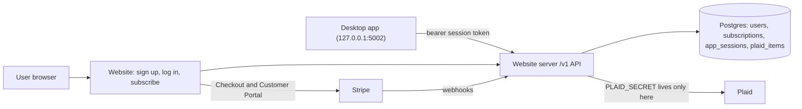

# Paid Plaid — Master Plan

**Goal:** Users pay **$8.99/month** to use Plaid bank syncing in the Workbench Budgeting
desktop app. Everything else in the app stays free. The website
(`budget_app_website`) becomes the hosted server that owns accounts, billing, and all
Plaid API calls. The desktop app (`budget_app`) becomes a client of that server.

- API contract (desktop <-> server): [API_CONTRACT.md](API_CONTRACT.md)
- Prompt for running a step with an agent: [AGENT_PROMPT.md](AGENT_PROMPT.md)
- Existing token-storage design notes (desktop repo): `../budget_app/docs/plaid_token_storage.md`

**Status legend:** `todo` · `in-progress` · `blocked` · `done`

**Run the steps in number order.** Every step depends only on earlier steps, so the next
step is always the lowest-numbered one that is not `done`.

---

## Checklist

| # | Step | Repo |
| --- | --- | --- |
| 1 | Database and app scaffolding | website |
| 2 | Serve installer downloads from GitHub Releases | website |
| 3 | Provision hosting (manual) | website + dashboards |
| 4 | Users, sign up, log in, log out | website |
| 5 | Password reset and email verification | website |
| 6 | My account page | website |
| 7 | Sign in with Google | website |
| 8 | Stripe Checkout and webhooks | website |
| 9 | Customer Portal and the paid-access check | website |
| 10 | App sessions and desktop sign-in API | website |
| 11 | Plaid link and exchange on the server | website |
| 12 | Transaction sync endpoint | website |
| 13 | Plaid connection lifecycle | website |
| 14 | Desktop cloud client and sign-in | desktop |
| 15 | Route desktop Plaid through the server | desktop |
| 16 | Re-link prompt for existing connections | desktop |
| 17 | Legal pages | website |
| 18 | Go live with Stripe, Plaid, and Google (manual) | dashboards |
| 19 | Launch | desktop + website |
| 20 | Remove the direct Plaid path | desktop |

Update the status in the step section below; this table is only an index.

---

## Architecture



## Ground rules (keep every step shippable)

1. **One step = one agent session = one PR in one repo** (step 19 is the only step with
   a PR in each repo). Each PR must be mergeable on its own without breaking anything
   that already works.
2. **In order.** Steps are numbered in a safe run order; don't start a step until every
   step it depends on is `done`.
3. **Feature flags:**
   - Website: new public-facing account/billing features stay behind
     `ACCOUNTS_ENABLED` (default **off** in production) until step 19.
   - Desktop: cloud Plaid behavior stays behind `BUDGET_APP_CLOUD_PLAID` (default
     **off**) until step 19. Today's direct Plaid path keeps working until then.
4. **Contract first.** Any new or changed endpoint updates
   [API_CONTRACT.md](API_CONTRACT.md) in the same PR.
5. **Branch naming:** `feature/mhoff/<short_topic>_<yyyymmdd>`.
6. **Close out every step:** set its status, add the PR link, log any decisions, and
   add a Handoff notes entry.
7. **Secrets never go in git.** Use environment variables (and `.env.example` for names only).

---

## Phase A — Groundwork (website)

### 1. Database and app scaffolding
- **Repo:** budget_app_website
- **Depends on:** —
- **Scope:** Add SQLAlchemy + Flask-Migrate (Alembic). Read `DATABASE_URL`, falling back
  to a local SQLite file for dev. Add `/healthz`, a pytest setup with a test client
  fixture, `.env.example`, and the `ACCOUNTS_ENABLED` flag (read from env, default off).
  Restructure `serve.py` only as much as needed (e.g. an app factory or `app/` package);
  `gunicorn serve:app` must still work.
- **Done when:** Existing pages render unchanged, `flask db upgrade` runs locally,
  `pytest` passes, `/healthz` returns 200.
- **Status:** done
- **PR:** [#38](https://github.com/maxwell-hoff/budget_app_website/pull/38)

### 2. Serve installer downloads from GitHub Releases
- **Repo:** budget_app_website
- **Depends on:** 1
- **Scope:** Change `/download/<platform>` to redirect to the matching GitHub Releases
  asset instead of streaming the LFS binaries in `frontend/static/downloads/`. Keep the
  release URLs in one config spot so a new release is a one-line change. Leave the
  binaries in the repo for now (removal can be a later cleanup). Add a test for each
  platform redirect.
- **Done when:** All three download buttons (mac-arm, mac-x64, windows) download the
  correct installer locally and on Render; the rest of the site is unchanged.
- **Status:** todo
- **PR:** —

### 3. Provision hosting (manual — you)
- **Repo:** budget_app_website (Render dashboard + `render.yaml`)
- **Depends on:** 1
- **Scope:** Create Postgres (Render or Neon), move the web service off the free tier,
  set env vars (`DATABASE_URL`, `SECRET_KEY`, `ACCOUNTS_ENABLED=false`), run migrations
  on deploy (`preDeployCommand: flask db upgrade` in `render.yaml`), set billing alerts.
  An agent can prepare the `render.yaml` change; the dashboard work is manual.
- **Done when:** Production deploy is healthy (`/healthz` 200) and connected to Postgres.
- **Status:** done
- **PR:** [open PR from `feature/mhoff/render_yaml_update_20260930`](https://github.com/maxwell-hoff/budget_app_website/pull/new/feature/mhoff/render_yaml_update_20260930) (replace with the PR URL once opened)

## Phase B — Accounts (website, behind `ACCOUNTS_ENABLED`)

### 4. Users, sign up, log in, log out
- **Repo:** budget_app_website
- **Depends on:** 1
- **Scope:** `users` table (`id`, `email` unique/lowercased, `password_hash` (nullable,
  so Google-only users from step 7 fit), `created_at`, `email_verified_at`). Flask-Login
  sessions, strong password hashing, CSRF protection on forms, basic rate limiting on
  login. Routes: `/signup`, `/login`, `/logout`. All return 404 when `ACCOUNTS_ENABLED`
  is off.
- **Done when:** With the flag on, a user can sign up, log in, and log out; with it off,
  the routes 404 and the site looks unchanged. Tests cover both.
- **Status:** todo
- **PR:** —

### 5. Password reset and email verification
- **Repo:** budget_app_website
- **Depends on:** 4
- **Scope:** Transactional email provider (Resend or Postmark) behind a small `send_email`
  helper (logs to console in dev). Signed, expiring tokens for reset and verification.
  Routes: `/forgot-password`, `/reset-password/<token>`, `/verify-email/<token>`.
- **Done when:** Reset and verify flows work end to end in dev (console email) and tests
  cover token expiry/reuse.
- **Status:** todo
- **PR:** —

### 6. My account page
- **Repo:** budget_app_website
- **Depends on:** 4
- **Scope:** `/account` (login required): email, verification status, placeholder for
  subscription status, change password, nav link when logged in (flag on only).
- **Done when:** Page renders for logged-in users, redirects to login otherwise.
- **Status:** todo
- **PR:** —

### 7. Sign in with Google
- **Repo:** budget_app_website
- **Depends on:** 4, 6
- **Scope:** Google OpenID Connect via Authlib. `oauth_identities` table (`user_id`,
  `provider` = `google`, `provider_subject` (Google `sub`, unique per provider),
  `email`, `created_at`). Routes: `/auth/google` (starts the flow with `state` and
  `nonce`) and `/auth/google/callback` (verifies the ID token, then logs in). Account
  matching: look up by `provider_subject` first; if not found and Google says the email
  is verified, link to the existing user with that email (or create a new user with no
  password and `email_verified_at` set). "Continue with Google" button on `/login` and
  `/signup`. On `/account`, show linked sign-in methods, and let a Google-only user
  set a password; never allow removing the last sign-in method. Env: `GOOGLE_CLIENT_ID`,
  `GOOGLE_CLIENT_SECRET`. Routes 404 when `ACCOUNTS_ENABLED` is off, and the button is
  hidden if the Google env vars are missing. The desktop sign-in flow (step 10) needs
  no changes because `/app-login` uses whatever web login the user picks.
- **Before starting (manual):** Create an OAuth client in Google Cloud Console (type
  "Web application") with redirect URI `http://127.0.0.1:5001/auth/google/callback`.
- **Done when:** A new user can sign up with Google, an existing password user can sign
  in with Google and end up on the same account. Tests mock Google's token and userinfo
  responses, including an unverified email (must not link) and a bad `state` (rejected).
- **Status:** todo
- **PR:** —

## Phase C — Billing (website, Stripe test mode)

### 8. Stripe Checkout and webhooks
- **Repo:** budget_app_website
- **Depends on:** 6
- **Before starting (manual):** Create a Stripe account; in test mode create the
  product and the $8.99/month price; install the Stripe CLI.
- **Scope:** `subscriptions` table (`user_id`, `stripe_customer_id`,
  `stripe_subscription_id`, `status`, `current_period_end`, `cancel_at_period_end`) and
  `stripe_events` table (processed event ids, for idempotency). `POST /billing/checkout`
  creates a Checkout Session for the $8.99/month price (`STRIPE_PRICE_ID`).
  `POST /stripe/webhook` verifies the signature (`STRIPE_WEBHOOK_SECRET`) and handles
  `checkout.session.completed`, `customer.subscription.created|updated|deleted`,
  `invoice.paid`, `invoice.payment_failed`.
- **Done when:** In Stripe test mode (Stripe CLI forwarding webhooks), subscribing
  creates an `active` subscription row; canceling updates it. Webhook tests use signed
  fixture payloads; duplicate events are ignored.
- **Status:** todo
- **PR:** —

### 9. Customer Portal and the paid-access check
- **Repo:** budget_app_website
- **Depends on:** 8
- **Scope:** `POST /billing/portal` redirects to the Stripe Customer Portal.
  `has_plaid_access(user)` is the **single** place that decides access: true if status
  is `active`/`trialing`, or `past_due` within a short grace period, or canceled but
  `now < current_period_end`. Show status + Subscribe/Manage buttons on `/account`.
- **Done when:** Unit tests cover every status branch of `has_plaid_access`; the account
  page shows the right button for each state.
- **Status:** todo
- **PR:** —

## Phase D — Desktop sign-in API (website)

### 10. App sessions and desktop sign-in API
- **Repo:** budget_app_website
- **Depends on:** 9
- **Scope:** `app_sessions` table (`user_id`, `token_hash`, `device_name`, `created_at`,
  `last_used_at`, `expires_at`, `revoked_at`) and short-lived one-time `auth_codes`.
  `GET /app-login` (browser; requires web login, then redirects to
  `http://127.0.0.1:5002/auth/callback?code=...&state=...`; only loopback redirect URIs
  allowed). `POST /v1/auth/token` (code + PKCE verifier -> session token),
  `GET /v1/me`, `POST /v1/auth/logout`. A `require_app_session` decorator for `/v1/*`.
  `/app-login` returns 404 while `ACCOUNTS_ENABLED` is off, like the other account pages.
- **Done when:** A scripted test performs the full code -> token -> `/v1/me` flow
  (after both a password login and a Google login); tokens are stored hashed;
  revoked/expired tokens get 401. Contract updated.
- **Status:** todo
- **PR:** —

## Phase E — Hosted Plaid (website, Plaid sandbox)

### 11. Plaid link and exchange on the server
- **Repo:** budget_app_website
- **Depends on:** 10
- **Before starting (manual):** Get Plaid sandbox keys from the Plaid Dashboard.
- **Scope:** `plaid_items` table (`user_id`, `item_id`, `access_token_encrypted`
  (Fernet, key from `PLAID_TOKEN_KEY`), `institution_id`, `institution_name`, `status`,
  `transactions_cursor`, `created_at`). Endpoints: `POST /v1/plaid/link-token`,
  `POST /v1/plaid/exchange`, `GET /v1/plaid/items`, `DELETE /v1/plaid/items/<id>`
  (calls Plaid `/item/remove`). All require an app session (401) **and**
  `has_plaid_access` (402). Port client setup from
  `../budget_app/backend/plaid_data_retreiver.py`. Env: `PLAID_CLIENT_ID`,
  `PLAID_SECRET`, `PLAID_ENVIRONMENT`.
- **Done when:** Against Plaid sandbox, a test user can create a link token, exchange a
  sandbox public token, list, and delete items. Access tokens are never returned to
  the client. Contract updated.
- **Status:** todo
- **PR:** —

### 12. Transaction sync endpoint
- **Repo:** budget_app_website
- **Depends on:** 11
- **Scope:** `POST /v1/plaid/sync` returns accounts and transactions for the user's items
  (or one item) in the shape the desktop ingest already consumes (see
  `../budget_app/backend/plaid_data_fetcher.py` and `plaid_data_retreiver.py`), with
  `days_back` support for the initial pull. Transaction data is passed through, not
  stored. Map Plaid `ITEM_LOGIN_REQUIRED` to 409.
- **Done when:** Sandbox sync returns data that the desktop ingest code accepts
  unchanged (verified with a fixture shared in the contract). Contract updated.
- **Status:** todo
- **PR:** —

### 13. Plaid connection lifecycle
- **Repo:** budget_app_website
- **Depends on:** 12
- **Scope:** `POST /plaid/webhook` (verify Plaid webhook JWT) to mark items needing
  re-link; update-mode link token support (`POST /v1/plaid/items/<id>/relink-token`).
  When a subscription fully ends (Stripe webhook), call `/item/remove` for that user's
  items so Plaid stops billing. Account deletion (`/account/delete`) purges items,
  sessions, and the user.
- **Done when:** Tests cover subscription-ended -> items removed, and webhook-driven
  status changes. Contract updated.
- **Status:** todo
- **PR:** —

## Phase F — Desktop client (budget_app, behind `BUDGET_APP_CLOUD_PLAID`)

### 14. Desktop cloud client and sign-in
- **Repo:** budget_app
- **Depends on:** 10
- **Scope:** `backend/cloud_client.py` (base URL from `BUDGET_APP_CLOUD_URL`, bearer
  token, typed errors for 401/402/409). Routes in `serve.py`: `/auth/start` (generates
  PKCE + state, opens browser to `/app-login`), `/auth/callback` (exchanges code, stores
  token via `keyring`), `/api/cloud/me`, `/api/cloud/logout`. Actions menu in
  `frontend/templates/index.html`: Sign in / Signed in as ... / Manage subscription.
  Only visible when the flag is on. **No Plaid behavior changes.**
- **Done when:** With the flag on, sign-in round-trips against a local website server;
  with it off, nothing in the UI changes. Tests mock the server.
- **Status:** todo
- **PR:** —

### 15. Route desktop Plaid through the server
- **Repo:** budget_app
- **Depends on:** 12, 14
- **Scope:** When the flag is on, the local Plaid routes in `serve.py`
  (`/api/plaid/create-link-token`, `/api/plaid/exchange-public-token`,
  `/api/plaid/connections`, `.../refresh`, `DELETE .../<id>`) call `cloud_client`
  instead of Plaid directly; synced data flows into the existing ingest code.
  `frontend/templates/plaid_connect.html` keeps calling the local endpoints. 402 ->
  "Subscribe to sync banks" prompt linking to the account page; 409 -> re-link prompt
  using the relink-token endpoint from step 13.
- **Done when:** With the flag on, link + sync + re-link works end to end against
  sandbox via the local website server; with the flag off, behavior is identical to today.
- **Status:** todo
- **PR:** —

### 16. Re-link prompt for existing connections
- **Repo:** budget_app
- **Depends on:** 13, 15
- **Scope:** With the flag on, detect connections that exist only locally (direct-path
  tokens in `plaid_tokens`) and show a one-time prompt to sign in, subscribe, and
  re-link them through the cloud; keep their existing transactions. The flag stays
  **off by default** in this step; turning it on happens at launch (step 19).
- **Done when:** With the flag on, an app with existing local connections keeps all its
  data and walks the user through re-linking; CSV import still works signed out. With
  the flag off, nothing changes.
- **Status:** todo
- **PR:** —

## Phase G — Launch

### 17. Legal pages
- **Repo:** budget_app_website
- **Depends on:** 1
- **Scope:** `/privacy`, `/terms`, `/refunds` pages linked in the footer (Stripe,
  Plaid, and Google all require them). Content drafted for you to review. These are
  public from the start (not behind `ACCOUNTS_ENABLED`).
- **Done when:** Pages render and are linked from every page footer.
- **Status:** todo
- **PR:** —

### 18. Go live with Stripe, Plaid, and Google (manual — you)
- **Repo:** — (dashboards)
- **Depends on:** 13, 17
- **Scope:** Stripe live mode (product, price, webhook endpoint, portal config); Plaid
  production access and security questionnaire; Google OAuth consent screen published
  with the production redirect URI (`https://workbenchbudgeting.com/auth/google/callback`),
  privacy policy and terms links, and brand verification if Google requests it; set
  production env vars. Keep `ACCOUNTS_ENABLED=false` until step 19.
- **Done when:** With `ACCOUNTS_ENABLED` turned on briefly for yourself (or on a
  staging service), a real $8.99 subscription and a real bank link work in production.
- **Status:** todo
- **PR:** —

### 19. Launch
- **Repo:** both (one PR in each, plus a production env change)
- **Depends on:** 2, 16, 18
- **Scope:** Desktop PR: default `BUDGET_APP_CLOUD_PLAID` to on, point
  `BUDGET_APP_CLOUD_URL` at production, bump the app version, update release notes,
  and publish the release. Website PR: update the download links (step 2 config) and
  marketing copy for the paid Plaid feature. Then set `ACCOUNTS_ENABLED=true` in
  production. Order: set the env var and merge the website PR first, then publish the
  desktop release, so the app never points users at sign-up pages that 404.
- **Done when:** A new user can download, sign up, subscribe, and sync a bank; an
  existing user who upgrades is walked through re-linking.
- **Status:** todo
- **PR:** —

### 20. Remove the direct Plaid path
- **Repo:** budget_app
- **Depends on:** 19 (released and stable for a while)
- **Scope:** Remove direct Plaid calls and `PLAID_SECRET` handling from the shipped build
  (`serve.py`, `backend/env_config.py`, `setup_wizard.py`, `budget_app.spec`,
  local `plaid_tokens` usage) and the `BUDGET_APP_CLOUD_PLAID` flag. Keep local data
  tables intact.
- **Done when:** The built app contains no Plaid secret handling; tests updated.
- **Status:** todo
- **PR:** —

---

## Decisions log

Newest last. One line each: date — decision — reason.

- 2026-09-30 — The hosted server is built into `budget_app_website` — sign-up, billing, webhooks, and Plaid all share one users/subscriptions database and one deploy.
- 2026-09-30 — Plaid access tokens are stored encrypted on the server, keyed by `user_id` — lets the server call `/item/remove` when a subscription ends and handle Plaid webhooks.
- 2026-09-30 — Payments use Stripe Billing (Checkout + Customer Portal + webhooks) — no card handling or billing UI to build.
- 2026-09-30 — Auth is built in-house with Flask-Login and hashed passwords — fewest vendors; revisit before starting step 4 if a managed provider is preferred.
- 2026-09-30 — Transaction data passes through the server and is not stored there — the desktop app stays local-first.
- 2026-09-30 — Add optional "Sign in with Google" (step 7) alongside email and password — many users prefer it, it gives them Google's two-factor protection, and fewer passwords stored here means less risk. Accounts link by verified email; the desktop flow is unchanged.
- 2026-09-30 — Desktop sign-in uses a browser redirect to the local server (`127.0.0.1:5002/auth/callback`) with PKCE; the session token is stored in the OS keychain via `keyring`.
- 2026-09-30 — Steps renumbered 1–20 in run order. Turning cloud Plaid on by default moved from the old desktop migration step into Launch (step 19), so existing users are never switched to cloud Plaid before sign-up is public.
- 2026-09-30 — Keep a flat layout (`serve.py` with `create_app()` plus `config.py` and `extensions.py`) instead of an `app/` package — smallest change that keeps `gunicorn serve:app` and existing endpoint names; revisit if the route count grows.
- 2026-09-30 — Postgres driver is psycopg 3 (`psycopg[binary]`); `DATABASE_URL` values starting `postgres://` or `postgresql://` are rewritten to `postgresql+psycopg://` — Render hands out `postgres://`, which SQLAlchemy 2 rejects.
- 2026-09-30 — `/healthz` runs `SELECT 1` and returns 503 if the database is unreachable — lets Render's health check catch a broken database connection, not just a dead process.
- 2026-09-30 — Migrations start from an empty baseline revision (`07f88d99736f`); `.flaskenv` sets `FLASK_APP=serve:app` so `flask db upgrade` needs no flags — step 3's `preDeployCommand` and later model steps chain onto it.
- 2026-09-30 — Production runs on Render Postgres, linked by pasting its Internal Database URL into `DATABASE_URL` in the dashboard. `render.yaml` lists `DATABASE_URL` and `SECRET_KEY` with `sync: false` rather than using `fromDatabase` — the service is managed in the dashboard, and a mismatched database name in a Blueprint sync could create a second, empty database.
- 2026-09-30 — Production base URL is `https://workbenchbudgeting.com` (API at `/v1`).

## Handoff notes

Newest first. Template:

```
### YYYY-MM-DD — step N — <repo> — <branch>
- Done:
- Not done / follow-ups:
- Manual actions needed (env vars, dashboards, deploys):
- Next step:
```

### 2026-09-30 — step 3 — budget_app_website — feature/mhoff/render_yaml_update_20260930
- Done (dashboard, by Max): Created Render Postgres in the web service's region; set `DATABASE_URL` (internal URL), `SECRET_KEY`, and `ACCOUNTS_ENABLED=false` on the web service; moved the web service to a paid instance type (workspace stays on Hobby). Production `/healthz` returns `{"status": "ok"}`.
- Done (repo): `render.yaml` now records the paid plan (`starter`), `preDeployCommand: flask db upgrade`, `healthCheckPath: /healthz`, `ACCOUNTS_ENABLED`, and `DATABASE_URL`/`SECRET_KEY` as `sync: false`. Filled in `https://workbenchbudgeting.com` in `API_CONTRACT.md` and the step 18 Google redirect URI. Set step 1's PR link to #38.
- Not done / follow-ups: Confirm the dashboard's Pre-Deploy Command is `flask db upgrade` and Health Check Path is `/healthz` (the service is dashboard-managed, so `render.yaml` doesn't apply them). Confirm the instance type name and correct `plan:` in `render.yaml` if it isn't Starter. Billing alerts: check the Render workspace billing settings.
- Manual actions needed: Open the PR (the `gh` CLI isn't installed) and paste its URL into step 3's PR line.
- Next step: 2.

### 2026-09-30 — step 1 — budget_app_website — feature/mhoff/db_scaffolding_20260930
- Done: `serve.py` now has `create_app()` (module-level `app` kept for gunicorn). Added `config.py` (`DATABASE_URL` with SQLite fallback at `instance/app.db`, `SECRET_KEY`, `ACCOUNTS_ENABLED` default off, `.env` loading in dev), `extensions.py` (`db`, `migrate`), `migrations/` with an empty baseline revision, `.flaskenv`, `GET /healthz`, `pytest.ini` + `tests/` (27 tests), `requirements-dev.txt`, `.env.example`. Updated `CLAUDE.md` and the `/healthz` entry in `API_CONTRACT.md`. Verified `/`, `/about`, and the 404 page render byte-identical to before, `flask db upgrade` runs, and `gunicorn serve:app` serves pages, downloads, and `/healthz`.
- Not done / follow-ups: The `ACCOUNTS_ENABLED` flag is only read into `app.config` so far; step 4 should add the helper that 404s account routes when it's off. `SECRET_KEY` falls back to a random per-process value when unset; step 3 must set it in production (step 4 may want to fail at startup if it's missing outside dev). This branch was cut from `feature/mhoff/paid_init_20260930`, which isn't merged yet, so merge that first.
- Manual actions needed: Open the PR (the `gh` CLI wasn't available) and paste its URL into this step's PR line. Merge `feature/mhoff/paid_init_20260930` first. No production env changes needed yet: with `DATABASE_URL` unset, Render keeps working on a throwaway SQLite file until step 3.
- Next step: 2 (step 3 also only depends on 1, but run in order).

### 2026-09-30 — plan update — budget_app_website — feature/mhoff/paid_init_20260930
- Done: Renumbered all steps 1–20 in run order and added the checklist. Old -> new: 0.2->1, 0.1->2, 0.3->3, 1.1->4, 1.2->5, 1.3->6, 1.4->7, 2.1->8, 2.2->9, 3.1->10, 4.1->11, 4.2->12, 4.3->13, 5.1->14, 5.2->15, 5.3->16 (+ flag flip moved to 19), 6.1->17, 6.2->18, 6.3->19, 5.4->20. Added "Before starting (manual)" notes to steps 7, 8, and 11. Updated step references in `API_CONTRACT.md` and `AGENT_PROMPT.md`.
- Not done / follow-ups: None.
- Manual actions needed: None.
- Next step: 1.

### 2026-09-30 — plan update — budget_app_website — feature/mhoff/paid_init_20260930
- Done: Added Sign in with Google (now step 7), made `password_hash` nullable (now step 4), added Google OAuth setup to go-live (now step 18), logged the decision, and listed the Google routes in `API_CONTRACT.md`.
- Not done / follow-ups: None.
- Manual actions needed: Before starting step 7, create an OAuth client in Google Cloud Console.
- Next step: 1.

### 2026-09-30 — setup — both repos — feature/mhoff/paid_init_20260930
- Done: Created this plan, `API_CONTRACT.md`, `AGENT_PROMPT.md`, website `CLAUDE.md`, a pointer in the desktop `CLAUDE.md`, and `../budget_app.code-workspace`.
- Not done / follow-ups: None.
- Manual actions needed: Merge the setup branches in both repos.
- Next step: 1.
