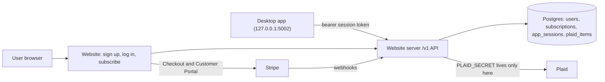

# Paid Plaid — Master Plan

**Goal:** Users pay **$8.99/month** to use Plaid bank syncing in the Workbench Budgeting
desktop app. Everything else in the app stays free. The website
(`budget_app_website`) becomes the hosted server that owns accounts, billing, and all
Plaid API calls. The desktop app (`budget_app`) becomes a client of that server.

- API contract (desktop <-> server): [API_CONTRACT.md](API_CONTRACT.md)
- Prompt for running a step with an agent: [AGENT_PROMPT.md](AGENT_PROMPT.md)
- Existing token-storage design notes (desktop repo): `../budget_app/docs/plaid_token_storage.md`

**Status legend:** `todo` · `in-progress` · `blocked` · `done`

**Next step:** the first step below whose status is `todo` and whose dependencies are `done`.

---

## Architecture



## Ground rules (keep every step shippable)

1. **One step = one agent session = one PR in one repo.** Each PR must be mergeable on
   its own without breaking anything that already works.
2. **Server before client.** Website/server steps land before the desktop steps that
   depend on them.
3. **Feature flags:**
   - Website: new public-facing account/billing features stay behind
     `ACCOUNTS_ENABLED` (default **off** in production) until step 6.3.
   - Desktop: cloud Plaid behavior stays behind `BUDGET_APP_CLOUD_PLAID` (default
     **off**) until step 5.3. Today's direct Plaid path keeps working until then.
4. **Contract first.** Any new or changed endpoint updates
   [API_CONTRACT.md](API_CONTRACT.md) in the same PR.
5. **Branch naming:** `feature/mhoff/<short_topic>_<yyyymmdd>`.
6. **Close out every step:** set its status, add the PR link, log any decisions, and
   add a Handoff notes entry.
7. **Secrets never go in git.** Use environment variables (and `.env.example` for names only).

---

## Phase 0 — Groundwork

### 0.1 Serve installer downloads from GitHub Releases
- **Repo:** budget_app_website
- **Depends on:** —
- **Scope:** Change `/download/<platform>` in `serve.py` (or the buttons in
  `frontend/templates/index.html`) to redirect to the matching GitHub Releases asset
  instead of streaming the LFS binaries in `frontend/static/downloads/`. Keep the
  release URLs in one config spot so a new release is a one-line change. Leave the
  binaries in the repo for now (removal can be a later cleanup).
- **Done when:** All three download buttons (mac-arm, mac-x64, windows) download the
  correct installer locally and on Render; the rest of the site is unchanged.
- **Status:** todo
- **PR:** —

### 0.2 Database and app scaffolding
- **Repo:** budget_app_website
- **Depends on:** —
- **Scope:** Add SQLAlchemy + Flask-Migrate (Alembic). Read `DATABASE_URL`, falling back
  to a local SQLite file for dev. Add `/healthz`, a pytest setup with a test client
  fixture, `.env.example`, and the `ACCOUNTS_ENABLED` flag (read from env, default off).
  Restructure `serve.py` only as much as needed (e.g. an app factory or `app/` package);
  `gunicorn serve:app` must still work.
- **Done when:** Existing pages render unchanged, `flask db upgrade` runs locally,
  `pytest` passes, `/healthz` returns 200.
- **Status:** todo
- **PR:** —

### 0.3 Provision hosting (manual — you)
- **Repo:** budget_app_website (Render dashboard + `render.yaml`)
- **Depends on:** 0.2
- **Scope:** Create Postgres (Render or Neon), move the web service off the free tier,
  set env vars (`DATABASE_URL`, `SECRET_KEY`, `ACCOUNTS_ENABLED=false`), run migrations
  on deploy (`preDeployCommand: flask db upgrade` in `render.yaml`), set billing alerts.
  An agent can prepare the `render.yaml` change; the dashboard work is manual.
- **Done when:** Production deploy is healthy (`/healthz` 200) and connected to Postgres.
- **Status:** todo
- **PR:** —

## Phase 1 — Accounts (website, behind `ACCOUNTS_ENABLED`)

### 1.1 Users, sign up, log in, log out
- **Repo:** budget_app_website
- **Depends on:** 0.2
- **Scope:** `users` table (`id`, `email` unique/lowercased, `password_hash` (nullable,
  so Google-only users from step 1.4 fit), `created_at`, `email_verified_at`). Flask-Login sessions, strong password hashing,
  CSRF protection on forms, basic rate limiting on login. Routes: `/signup`, `/login`,
  `/logout`. All return 404 when `ACCOUNTS_ENABLED` is off.
- **Done when:** With the flag on, a user can sign up, log in, and log out; with it off,
  the routes 404 and the site looks unchanged. Tests cover both.
- **Status:** todo
- **PR:** —

### 1.2 Password reset and email verification
- **Repo:** budget_app_website
- **Depends on:** 1.1
- **Scope:** Transactional email provider (Resend or Postmark) behind a small `send_email`
  helper (logs to console in dev). Signed, expiring tokens for reset and verification.
  Routes: `/forgot-password`, `/reset-password/<token>`, `/verify-email/<token>`.
- **Done when:** Reset and verify flows work end to end in dev (console email) and tests
  cover token expiry/reuse.
- **Status:** todo
- **PR:** —

### 1.3 My account page
- **Repo:** budget_app_website
- **Depends on:** 1.1
- **Scope:** `/account` (login required): email, verification status, placeholder for
  subscription status, change password, nav link when logged in (flag on only).
- **Done when:** Page renders for logged-in users, redirects to login otherwise.
- **Status:** todo
- **PR:** —

### 1.4 Sign in with Google
- **Repo:** budget_app_website
- **Depends on:** 1.1 (1.3 recommended, so linked sign-in methods can be shown)
- **Scope:** Google OpenID Connect via Authlib. `oauth_identities` table (`user_id`,
  `provider` = `google`, `provider_subject` (Google `sub`, unique per provider),
  `email`, `created_at`). Routes: `/auth/google` (starts the flow with `state` and
  `nonce`) and `/auth/google/callback` (verifies the ID token, then logs in). Account
  matching: look up by `provider_subject` first; if not found and Google says the email
  is verified, link to the existing user with that email (or create a new user with no
  password and `email_verified_at` set). "Continue with Google" button on `/login` and
  `/signup`. On `/account`, show linked sign-in methods, and let a Google-only user
  set a password; never allow removing the last sign-in method. Env: `GOOGLE_CLIENT_ID`,
  `GOOGLE_CLIENT_SECRET`. Routes 404 when `ACCOUNTS_ENABLED` is off, and the button is
  hidden if the Google env vars are missing. The desktop sign-in flow (step 3.1) needs
  no changes because `/app-login` uses whatever web login the user picks.
- **Done when:** With a Google OAuth client for local dev (redirect URI
  `http://127.0.0.1:5001/auth/google/callback`), a new user can sign up with Google, an
  existing password user can sign in with Google and end up on the same account, and
  `/app-login` works after a Google login. Tests mock Google's token and userinfo
  responses, including an unverified email (must not link) and a bad `state` (rejected).
- **Status:** todo
- **PR:** —

## Phase 2 — Billing (website, Stripe test mode)

### 2.1 Stripe Checkout and webhooks
- **Repo:** budget_app_website
- **Depends on:** 1.3
- **Scope:** `subscriptions` table (`user_id`, `stripe_customer_id`,
  `stripe_subscription_id`, `status`, `current_period_end`, `cancel_at_period_end`) and
  `stripe_events` table (processed event ids, for idempotency). `POST /billing/checkout`
  creates a Checkout Session for the $8.99/month price (`STRIPE_PRICE_ID`).
  `POST /stripe/webhook` verifies the signature (`STRIPE_WEBHOOK_SECRET`) and handles
  `checkout.session.completed`, `customer.subscription.created|updated|deleted`,
  `invoice.paid`, `invoice.payment_failed`.
- **Done when:** In Stripe test mode (Stripe CLI forwarding webhooks), subscribing
  creates an `active` subscription row; canceling updates it. Webhook tests use signed
  fixture payloads; duplicate events are ignored.
- **Status:** todo
- **PR:** —

### 2.2 Customer Portal and the paid-access check
- **Repo:** budget_app_website
- **Depends on:** 2.1
- **Scope:** `POST /billing/portal` redirects to the Stripe Customer Portal.
  `has_plaid_access(user)` is the **single** place that decides access: true if status
  is `active`/`trialing`, or `past_due` within a short grace period, or canceled but
  `now < current_period_end`. Show status + Subscribe/Manage buttons on `/account`.
- **Done when:** Unit tests cover every status branch of `has_plaid_access`; the account
  page shows the right button for each state.
- **Status:** todo
- **PR:** —

## Phase 3 — Desktop sign-in API (website)

### 3.1 App sessions and desktop sign-in
- **Repo:** budget_app_website
- **Depends on:** 2.2
- **Scope:** `app_sessions` table (`user_id`, `token_hash`, `device_name`, `created_at`,
  `last_used_at`, `expires_at`, `revoked_at`) and short-lived one-time `auth_codes`.
  `GET /app-login` (browser; requires web login, then redirects to
  `http://127.0.0.1:5002/auth/callback?code=...&state=...`; only loopback redirect URIs
  allowed). `POST /v1/auth/token` (code + PKCE verifier -> session token),
  `GET /v1/me`, `POST /v1/auth/logout`. A `require_app_session` decorator for `/v1/*`.
  `/app-login` returns 404 while `ACCOUNTS_ENABLED` is off, like the other account pages.
- **Done when:** A scripted test performs the full code -> token -> `/v1/me` flow;
  tokens are stored hashed; revoked/expired tokens get 401. Contract updated.
- **Status:** todo
- **PR:** —

## Phase 4 — Hosted Plaid (website, Plaid sandbox)

### 4.1 Link and exchange on the server
- **Repo:** budget_app_website
- **Depends on:** 3.1
- **Scope:** `plaid_items` table (`user_id`, `item_id`, `access_token_encrypted`
  (Fernet, key from `PLAID_TOKEN_KEY`), `institution_id`, `institution_name`, `status`,
  `transactions_cursor`, `created_at`). Endpoints: `POST /v1/plaid/link-token`,
  `POST /v1/plaid/exchange`, `GET /v1/plaid/items`, `DELETE /v1/plaid/items/<id>`
  (calls Plaid `/item/remove`). All require an app session (401) **and**
  `has_plaid_access` (402). Port client setup from
  `../budget_app/backend/plaid_data_retreiver.py`. Env: `PLAID_CLIENT_ID`,
  `PLAID_SECRET`, `PLAID_ENVIRONMENT`.
- **Done when:** Against Plaid sandbox, a test user can create a link token, exchange a
  sandbox public token, list, and delete items. Access tokens are never returned to
  the client. Contract updated.
- **Status:** todo
- **PR:** —

### 4.2 Transaction sync endpoint
- **Repo:** budget_app_website
- **Depends on:** 4.1
- **Scope:** `POST /v1/plaid/sync` returns accounts and transactions for the user's items
  (or one item) in the shape the desktop ingest already consumes (see
  `../budget_app/backend/plaid_data_fetcher.py` and `plaid_data_retreiver.py`), with
  `days_back` support for the initial pull. Transaction data is passed through, not
  stored. Map Plaid `ITEM_LOGIN_REQUIRED` to 409.
- **Done when:** Sandbox sync returns data that the desktop ingest code accepts
  unchanged (verified with a fixture shared in the contract). Contract updated.
- **Status:** todo
- **PR:** —

### 4.3 Connection lifecycle
- **Repo:** budget_app_website
- **Depends on:** 4.2
- **Scope:** `POST /plaid/webhook` (verify Plaid webhook JWT) to mark items needing
  re-link; update-mode link token support (`POST /v1/plaid/items/<id>/relink-token`).
  When a subscription fully ends (Stripe webhook), call `/item/remove` for that user's
  items so Plaid stops billing. Account deletion (`/account/delete`) purges items,
  sessions, and the user.
- **Done when:** Tests cover subscription-ended -> items removed, and webhook-driven
  status changes. Contract updated.
- **Status:** todo
- **PR:** —

## Phase 5 — Desktop client (budget_app, behind `BUDGET_APP_CLOUD_PLAID`)

### 5.1 Cloud client and sign-in
- **Repo:** budget_app
- **Depends on:** 3.1
- **Scope:** `backend/cloud_client.py` (base URL from `BUDGET_APP_CLOUD_URL`, bearer
  token, typed errors for 401/402/409). Routes in `serve.py`: `/auth/start` (generates
  PKCE + state, opens browser to `/app-login`), `/auth/callback` (exchanges code, stores
  token via `keyring`), `/api/cloud/me`, `/api/cloud/logout`. Actions menu in
  `frontend/templates/index.html`: Sign in / Signed in as ... / Manage subscription.
  Only visible when the flag is on. **No Plaid behavior changes.**
- **Done when:** With the flag on, sign-in round-trips against a local website server;
  with it off, nothing in the UI changes. Tests mock the server.
- **Status:** todo
- **PR:** —

### 5.2 Route Plaid through the server
- **Repo:** budget_app
- **Depends on:** 4.2, 5.1
- **Scope:** When the flag is on, the local Plaid routes in `serve.py`
  (`/api/plaid/create-link-token`, `/api/plaid/exchange-public-token`,
  `/api/plaid/connections`, `.../refresh`, `DELETE .../<id>`) call `cloud_client`
  instead of Plaid directly; synced data flows into the existing ingest code.
  `frontend/templates/plaid_connect.html` keeps calling the local endpoints. 402 ->
  "Subscribe to sync banks" prompt linking to the account page; 409 -> re-link prompt.
- **Done when:** With the flag on, link + sync works end to end against sandbox via the
  local website server; with the flag off, behavior is identical to today.
- **Status:** todo
- **PR:** —

### 5.3 Migrate existing users and turn the flag on
- **Repo:** budget_app
- **Depends on:** 4.3, 5.2
- **Scope:** Detect connections that exist only locally (direct-path tokens) and prompt
  a one-time re-link through the cloud. Default `BUDGET_APP_CLOUD_PLAID` to on, bump the
  app version, update release notes.
- **Done when:** Upgrading from the previous version keeps all local data and walks the
  user through re-linking; CSV import still works signed out.
- **Status:** todo
- **PR:** —

### 5.4 Remove the direct Plaid path
- **Repo:** budget_app
- **Depends on:** 5.3 (released and stable)
- **Scope:** Remove direct Plaid calls and `PLAID_SECRET` handling from the shipped build
  (`serve.py`, `backend/env_config.py`, `setup_wizard.py`, `budget_app.spec`,
  local `plaid_tokens` usage). Keep local data tables intact.
- **Done when:** The built app contains no Plaid secret handling; tests updated.
- **Status:** todo
- **PR:** —

## Phase 6 — Launch

### 6.1 Legal pages
- **Repo:** budget_app_website
- **Depends on:** —
- **Scope:** `/privacy`, `/terms`, `/refunds` pages linked in the footer (Stripe and
  Plaid both require them). Content drafted for you to review.
- **Done when:** Pages render and are linked from every page footer.
- **Status:** todo
- **PR:** —

### 6.2 Go live with Stripe and Plaid (manual — you)
- **Repo:** — (dashboards)
- **Depends on:** 4.3, 6.1
- **Scope:** Stripe live mode (product, price, webhook endpoint, portal config); Plaid
  production access and security questionnaire; Google OAuth consent screen published
  with the production redirect URI (`https://<website-domain>/auth/google/callback`),
  privacy policy and terms links, and brand verification if Google requests it; set
  production env vars.
- **Done when:** A real $8.99 subscription and a real bank link work in production.
- **Status:** todo
- **PR:** —

### 6.3 Launch
- **Repo:** both
- **Depends on:** 5.3, 6.2
- **Scope:** Set `ACCOUNTS_ENABLED=true` in production, publish the desktop release,
  update website download links (step 0.1 config) and marketing copy.
- **Done when:** A new user can download, sign up, subscribe, and sync a bank.
- **Status:** todo
- **PR:** —

---

## Decisions log

Newest last. One line each: date — decision — reason.

- 2026-09-30 — The hosted server is built into `budget_app_website` — sign-up, billing, webhooks, and Plaid all share one users/subscriptions database and one deploy.
- 2026-09-30 — Plaid access tokens are stored encrypted on the server, keyed by `user_id` — lets the server call `/item/remove` when a subscription ends and handle Plaid webhooks.
- 2026-09-30 — Payments use Stripe Billing (Checkout + Customer Portal + webhooks) — no card handling or billing UI to build.
- 2026-09-30 — Auth is built in-house with Flask-Login and hashed passwords — fewest vendors; revisit before starting 1.1 if a managed provider is preferred.
- 2026-09-30 — Transaction data passes through the server and is not stored there — the desktop app stays local-first.
- 2026-09-30 — Add optional "Sign in with Google" (step 1.4) alongside email and password — many users prefer it, it gives them Google's two-factor protection, and fewer passwords stored here means less risk. Accounts link by verified email; the desktop flow is unchanged.
- 2026-09-30 — Desktop sign-in uses a browser redirect to the local server (`127.0.0.1:5002/auth/callback`) with PKCE; the session token is stored in the OS keychain via `keyring`.

## Handoff notes

Newest first. Template:

```
### YYYY-MM-DD — step X.Y — <repo> — <branch>
- Done:
- Not done / follow-ups:
- Manual actions needed (env vars, dashboards, deploys):
- Next step:
```

### 2026-09-30 — plan update — budget_app_website — feature/mhoff/paid_init_20260930
- Done: Added step 1.4 (Sign in with Google), made `password_hash` nullable in 1.1, added Google OAuth setup to 6.2, logged the decision, and listed the Google routes in `API_CONTRACT.md`.
- Not done / follow-ups: None.
- Manual actions needed: Before starting 1.4, create an OAuth client in Google Cloud Console (type "Web application") with the local redirect URI.
- Next step: Unchanged (0.1 or 0.2).

### 2026-09-30 — setup — both repos — feature/mhoff/paid_init_20260930
- Done: Created this plan, `API_CONTRACT.md`, `AGENT_PROMPT.md`, website `CLAUDE.md`, a pointer in the desktop `CLAUDE.md`, and `../budget_app.code-workspace`.
- Not done / follow-ups: None.
- Manual actions needed: Merge the setup branches in both repos.
- Next step: 0.1 or 0.2 (independent; 0.2 unblocks most of the plan).
